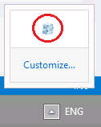

## Modulo 9 - Adding Offline Support to Web Applications

1. **Nombres y apellidos:** José René Fuentes
2. **Fecha:** Jueves 1 de octubre de 2020.
3. **Resumen del Ejercicio:**
    * En este laboratorio hace uso Chrome DevTools que son un conjunto de herramientas de creación web y depuración integrado en Google Chrome. Usamos DevTools para iterar y depurar tu sitio, y para crear un perfil de él. 
    Algunos de los paneles que contiene son:
    * Device Mode - para desarrollar experiencias web con una completa capacidad de respuestas y que prioricen los dispositivos móviles. Emula sensores: ubicación geográfica y acelerómetro.
    * Elements - el panel de Elements se usa para iterar la distribución y el diseño de tu sitio mediante la libre manipulación de DOM y CSS. Además; Inspecciona y modifica ligeramente tus páginas, Edita estilos y Edita el DOM.
    * Console - para registrar información de diagnóstico durante el desarrollo o úsalo como un shell para interactuar con el código JavaScript en la página. Entro lo cual; Interactúa desde la línea de comandos.
    * Sources - Panel Sources Depura tu código JavaScript con puntos de interrupción en el panel Sources o conecta los archivos locales mediante espacios de trabajo para usar el editor en tiempo real de DevTools. Además; Depura con puntos de interrupción, Depura código ofuscado, Configura la persistencia con los espacios de trabajo de DevTools.
    * Network - el panel Network para obtener información sobre recursos solicitados y descargados, y optimizar el rendimiento de carga de tu página. Como por ejemplo; Conceptos básicos del panel Network, Comprensión de Resource Timing, Limitación de la red.
    * Timeline - el panel Timeline para mejorar el rendimiento del tiempo de ejecución de la página mediante la grabación y la exploración de los diferentes eventos que ocurren durante el ciclo de vida de un sitio. Además nos ayuda con; Cómo ver el rendimiento, Analizar el rendimiento del tiempo de ejecución,
    Diagnosticar diseños sincrónicos forzados.
    * Profiles - el panel Profiles si necesitas más información que la que proporciona el panel Timeline; por ejemplo, para rastrear pérdidas de memoria, también así se usa como; Generador de perfiles de CPU en JavaScript, Generador de perfiles de montón.
    * Application - el panel Resources para inspeccionar todos los recursos que se cargan; entre otros, bases de datos IndexedDB o Web SQL, almacenamiento local y de sesión, cookies, caché de la app, imágenes, fuentes y hojas de estilos, además de Administrar datos.
    
4. **Dificultad o problemas presentados y como se resolvieron:** La experiencia nueva de usar F12 es la única dificultad. Hay caracteristicas que no son las mismas en diferentes navegadores. En mi caso yo uso Chrome por eso enfoco el desarrollo de este laboratorio a Chrome. 

Fecha de entrega: Martes 29 de septiembre de 2020

>**Objetivos**: 
* En este laboratorio hace uso de Chrome DevTools que son un conjunto de herramientas de creación web y depuración integrado en Google Chrome. Usamos DevTools para iterar y depurar tu sitio, y para crear un perfil de él. En el resumen del ejercicio indicamos los diferentes paneles con los cuales nos vamos a familirizar en este laboratorio.

Dondequiera que la ruta de un archivo comience con *[Raíz del repositorio]*, reemplácela con la ruta absoluta de la carpeta en la que reside el repositorio 20480. Por ejemplo, si clonaste o extrajiste el repositorio 20480 a to**C:\Users\John Doe\Downloads\20480**, cambiar la ruta de:**[Repository Root]\AllFiles\20480C\Mod01** a**C:\Users\John Doe\Downloads\20480\AllFiles\20480C\Mod01**.


### Ejercicio 1: Almacenamiento en caché de datos fuera de línea mediante el uso de la API de caché de aplicaciones

#### Tarea 1: Configurar el manifiesto de la caché de la aplicación

1.	En el menú de **Inicio**, haga clic en el azulejo **Escritorio**.
2.	En la barra de tareas, haga clic en Microsoft Edge.
3.	En Microsoft Edge, para mostrar la barra de menú, presione F10.
4.	En el menú **Herramientas**, haga clic en **Opciones de Internet**.
5.	En el cuadro de diálogo **Opciones de Internet**, haga clic en **Configuración**.
6.	En el cuadro de diálogo **Configuración de datos del sitio web**, haga clic en la pestaña **Cachés y bases de datos**.
7.	Seleccione la casilla de verificación **Permitir cachés y bases de datos del sitio web** y, a continuación, haga clic en **OK**.
8.	En el cuadro de diálogo **Opciones de Internet**, haga clic en **OK**.
9.	Cierre Microsoft Edge.
10.	Abra Microsoft Visual Studio 2017. 
11.	En Microsoft Visual Studio, en el menú **Archivo**, apunta a **Abrir**, y luego haz clic en **Proyecto/Solución**.
12.	En el cuadro de diálogo **Abrir Proyecto**, apunta a ****[Repository Root]\Allfiles\Mod09\Labfiles\Starter\Exercise 1**, y luego abre la solución **ContosoConf.sln**.
>**Nota**: Si aparece el cuadro de diálogo **Aviso de seguridad para ContosoConf**, desmarca la casilla **Aviso para cada proyecto de esta solución** y luego pulsa **OK**.
13.	En **Solution Explorer**, expanda el nodo del proyecto **ContosoConf**, y luego haga doble clic en **appcache.manifest**.
14.	Encuentra el siguiente comentario:

   ```javascript
        # TODO: Add index, about, schedule and location pages
   ```
15.	Después del comentario, escriba las siguientes URL:
   ```javascript
        /index.htm
        /about.htm
        /location.htm
        /schedule.htm
   ```
16.	En **Solution Explorer**, haga doble clic en **index.htm**. 
17.	Añada el atributo **manifiesto** al elemento **&lt;html;**, como se muestra a continuación:
   ```html
        <html lang="en" manifest="/appcache.manifest">
   ```
18.	En **Solution Explorer**, haga doble clic en **about.htm**.
19. Añada el atributo del manifiesto al elemento **&lt;html&gt;**, como se muestra a continuación:

   ```html
        <html lang="en" manifest="/appcache.manifest">
   ```

20.	En **Solution Explorer**, haga doble clic en **schedule.htm**.
21.	Añada el atributo **manifiesto** al elemento **&lt;html;**, como se muestra a continuación:
   ```html
        <html lang="en" manifest="/appcache.manifest">
   ```

22.	En **Solution Explorer**, haga doble clic en **location.htm**.
23.	Añada el atributo **manifiesto** al elemento **&lt;html;**, como se muestra a continuación:

   ```html
        <html lang="en" manifest="/appcache.manifest">
   ```
### Tarea 2: Detectar el modo fuera de línea usando un código JavaScript

1.	En **Solution Explorer**, expande la carpeta **scripts**, y luego haz doble clic en **offline.js**.
2.	Encuentra el siguiente comentario:

   ```javascript
        // TODO: if currently offline, hide navigation links that require online
   ```
3.	Después de este comentario, añade el siguiente código JavaScript:

   ```javascript
        if (!navigator.onLine) {
            hideLinksThatRequireOnline();
        }
   ```
4.	Encuentra el siguiente comentario:
   ```javascript
        // TODO: add onoffline and ononline events to document.body
   ```

5.	Después de la segunda línea de este comentario, agregue el siguiente código JavaScript:

   ```javascript
        document.body.onoffline = hideLinksThatRequireOnline;
        document.body.ononline = showLinks;
   ```
6.	Encuentra el siguiente comentario:
   ```javascript
        // TODO: also handle the applicationCache error event to hide l
7.	Después de este comentario, añade el siguiente código JavaScript:

   ```javascript
        applicationCache.addEventListener("error", hideLinksThatRequireOnline, false);
   ```


### Tarea 3: Probar la aplicación

1.	En **Solution Explorer**, haga doble clic en **index.htm**.
2.	En el menú **Debug**, haga clic en **Iniciar sin depuración**.
3.	En **Microsoft Edge**, si aparece el mensaje **Configuración de la Intranet desactivada de forma predeterminada**, haga clic en **No mostrar este mensaje de nuevo**.
4.	Verifica que Microsoft Edge muestra la página de **Casa**.
5.	Expanda el área de notificación de Windows, haga clic con el botón derecho del ratón en **IIS Express**, y luego seleccione **Salir**.

>**Nota**: Cuando **IIS Express** comienza a funcionar por primera vez, el icono de **IIS Express** puede aparecer en la barra de tareas en lugar del área de notificación. Si esto ocurre, haga clic con el botón derecho del ratón en el icono **IIS Express** de la barra de tareas, y luego seleccione **Salir**.




6.	En el cuadro de diálogo **Confirmación**, haga clic en **Sí**.
7.	En Microsoft Edge, haga clic en **Calendar**.
8.	Verifique que la página se cargue y muestre la información del horario.
9.	Espere cinco segundos, y luego verifique que la barra de navegación del sitio web ya no muestra el enlace **Registrarse**.
10.	Haga clic en **Acerca de**.
11.	Verifique que la página se cargue y muestre la información que describe la conferencia.
12.	Veifique que la barra de navegación del sitio web no muestra el enlace **Registrarse**.
13.	Cierre Microsoft Edge.

>**Resultados**: Después de completar este ejercicio, habrás modificado la aplicación web y habrás hecho las páginas **Casa**, **Acerca de**, **Programa**, y **Lugar** disponibles fuera de línea.


### Ejercicio 2: Persistir en los datos del usuario usando la API de almacenamiento local

#### Tarea 1: Observar el comportamiento actual de la página del Programa

1.	En Microsoft Visual Studio, en el menú **Archivo**, haga clic en señalar a **Abrir**, y luego haga clic en **Proyecto/Solución**.
2.	En el cuadro de diálogo **Abrir Proyecto**, apunta a **[Repository Root]\Allfiles\Mod09\Labfiles\Starter\Exercise 2**, y luego abre la solución **ContosoConf.sln**.
>**Nota**: Si aparece el cuadro de diálogo **Aviso de seguridad para ContosoConf**, desmarca la casilla **Aviso para cada proyecto de esta solución** y luego haz clic en **OK**.
3.	En **Solution Explorer**, expanda el proyecto **ContosoConf**, y luego haga doble clic en **schedule.htm**.
4.	En el menú **Debug**, haga clic en **Start Without Debugging**.
5.	Expandir el área de notificación de Windows, hacer clic con el botón derecho del ratón en **IIS Express**, y luego seleccionar **Salir**.
6.	En el cuadro de diálogo **Confirmación**, haga clic en **Sí**.
7.	En Microsoft Edge, en el cuadro **Registro**, haga clic en el icono de la estrella, y luego verifique que el icono ahora es de color amarillo.
8.	Haz clic en **Actualizar**.
9.	Verifica que el icono de la estrella de **Registro** ahora es de color blanco.
10.	Cierra Microsoft Edge.

### Tarea 2: Guardar información sobre las sesiones de estrellas en el almacenamiento local

1.	En **Solution Explorer**, expande el proyecto **ContosoConf**, expande la carpeta **scripts**, y luego haz doble clic en **LocalStarStorage.js**.
2.	Encuentra los siguientes comentarios:
   ```javascript
        // TODO: convert this.sessions into a JSON string

        // TODO: save this JSON string into local storage as 
  ```
3.	Después del segundo comentario, inserte el siguiente código JavaScript:

   ```javascript
        this.localStorage.setItem("stars", JSON.stringify(this.sessions));
   ```


### Tarea 3: Cargar la información sobre las sesiones estelares del almacenamiento local

1.	En **LocalStarStorage.js**, encuentra el siguiente comentario:

   ```javascript
        // TODO: get the "stars" from local storage
   ```
2.	Después de este  comentario, inserte el siguiente código JavaScript:

   ```javascript
        var json = this.localStorage.getItem
        ("stars");
   ```

3.	Encuentre el siguiente comentario:
   ```javascript
        // TODO: parse the JSON string into this.sessions
        
        // TODO: handle failures due to missing data etc
   ```

4. Después del segundo comentario, inserte el siguiente código JavaScript

   ```javascript
        if (json) {
            try {
                this.sessions = JSON.parse(json) || [];
            } catch (exception) {
                this.sessions = [];
            }
        } else {
            this.sessions = [];
        }
   ```


### Tarea 4: Usar el envoltorio de almacenamiento local para guardar y cargar los datos en la página de la Agenda

1.	En **Solution Explorer**, expande la carpeta **scripts**, luego haz doble clic en **ScheduleItem.js**.
2.	Encuentra el siguiente comentario:

   ```javascript
        // TODO: Check if item is starred
   ```
3. Después de este comentario, inserte el siguiente código JavaScript:
   ```javascript
        if (localStarStorage.isStarred(this.id)) {
            this.element.classList.add(this.starredClass);
        }
   ```
4.	Encuentra el siguiente comentario:
   ```javascript
        // TODO: remove the star from the item
   ```

5. Después de este comentario, inserte el siguiente código JavaScript:
   ```javascript
        this.localStarStorage.addStar(this.id);
   ```

### Tarea 5: Probar la aplicación

1.	En **Solution Explorer**, haga doble clic en **appcache.manifest**.
2.	Encuentra la siguiente línea:
   ```javascript
        CACHE MANIFEST
   ```

3. Después de este comentario, inserte lo siguiente:
   ```javascript
        # version 2
   ```      


4.	En **Solution Explorer**, haga doble clic en **schedule.htm**.
5.	En el menú **Debug**, haga clic en **Start Without Debugging**.
6.	En Microsoft Edge, para refrescar la página, presione F5.
7.	Expanda el área de notificación de Windows, haga clic con el botón derecho en **IIS Express**, y luego seleccione **Salir**.
8.	En el cuadro de diálogo **Confirmación**, haga clic en **Sí**.
9.	En Microsoft Edge, haga clic en el icono de la estrella en la casilla **Registro**, y luego verifique que el icono esté ahora coloreado en amarillo.
10.	Presione F5.
11.	Verifica que el icono de la estrella de **Registro** sigue siendo de color amarillo.
12.	Cierra Microsoft Edge.

### Tarea 6: Restablecer el caché de Microsoft Edge

1.	En la barra de tareas, haga clic en **Borde de Microsoft**.
2.	En Microsoft Edge, para mostrar la barra de menú, presione F10.
3.	En el menú **Herramientas**, haga clic en **Opciones de Internet**.
4.	En el cuadro de diálogo **Opciones de Internet**, haga clic en **Configuración**.
5.	En el cuadro de diálogo **Configuración de datos del sitio web**, haga clic en la pestaña **Cachés y bases de datos**.
6.	Desactive la casilla de verificación **Permitir cachés y bases de datos del sitio web** y, a continuación, haga clic en **OK**.
7.	En el cuadro de diálogo **Opciones de Internet**, haga clic en **OK**.
8.  Cierre Microsoft Edge.
9.  Cierre todas las ventanas abiertas.

>**Resultados**: Después de completar este ejercicio, habrás actualizado la página de **Programa** para registrar las sesiones estrelladas localmente.
