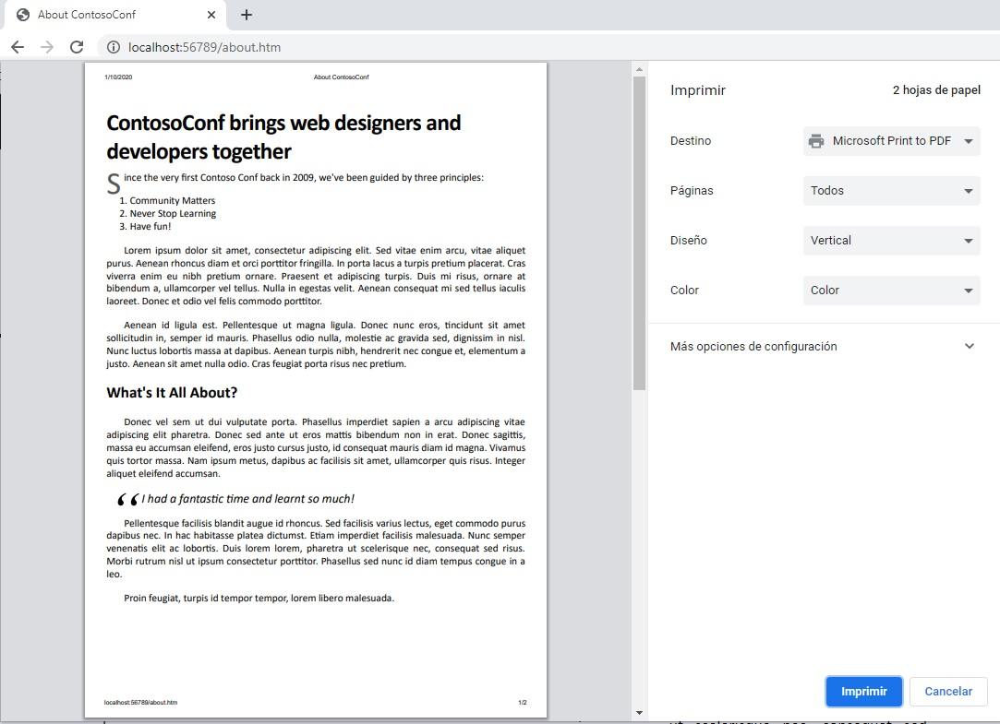
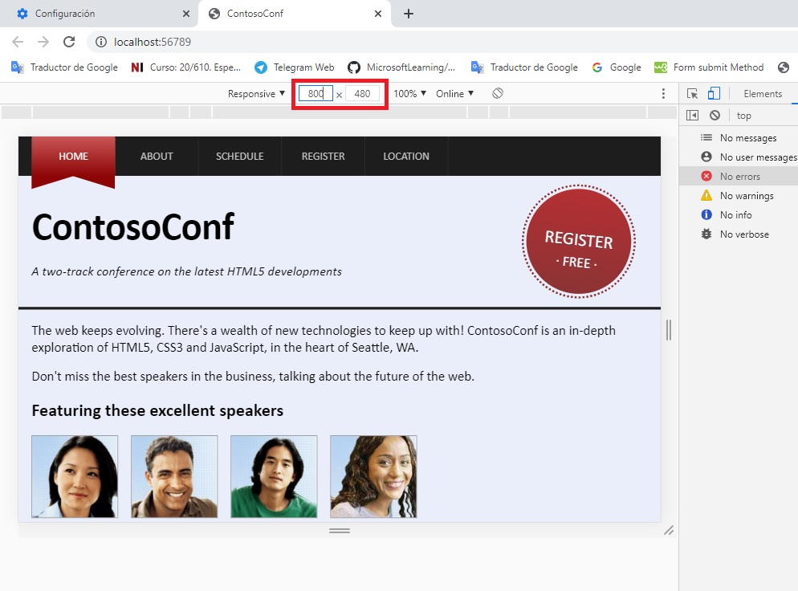
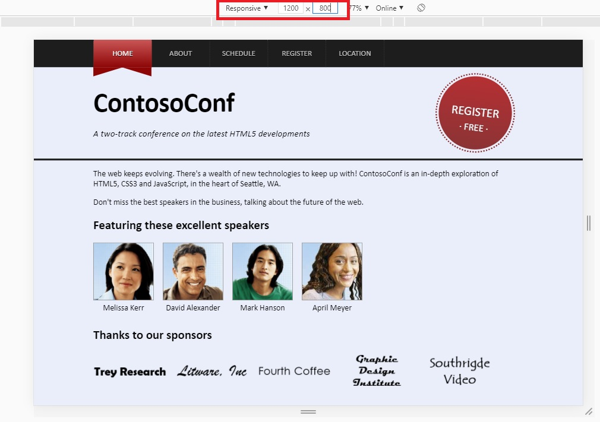
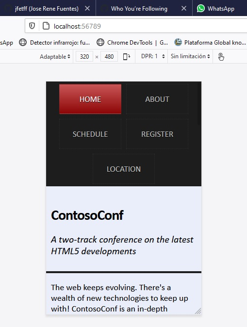

## Modulo 10: Implementación de una interfaz de usuario adaptable

1. **Nombres y apellidos:** José René Fuentes
2. **Fecha:** 30 de Septiembre 2020Jueves 1 de octubre de 2020.
3. **Resumen del Ejercicio:**
    * En este laboratorio hace uso Chrome DevTools que son un conjunto de herramientas de creación web y depuración integrado en Google Chrome. Usamos DevTools para iterar y depurar tu sitio, y para crear un perfil de él. 
    Algunos de los paneles que contiene son:
    * Device Mode - para desarrollar experiencias web con una completa capacidad de respuestas y que prioricen los dispositivos móviles. Emula sensores: ubicación geográfica y acelerómetro.
    * Elements - el panel de Elements se usa para iterar la distribución y el diseño de tu sitio mediante la libre manipulación de DOM y CSS. Además; Inspecciona y modifica ligeramente tus páginas, Edita estilos y Edita el DOM.
    * Console - para registrar información de diagnóstico durante el desarrollo o úsalo como un shell para interactuar con el código JavaScript en la página. Entro lo cual; Interactúa desde la línea de comandos.
    * Sources - Panel Sources Depura tu código JavaScript con puntos de interrupción en el panel Sources o conecta los archivos locales mediante espacios de trabajo para usar el editor en tiempo real de DevTools. Además; Depura con puntos de interrupción, Depura código ofuscado, Configura la persistencia con los espacios de trabajo de DevTools.
    * Network - el panel Network para obtener información sobre recursos solicitados y descargados, y optimizar el rendimiento de carga de tu página. Como por ejemplo; Conceptos básicos del panel Network, Comprensión de Resource Timing, Limitación de la red.
    * Timeline - el panel Timeline para mejorar el rendimiento del tiempo de ejecución de la página mediante la grabación y la exploración de los diferentes eventos que ocurren durante el ciclo de vida de un sitio. Además nos ayuda con; Cómo ver el rendimiento, Analizar el rendimiento del tiempo de ejecución,
    Diagnosticar diseños sincrónicos forzados.
    * Profiles - el panel Profiles si necesitas más información que la que proporciona el panel Timeline; por ejemplo, para rastrear pérdidas de memoria, también así se usa como; Generador de perfiles de CPU en JavaScript, Generador de perfiles de montón.
    * Application - el panel Resources para inspeccionar todos los recursos que se cargan; entre otros, bases de datos IndexedDB o Web SQL, almacenamiento local y de sesión, cookies, caché de la app, imágenes, fuentes y hojas de estilos, además de Administrar datos.
    
4. **Dificultad o problemas presentados y como se resolvieron:** La experiencia nueva de usar F12 es la única dificultad. Hay caracteristicas que no son las mismas en diferentes navegadores. En mi caso yo uso Chrome por eso enfoco el desarrollo de este laboratorio a Chrome. 

Fecha de entrega: Martes 29 de septiembre de 2020

>**Objetivos**: 
* En este laboratorio hace uso de Chrome DevTools que son un conjunto de herramientas de creación web y depuración integrado en Google Chrome. Usamos DevTools para iterar y depurar tu sitio, y para crear un perfil de él. En el resumen del ejercicio indicamos los diferentes paneles con los cuales nos vamos a familirizar en este laboratorio.

# Laboratorio: Implementación de una interfaz de usuario adaptable

## Lab Configuración

## Pasos de preparación

Dondequiera que la ruta de un archivo comience con *[Raíz del repositorio]*, reemplácela con la ruta absoluta de la carpeta en la que reside el repositorio 20480. Por ejemplo, si clonaste o extrajiste el repositorio 20480 a to**C:\Users\John Doe\Downloads\20480**, cambiar la ruta de:**[Repository Root]\AllFiles\20480C\Mod01** a**C:\Users\John Doe\Downloads\20480\AllFiles\20480C\Mod01**.

1. Asegúrate de que has clonado el directorio 20480C de GitHub (**https://github.com/MicrosoftLearning/20480-Programming-in-HTML5-with-JavaScript-and-CSS3/tree/master/Allfiles**). Contiene los segmentos de código para los laboratorios y demostraciones de este curso.
2. Antes de empezar este ejercicio, asegúrate de que has desactivado el caché en el navegador. Para ello:
    - Abrir el navegador.
    - Presiona F12.
    - Haz clic en la pestaña **Red**.
    - Haz clic en **Siempre actualizar desde el servidor**.


### Ejercicio 1: Crear una hoja de estilo fácil de imprimir

#### Tarea 1: Revisar la aplicación existente

1.	Abrir Microsoft Visual Studio 2017.
2.	En Microsoft Visual Studio, en el menú **Archivo**, apunta a **Abrir**, y luego selecciona **Proyecto/Solución**.
3.	En el cuadro de diálogo **Abrir Proyecto**, apunta a **[Repository Root]\Allfiles\Mod10\Labfiles\Starter\Exercise 1**, haz clic en **ContosoConf.sln**, y luego en **Abrir**.
>**Nota**: Si aparece el cuadro de diálogo **Aviso de seguridad para ContosoConf**, desactive la casilla **Aviso para cada proyecto de esta solución** y luego haga clic en **OK**.
4.	En ContosoConf - Microsoft Visual Studio, en **Solution Explorer**, expanda el proyecto **ContosoConf**, y luego haga doble clic en **about.htm**.
5.	En el menú **Debug**, haga clic en **Iniciar sin depuración**.
6.	En el navegador, si aparece el mensaje **Configuración de la Intranet desactivada por defecto**, haga clic en **No mostrar este mensaje de nuevo**.
7.	Presione **ctrl + P** para abrir la ventana **Vista previa de impresión**.
8.  En la ventana **Sobre ContosoConf - Imprimir**, verifique que la vista previa se vea como la siguiente imagen:


9.	Cierra la ventana de **Acerca de ContosoConf - Imprimir**.
10.	10. Cierre la ventana de el navegador.
11.	En ContosoConf - Microsoft Visual Studio, en **Solution Explorer**, haga doble clic en **sobre.htm**.
12. Verifique que el archivo contenga el siguiente marcado HTML:
    ```html
        <nav class="page-nav">

        <header class="page-header">

        <footer class="page-footer">
    ```


#### Tarea 2: Crear una hoja de estilo para imprimir páginas web

1.	En ContosoConf - Microsoft Visual Studio, en **Solution Explorer**, haga clic en la carpeta **styles**.
2.	En el menú **Proyecto**, haga clic en **Agregar nuevo elemento**.
3.	n el cuadro de diálogo **Agregar nuevo elemento - ContosoConf**, en el panel izquierdo, amplíe el nodo **Visual C#**, y luego haga clic en **Web**.
4.  En el panel del medio, haga clic en **Style Sheet**.
5.	En el cuadro **Nombre**, escriba **impresión.css**.
6.	Haz clic en **Agregar**.
7.	En **impresión.css**, borre el contenido del archivo existente.
8.	Añada el siguiente CSS:

    ```css
        nav.page-nav,
        header.page-header,
        footer.page-footer {
            display: none;
        }

        .container {
            padding: 0;
            max-width: none;
        }
    ```

9.	En **print.css**, al final del archivo, añada el siguiente CSS:

    ```css
        .about > article > section {
            column-count: 1;
        }
    ```

#### Tarea 3: Vincular la hoja de estilo de impresión a la página Acerca de

1.	En **Solution Explorer**, haga doble clic en **about.htm**.
2.	Encuentra el siguiente comentario:

    ```html
        <!-- TODO: Add print.css <link> here -->
    ```

3.	Después del comentario, agregue el siguiente HTML:

    ```html
        <link href="/styles/print.css" media="print" rel="stylesheet" type="text/css" />
    ```

#### Tarea 4: Probar la aplicación

1.	En el menú **Debug**, haga clic en **Iniciar sin depuración**.
2.	Para refrescar la página, en el navegador, presione F5.
3.	Presione **ctrl + P** para abrir la ventana **Vista previa de impresión**.
4.  4. Verifique que la ventana **Sobre ContosoConf - Imprimir** muestre la siguiente imagen:




5.	Cierra la ventana de **Acerca de ContosoConf - Imprimir**.
6.	6. Cierra la ventana de el navegador.

>**Resultados**: Después de completar este ejercicio, habrás añadido una hoja de estilo que implementa un formato fácil de imprimir para las páginas web.

## Ejercicio 2: Adaptación del diseño de la página para que se ajuste a los diferentes factores de forma

### Tarea 1: Simular la aplicación web que se ejecuta en un pequeño dispositivo


1.	En ContosoConf - Microsoft Visual Studio, en el menú **Archivo**, apunte a **Abrir**, y luego seleccione **Proyecto/Solución**.
2.	En el cuadro de diálogo **Abrir Proyecto**, apunta a **[Repository Root]\Allfiles\Mod10\Labfiles\Starter\Exercise 2**, apunta a **ContosoConf.sln**, y luego haz clic en **Abrir**.
>**Nota**: Si aparece el cuadro de diálogo **Aviso de seguridad para ContosoConf**, desactive la casilla **Aviso para cada proyecto de esta solución** y luego haga clic en **OK**.
3.	En **Solution Explorer**, expanda el proyecto **ContosoConf**, y luego haga doble clic en **index.htm**.
4.	En el menú **Debug**, haga clic en **Iniciar sin depuración**.
5.	En el navegador, presione F12.
6.	En la ventana **DevTools -el navegador** haz clic en **Emulación** en **Visualización** cambia la orientación como **Retrato** y luego en la lista desplegable de resolución haz clic en **800x480**
8.	Verifique que la página de **home** se vea similar a la siguiente imagen:


9.	Cerrar el navegador.

### Tarea 2: Implementar estilos para dispositivos de mano y smartphones

1.	En **Solution Explorer**, expande la carpeta **styles**, y luego haz doble clic en **mobile.css**.
2.	2. Añade el siguiente CSS al archivo:

    ```css
        @media screen and (max-width: 480px) {
        }
    ```

3.	Añade al archivo las reglas CSS que se muestran a continuación en negrita: 

    ```css
        @media screen and (max-width: 720px) {
            header.page-header {
                height: auto;
            }

            header.page-header .register {
                display: none;
            }

            header.page-header h1 {
                font-size: 3rem;
            }
        }
    ```

### Tarea 3: Probar la aplicación

1.	En **Solution Explorer**, haga doble clic en **index.htm**.
2.	En el menú **Debug**, haga clic en **Iniciar sin depuración**.
3.	En el navegador, presiona F12.
4.  En la ventana **DevTools - el navegador** haz clic en **Emulación** en **Visualizar** de la lista desplegable de resolución Selecciona **1280x800**.
5.	Presiona F12.
6.	Verifique que la página **home** se muestra correctamente en el escritorio.




7. En la ventana de **DevTools - el navegador** haga clic en **Emulación** bajo **Visualización** cambie la orientación como **Retrato** y luego en la lista desplegable de resolución haga clic en **800x480**.

8. Verifique que la barra de navegación se muestre correctamente en el factor de forma reducido (se envuelve), y que el enlace **Registrarse** no aparezca en el encabezado de la página web.




9.	Cerrar el navegador.
10. 10. Cierre todas las ventanas abiertas.

>**Resultados**: Después de completar este ejercicio, tendrás un sitio web que se adapta a diferentes tamaños de pantalla.


