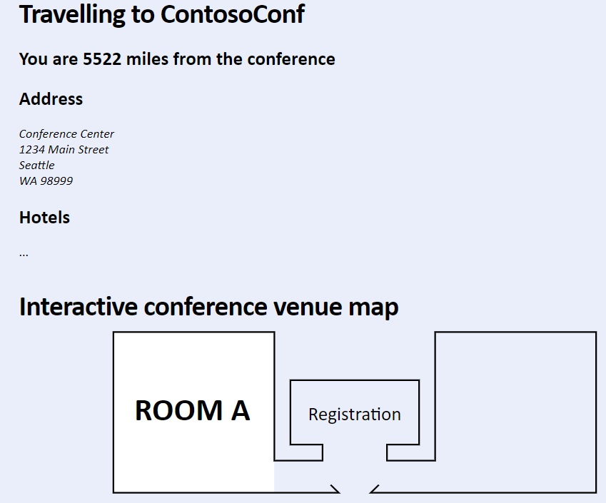
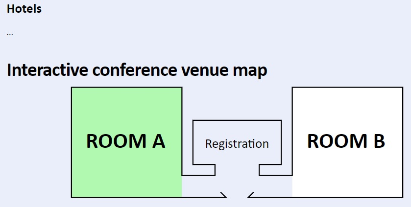
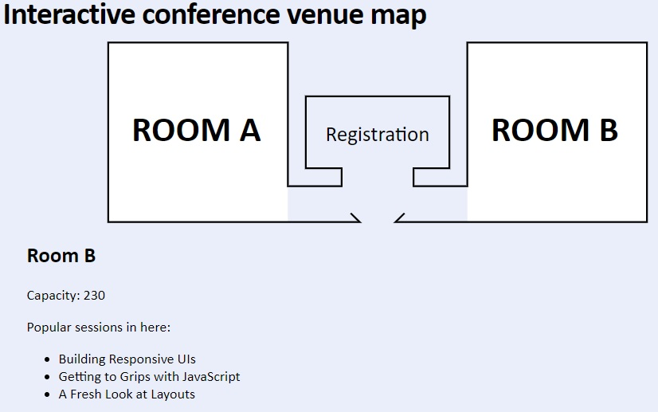

## Modulo 11: Creando Gráficos avanzados

1. **Nombres y apellidos:** José René Fuentes
2. **Fecha:** Jueves 1 de octubre de 2020.
3. **Resumen del Ejercicio:**
    * En este laboratorio haremos dos ejericios;
        * Mostrar la técnicas usadas css en conjunto con svg para la interacción en una aplicación web.
        * Haremos visualizar la información sobre las aulas de la conferencia por medio de css y usando gráficos svg.
        * Crear insignia de honor para los participantes.

    
4. **Dificultad o problemas presentados y como se resolvieron:** Ninguna presentada.

Fecha de entrega: Jueves 1 de octubre de 2020.

>**Objetivos**: 
* Mostrar la técnicas usadas css en conjunto con svg para la interacción en una aplicación web.
* Haremos visualizar la información sobre las aulas de la conferencia por medio de css y usando gráficos svg.

# Lab: Creando Gráficos avanzados

## Lab Configuración

### Pasos de preparación 

Asegúrate de que has clonado el directorio 20480C de GitHub (**https://github.com/MicrosoftLearning/20480-Programming-in-HTML5-with-JavaScript-and-CSS3/tree/master/Allfiles**). Contiene los segmentos de código para los laboratorios y demostraciones de este curso.


## Ejercicio 1: Crear un mapa interactivo del lugar utilizando SVG

### Tarea 1: Revisar el marcado HTML incompleto para el mapa del lugar

1.	Abrir Microsoft Visual Studio 2017.
2.	En Microsoft Visual Studio, en el menú **Archivo**, apunta a **Abrir**, y luego selecciona **Proyecto/Solución**.
3.	En el cuadro de diálogo **Abrir Proyecto**, apunta a **[Repository Root]\Allfiles\Mod11\Labfiles\Starter\Exercise 1**, haz clic en **ContosoConf.sln**, y luego en **Abrir**.
>**Nota**: Si aparece el cuadro de diálogo **Aviso de seguridad para ContosoConf**, desactive la casilla **Aviso para cada proyecto de esta solución** y luego haga clic en **OK**.
4.	En **Solution Explorer**, expanda el nodo de proyecto **ContosoConf**, y luego haga doble clic en **location.htm**.
5.	Verifique que la página contiene el siguiente marcado HTML:
    ```html
        <svg viewBox="-1 -1 302 102" width="100%" height="230">
            <!-- Room A -->
            <g id="room-a" class="room">
                <rect fill="#fff" x="0" y="0" width="100" height="100"/>
                <text x="13" y="55" font-weight="bold" font-size="20">ROOM A</text>
            </g>
            <!-- Room B -->

            <!-- The outline of the building -->
            <polyline fill="none" stroke="#000" points="135,95 140,100 0,100 0,0 100,0 100, 80 130,80 130,70 110,70 110,30 190,30 190,70 170,70 170,80 200,80 200,0 300,0 300,100 160,100 165,95"/>
            <text x="150" y="55" font-size="12" style="text-anchor:middle">Registration</text>
        </svg>
    ```
6.	Verifique que el HTML contiene el siguiente marcado:
    ``HTML??
        <script src="/scripts/pages/location-venue.js" type="text/javascript"></script>
    ```
7.	En el menú **Debug**, haga clic en **Iniciar sin depuración**.
8.	Haga clic en **Localización**.
9.	Si el mensaje **localhost quiere rastrear su ubicación** aparece, haga clic en **Permitir una vez**.
10.	En el cuadro de diálogo **Habilitar servicios de localización**, haz clic en **Sí**.
11.	11. Si aparece el mensaje **Configuración de la Intranet desactivada por defecto**, haga clic en **No mostrar este mensaje de nuevo**.
12.	Desplácese hacia abajo y vea el mapa del lugar de celebración.



13.	Cerrar el navegador.

### Tarea 2: Completar el mapa de la sede del SVG

1.	En Visual Studio, en **location.htm**, se encuentra el siguiente comentario:

    ```html
        <!-- Room B -->
    ```
	
2.	Después del comentario, agregue el siguiente marcado:
    ```css
        <g id="room-b" class="room">
            <rect fill="#fff" x="200" y="0" width="100" height="100"/>
            <text x="213" y="55" font-weight="bold" font-size="20">ROOM B</text>
        </g>
    ```
#### Tarea 3: Añadir interactividad al mapa del recinto

1.	En **Solution Explorer**, haga doble clic en **location.htm**.
2.	Busque el siguiente marcado HTML:
    ```html
        <div id="room-a-info" style="display: none">
          <h2>Room A</h2>
          <p>Capacity: 250</p>
          <p>Popular sessions in here:</p>
          <ul>
            <li>Diving in at the deep end with Canvas</li>
            <li>Real-world Applications of HTML5 APIs</li>
            <li>Transforms and Animations</li>
          </ul>
        </div>
        <div id="room-b-info" style="display: none">
          <h2>Room B</h2>
          <p>Capacity: 230</p>
          <p>Popular sessions in here:</p>
          <ul>
            <li>Building Responsive UIs</li>
            <li>Getting to Grips with JavaScript</li>
            <li>A Fresh Look at Layouts</li>
          </ul>
        </div>
    ```
3.	En **Solution Explorer**, expandir la carpeta **styles**, expandir la carpeta **pages**, y luego hacer doble clic en **location.css**.
4.	Al final del archivo, agregue el siguiente CSS:
    ```css
        .room:hover rect {
            fill: #b1f8b0;
        }
    ```

5.	En **Solution Explorer**, expande la carpeta **scripts**, expande la carpeta **pages**, y luego haz doble clic en **location-venue.js**.
6.	Encuentra el siguiente comentario:

   ```
        // TODO: Get the room elements in the svg element.
    ```

7.	Después de este comentario, añade el siguiente código JavaScript:

    ```javascript
        const rooms = document.querySelectorAll(".room");
    ```

8.	Encuentra el comentario que comienza con el siguiente texto:

    ```javascript
        // TODO: Add a click event listener for each room element.
    ```

9.	Después de la segunda línea de este comentario, añada el siguiente código JavaScript:

    ```javascript
        for (let i = 0; i < rooms.length; i++) {
            const room = rooms[i];
            room.addEventListener("click", function () {
                showRoomInfo(this.id);
            });
        }
    ```

## Tarea 4: Probar la aplicación

1.	En **Solution Explorer**, haga doble clic en **location.htm**.
2.	En el menú **Debug**, haga clic en **Iniciar sin depuración**.
3.	En el navegador, si aparece el mensaje **localhost quiere rastrear tu ubicación física**, haz clic en **Allow once**.
4.	Desplácese hacia abajo hasta el mapa del lugar y coloque el puntero del ratón sobre **Sala A**.
5.	Verifica que el mapa del lugar se ve similar a la siguiente imagen:




6.	Haga clic en **Sala B**, verifique que la información de la sala se muestra y que es similar a la siguiente imagen:

-   Resultado gráfico del paso anterior:


7.	Cerrar el navegador.

>**Resultados**: Después de completar este ejercicio, tendrás un mapa del lugar que muestra información extra cuando se hace clic.

### Ejercicio 2: Crear un distintivo de orador usando el Canvas API

#### Tarea 1: Crear el elemento de lona

1.	En ContosoConf - Microsoft Visual Studio, en el menú **Archivo**, apunte a **Abrir**, y luego seleccione **Proyecto/Solución**.
2.	2. En el cuadro de diálogo **Abrir Proyecto**, apunta a **[Repository Root]\Allfiles\Mod11\Labfiles\Starter\Exercise 2**, apunta a **ContosoConf.sln**, y luego haz clic en **Abrir**.
>**Nota**: Si aparece el cuadro de diálogo **Aviso de seguridad para ContosoConf**, desactive la casilla **Aviso para cada proyecto de esta solución** y luego haga clic en **OK**.
3.	En **Solution Explorer**, expanda el proyecto **ContosoConf**, y luego haga doble clic en **speaker-badge.htm**.
4.	Encuentra el siguiente comentario:
    ```html
         <!-- TODO: Add canvas here -->
    ```
5.	Después de este comentario, agregue el siguiente marcado HTML:
    ```html
        <canvas
            width="500"
            height="200"
            style="border: 1px solid "#888"
            data-speaker-id="234724"
            data-speaker-name="Mark Hanson">
        </canvas>
    ```

#### Tarea 2: Dibujar los detalles para la placa

1.	En **Solution Explorer**, expande la carpeta **scripts**, expande la carpeta **pages**, y luego haz doble clic en **speakerbadgePage.js**.
2.	2. Verifica que el archivo contiene el siguiente código JavaScript:
    ```javascript
        this.canvas = element.querySelector("canvas");
    ```
3.	Encuentra el siguiente comentario:

    ```javascript
        // TODO: Get the canvas's (this.canvas) context and assign to this.context
    ```
4.	Después de este comentario, añade el siguiente código JavaScript:
    ```javascript
        this.context = this.canvas.getContext("2d");
    ```
5.	Encuentra el comentario que comienza con la siguiente línea:
    ```javascript
               // TODO: Draw the following by calling the helper methods of `this`
    ```
6.	Después de la última línea de este comentario, añade el siguiente código JavaScript:
    ```javascript
        this.drawBackground();
        this.drawTopText();
        this.drawSpeakerName();
        if (image) {
            this.drawSpeakerImage(image);
        } else {
            this.drawImagePlaceholder();
        }
        this.drawBarCode(this.speakerId);
    ```
7.	Encuentra el siguiente comentario:
    ```javascript
               // TODO: Fill the canvas with a white rectangle
    ```
8.	Después de este comentario, añade el siguiente código JavaScript:
    ```javascript
        this.context.fillStyle = "white";
        this.context.fillRect(0, 0, this.canvas.width, this.canvas.height);
    ```
9. Encuentra el comentario que comienza con la siguiente línea:
    ```javascript
          // TODO: Draw the image on the canvas
    ```
10. Después de la última línea de este comentario, añade el siguiente código JavaScript:
    ```javascript
        const size = Math.min(image.width, image.height);
        const sourceX = image.width / 2 - size / 2;
        const sourceY = image.height / 2 - size / 2;
        this.context.drawImage(image, sourceX, sourceY, size, size, 20, 20, 160, 160);
    ```
11. Encuentra el comentario que comienza con la siguiente línea:
    ```javascript
        // TODO: Draw this.speakerName on the canvas
    ```
12. Después de la última línea de este comentario, añade el siguiente código JavaScript:
    ```javascript
        this.context.font = "40px sans-serif";
        this.context.fillStyle = "black";
        this.context.textBaseline = "top";
        this.context.textAlign = "left";
        this.context.fillText(this.speakerName, 200, 60);
    ```


#### Tarea 3: Probar la aplicación

1.	En **Solution Explorer**, haga doble clic en **speaker-badge.htm**.
2.	En el menú **Debug**, haga clic en **Iniciar sin depuración**.
3.	3. En la barra de tareas, haz clic en **Explorador de archivos**, y luego busca la carpeta **[Repository Root]\Allfiles\Mod11\Labfiles\Resources**.
4.	Desde el Explorador de Archivos, arrastra **mark-hanson.jpg** a la insignia del altavoz en el navegador.
5.	5. Verifica que la placa del altavoz se ve similar a la siguiente imagen:

    -   Resultado gráfico del paso anterior antes de arrastrar la imagen:


    -   Resultado gráfico del paso anterior despùes de arrastrar la imagen:


6.	Cerrar el navegador.
7.  Cierre todas las ventanas abiertas.

>**Resultados**: Después de completar este ejercicio, tendrás una página de Insignia de Orador que permite a un orador de la conferencia crear su insignia.


