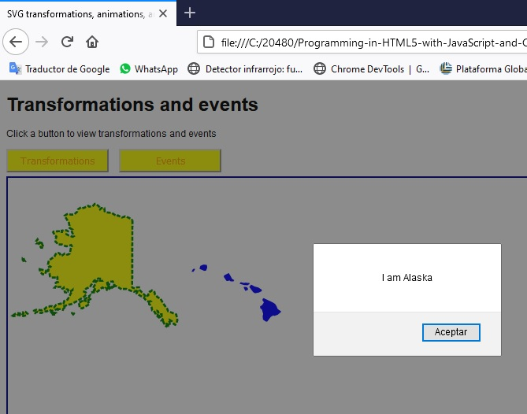
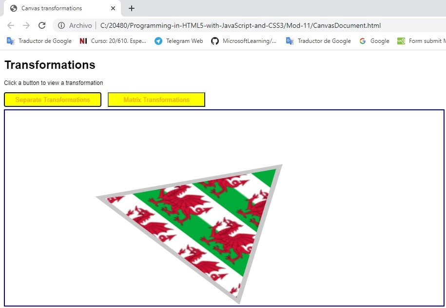
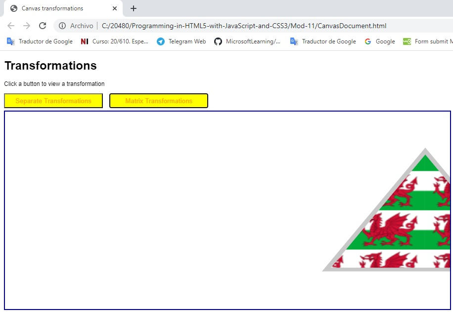

## Modulo 11: Creando Gráficos Avanzados

1. **Nombres y apellidos:** José René Fuentes
2. **Fecha:** Jueves 1 de octubre de 2020.
3. **Resumen del Ejercicio:**
    * En este laboratorio hacemos uso de las etiqueta "svg" para la creacion de gráficos en páginas html. Pintamos diferentes formas y hacemos uso de propiedades como eventos para transformar, trasladar, rotar y obtener efectos varios.

    
4. **Dificultad o problemas presentados y como se resolvieron:** Ninguna presentada.

Fecha de entrega: Martes 29 de septiembre de 2020

>**Objetivos**: 
* Implementar la etiqueta "svg" para la creacion de gráficos en páginas html. Pintamos diferentes formas y hacemos uso de propiedades como eventos para transformar, trasladar, rotar y obtener efectos varios.


# Lección 1: Creación de gráficos interactivos mediante SVG

## Demostración: uso de transformaciones y eventos de gráficos vectoriales escalables (SVG)

### Pasos de preparación

Dondequiera que la ruta de un archivo comience con *[Raíz del repositorio]*, reemplácela con la ruta absoluta de la carpeta en la que reside el repositorio 20480. Por ejemplo, si clonaste o extrajiste el repositorio 20480 a to**C:\Users\John Doe\Downloads\20480**, cambiar la ruta de:**[Repository Root]\AllFiles\20480C\Mod01** a**C:\Users\John Doe\Downloads\20480\AllFiles\20480C\Mod01**.

1. Asegúrate de que has clonado el directorio 20480C de GitHub (**https://github.com/MicrosoftLearning/20480-Programming-in-HTML5-with-JavaScript-and-CSS3/tree/master/Allfiles**). Contiene los segmentos de código para los laboratorios y demostraciones de este curso.
2. Antes de empezar este ejercicio, asegúrate de que has desactivado el caché en el navegador. Para ello:
    - Abrir el navegador.
    - Presiona F12.
    - Haz clic en la pestaña **Red**.
    - Haz clic en **Siempre actualizar desde el servidor**.


## Pasos de demostración

## Transformar los elementos del SVG

1.	En el menú de **Inicio**, haga clic en el azulejo **Escritorio**.
2.	En la barra de tareas, haz clic en **Borde de Microsoft**.
3.	En el navegador, abre el archivo **[Repository Root]\Allfiles\Mod11\Democode\SvgDocument.html**.
4.	Si aparece un cuadro de mensaje preguntando si quieres permitir el contenido bloqueado, haz clic en **Permitir contenido bloqueado**.
5.	En el navegador, haz clic en **Transformaciones**.
6. En el navegador, haga clic con el botón derecho del ratón en la página web, y luego seleccione **Ver fuente**.
7.	En la ventana de la fuente, localice el comentario **&lt;!-- Demuestre las transformaciones --&gt;**, y luego revise el elemento **&lt;svg&gt;**:
- Los elementos **&lt;transform&gt;** mueven el cuadrado por **200** unidades en los ejes X e Y, lo escalan por un factor de **0,5**, y luego lo rotan.
8.	Cierre la ventana de la fuente.

    - El resultado gráfico se muestra a continuación:



## Manejar eventos en elementos SVG

1.	En el navegador, haz clic en **Eventos**.
2.	Coloca el puntero del ratón sobre la forma roja en el lado izquierdo de la ventana. Verifica que el color de la forma cambie a amarillo con un borde verde punteado.
3.	Desplaza el puntero del ratón fuera de la forma. Verifica que el color de la forma vuelva a ser rojo sin contorno.
4.	Coloca el puntero del ratón sobre la forma azul en el lado derecho de la ventana. 5. Verifica que el color de la forma cambia a amarillo con un borde verde punteado.
5.	Desplace el puntero del ratón fuera de la forma. 6. Verifica que su color vuelve al azul sin contorno.
6.	Haga clic en la forma roja. 7. Verifica que aparece un cuadro de mensaje, indicando que la forma representa a Alaska. Cierre el cuadro de mensaje.
7.	Haga clic en la forma azul. 8. Verifique que aparezca un cuadro de mensaje, indicando que la forma representa a Hawai. 8. Cierre el cuadro de mensaje.
8.	Haga clic con el botón derecho del ratón en la ventana del navegador y seleccione **Ver fuente**.
9.	En la ventana de la fuente, localice el comentario **&lt;!-- Demuestre los eventos --&gt;**, y luego revise el elemento **&lt;svg&gt;**
- Los elementos **&lt;svg&gt;** contienen los datos que definen los dos mapas.
- Cada elemento **&lt;path&gt;** responde al evento **onmousedown** y utiliza el código JavaScript para mostrar el mensaje apropiado.
10.	En la ventana de la fuente, localice la regla **path:hover** de las Hojas de Estilo en Cascada (CSS) cerca de la parte superior del documento. Esta regla CSS define el estilo para todos los elementos **&lt;path&gt;** cuando el usuario coloca el puntero del ratón sobre ellos.
11.	Cierre la ventana de la fuente.
12.	Cierre el navegador.

    - El resultado gráfico se muestra a continuación:


>**Nota**: El documento HTML tiene dos botones que permiten demostrar las transformaciones y los eventos. Hay un elemento **&lt;svg;** separado para cada parte de la demostración. Cuando se hace clic en uno de los botones de la página, ésta utiliza el DOM para localizar el elemento **&lt;svg²;** apropiado para esa parte de la demostración.
Cuando se hace clic en **Transformaciones**, la página muestra dos rectángulos. El primer rectángulo no se transforma. El segundo rectángulo tiene tres transformaciones aplicadas: una traslación, una escala y una inclinación en la dirección X.
Al hacer clic en **Eventos**, la página web muestra dos formas **&lt;path**;** que representan a Alaska y Hawai. Para mostrar un cuadro de mensaje cuando el usuario hace clic en la forma, el evento **onmousedown** se maneja en cada forma. La página web también define una regla CSS que cambia el color de la forma cuando el usuario coloca el puntero del ratón sobre la forma.


# Lección 2: Dibujar gráficos usando el API del lienzo

## Demonstration: Realizar transformaciones usando el Canvas API

## Pasos de preparación

Asegúrate de que has clonado el directorio 20480C de GitHub (**https://github.com/MicrosoftLearning/20480-Programming-in-HTML5-with-JavaScript-and-CSS3/tree/master/Allfiles**). Contiene los segmentos de código para los laboratorios y demostraciones de este curso.

## Pasos de la demostración

## Realizar transformaciones simples


1.	En el menú de **Inicio**, haga clic en el azulejo **Escritorio**.
2.	En la barra de tareas, haz clic en **Borde de Microsoft**.
3.	En el navegador, abre el archivo **[Raíz del Repositorio]\AllFiles\Mod11-Democode\CanvasDocument.html**.
4.	Si aparece un cuadro de mensaje preguntando si quieres permitir el contenido bloqueado, haz clic en **Permitir contenido bloqueado**.
5.	En el navegador, haz clic en **Transformaciones separadas**.
6.	En el navegador, haga clic con el botón secundario en la página web y seleccione **Ver fuente**.
7.	En la ventana de la fuente, localiza la función **demoSeperateTransformations**, y luego revisa el código:
- La función **demoSeperateTransformations** utiliza la función **drawShape** para dibujar un triángulo con una imagen de la bandera galesa.
- Antes de llamar a la función **drawShape**, el código transforma el contexto. Mueve el lienzo hacia la derecha y hacia abajo por la mitad de la anchura y la altura del lienzo, luego escala el contexto por un valor diferente en las dimensiones X e Y, y luego rota el contexto por **pi/4** radianes.
- Cuando se llama a la función **drawShape**, la imagen se transforma de acuerdo con los ajustes del contexto.

>**Nota**: Si el tiempo lo permite, comenta cada una de las transformaciones y ejecuta el código de nuevo. Luego, descomente cada transformación una por una, para que los estudiantes puedan ver los efectos de cada una.

### Realizar la transformación de la matriz


1.	En el navegador, haga clic en **Transformaciones de la matriz**.
2.	En la ventana de la fuente, localiza la función **demoMatrixTransformaciones**, y luego revisa el código:
- Esta función es similar a la anterior en el sentido de que transforma el contexto, y luego llama a la función **drawShape** para mostrar la imagen.
- La diferencia es que esta función utiliza la función **transformar** para realizar una transformación de matriz, y escala, sesga y traduce el contexto en una sola llamada a la función.
3.	Cierre la ventana de la fuente.
4.	Cerrar el navegador.

    - El resultado gráfico se muestra a continuación:


>**Nota**: Al hacer clic en **Transformaciones Separadas**, la página web invoca la función **demoTransformaciones Separadas()**. Esta función invoca funciones de transformación separadas en el contexto bidimensional. Explica estas funciones. Señale también las llamadas a las funciones **save()** y **restore()**, que guardan el contexto inicial, y luego lo restauran al final de las operaciones de dibujo.
Al hacer clic en **Matrix Transformations**, la página web invoca la función **demoMatrixTransformations()**. Esta función realiza una transformación relativa compuesta en el sistema de coordenadas utilizando la función **transform()**. El código también contiene una llamada comentada a **setTransform()** para mostrar cómo realizar una transformación absoluta. Explica la diferencia entre **transform()** y **setTransform()**.

    - El resultado gráfico se muestra a continuación:


### Demostración: Creación de gráficos avanzados

#### Pasos de preparación

Asegúrate de que has clonado el directorio 20480C de GitHub (**https://github.com/MicrosoftLearning/20480-Programming-in-HTML5-with-JavaScript-and-CSS3/tree/master/Allfiles**). Contiene los segmentos de código para los laboratorios y demostraciones de este curso.

#### Pasos de la demostración

1.	Lea el escenario del laboratorio a los estudiantes y señale que deben leer cada escenario antes de intentar el laboratorio para un módulo.
2.	Señale a los estudiantes que el escenario de cada ejercicio es una lectura esencial y contiene una descripción de lo que lograrán en el ejercicio.
3. En Microsoft Visual Studio, en el menú **Archivo** Apunte a **Abrir**, y luego haga clic en **Proyecto/Solución**.
4.	Navegue hasta la solución **[Repository Root]\Allfiles\Mod11\Labfiles\Solution\Exercise 2**, and then open the **ContosoConf.sln**


>**Nota**: Si **Aviso de seguridad para ContosoConf** aparece el cuadro de diálogo claro **Pregúntame para cada proyecto de esta solución** y luego haz clic en **OK**.

5.	En el menú **Debug**, haga clic en **Iniciar sin depuración**.

>**Nota**: Si aparece el mensaje **Configuración de la Intranet desactivada por defecto**, haga clic en **No mostrar este mensaje** de nuevo.

6.	En el navegador, en la barra de navegación, haga clic en **Localización**.
7.	En el mensaje **localhost quiere rastrear tu ubicación física**, haz clic en **Permitir una vez**.
8.	Desplázate hacia abajo y señala el mapa de ubicación. Mencione que los estudiantes implementarán una parte de este mapa en el Ejercicio 1.
9.	En el mapa de ubicación, haga clic en **Sala B**. 10. Señale que los estudiantes escribirán el código para captar el evento **clic** del elemento SVG que define el mapa para la sala B y usarán este evento para mostrar las sesiones que se están llevando a cabo en esa sala.
10.	Cierre el el navegador.
11.	En **Solution Explorer**, expanda el proyecto **ContosoConf**, y luego haga doble clic en **location.htm**.
12.	En la ventana **Editor de código**, encuentre el elemento **&lt;svg viewBox ...**, y luego explique que los estudiantes implementarán este elemento para dibujar el mapa de la sala B.
13.	En **Solution Explorer**, expanda la carpeta **scripts**, expanda la carpeta **pages**, y luego haga doble clic en **location-venue.js**.
14.	En la ventana **Editorial de códigos**, explique que el código de este archivo maneja el evento de clic para el elemento **&lt;svg&gt;**, y luego muestra la lista de sesiones que se ejecutan en la sala en la que el usuario hizo clic.
15.	En **Solution Explorer**, haga doble clic en **speaker-badge.htm**.
16.	En la ventana **Editorial de códigos**, encuentre la siguiente sección:

```html
        <section class="page-section badge">
            <div class="container">
                <h1>Create your speaker badge for ContosoConf</h1>
                <!-- TODO: Add canvas here -->
                <canvas width="500" height="200" style="border: 1px solid #888" data-speaker-id="234724" data-speaker-name="Mark Hanson">
                </canvas>
            </div>
        </section>
   ```

17.	Explique que en el Ejercicio 2, los alumnos crearán el elemento **&lt;img&gt;**


