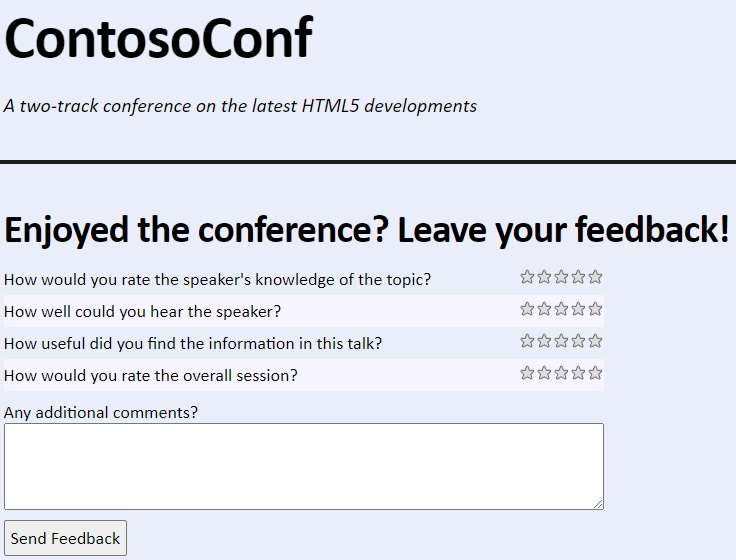
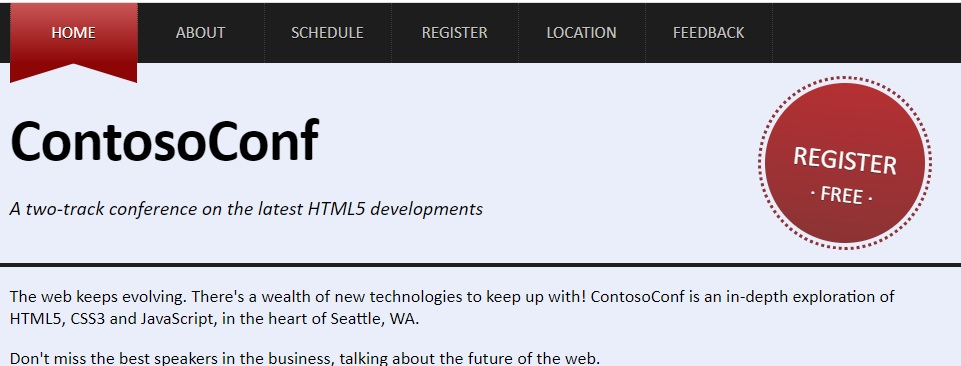
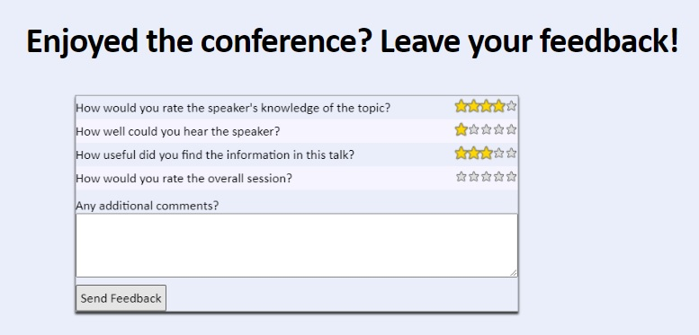

## Modulo 12: Animando la interfase de usuario

1. **Nombres y apellidos:** José René Fuentes
2. **Fecha:** Jueves 1 de octubre de 2020.
3. **Resumen del Ejercicio:**
    * En este laboratorio haremos dos ejericios;
        * En el primer ejericio hacemos uso de técnicas para hacer rotar una imagen y al mismo tiemo manipular su tamaño.
        * En un segunto ejercicio se manipula la animación para la retroalimentación de un formulario con efectos de envío tipo vuelo.

    
4. **Dificultad o problemas presentados y como se resolvieron:** Ninguna presentada.

Fecha de entrega: Jueves 1 de octubre de 2020.

>**Objetivos**: 
* En este laboratorio tenemos como objetivo aprender a hacer animaciones y manipulación de gráfico en cuanto tamaño, rotación y otros efectos por medio de canvas, css y otros.

# Lab: Animando la interfase de usuario

## Configuración del Lab

### Pasos de preparación 

Asegúrate de que has clonado el directorio 20480C de GitHub (**https://github.com/MicrosoftLearning/20480-Programming-in-HTML5-with-JavaScript-and-CSS3/tree/master/Allfiles**). Contiene los segmentos de código para los laboratorios y demostraciones de este curso.


## Ejercicio 1: Aplicación de las transiciones del CSS

### Tarea 1: Revisar la página de retroalimentación

1.	Abrir Microsoft Visual Studio 2017.
2.	En Microsoft Visual Studio, en el menú **Archivo**, apunta a **Abrir**, y luego selecciona **Proyecto/Solución**.
3.	En el cuadro de diálogo **Abrir Proyecto**, apunta a **[Repository Root]\Allfiles\Mod12\Labfiles\Starter\Exercise 1**, haz clic en **ContosoConf.sln**, y luego en **Abrir**.
>**Nota**: Si aparece el cuadro de diálogo **Aviso de seguridad para ContosoConf**, desactive la casilla **Aviso para cada proyecto de esta solución** y luego haga clic en **OK**.
4.	En **Solution Explorer**, expanda el nodo de proyecto **ContosoConf**, y luego haga doble clic en **feedback.htm**.
5.	Verifique que esta página contiene el siguiente marcado HTML:
    ```html
        <form method="post" action="/send-feedback">
            <div class="field feedback-question">
                <label>How would you rate the speaker's knowledge of the topic?</label>
                <input name="question" type="range" min="1" max="5"/>
            </div>
            <div class="field feedback-question">
                <label>How well could you hear the speaker?</label>
                <input name="question" type="range" min="1" max="5"/>
            </div>
            <div class="field feedback-question">
                <label>How useful did you find the information in this talk?</label>
                <input name="question" type="range" min="1" max="5"/>
            </div>
            <div class="field feedback-question">
                <label>How would you rate the overall session?</label>
                <input name="question" type="range" min="1" max="5"/>
            </div>
            <div class="field comments">
                <label>Any additional comments?</label>
                <textarea name="comments" cols="30" rows="5"></textarea>
            </div>
            <div class="field actions">
                <button type="submit">Send Feedback</button>
            </div>
        </form>
    ```
6.	Verifique que el HTML contiene lo siguiente:
    ```HTML
        <link href="/styles/pages/feedback.css" rel="stylesheet" type="text/css" />
    ```
7.	Verifique que el HTML contiene lo siguiente:
    ```HTML
        <script src="/scripts/pages/feedback.js" type="text/javascript"></script>
    ```
8.	En el menú **Debug**, haga clic en **Iniciar sin depuración**.
9.	En el navegador, si aparece el mensaje **Configuración de la Intranet desactivada por defecto**, haga clic en **No mostrar este mensaje de nuevo**.
10. Verifique que el formulario **Feedback** se muestra y tiene iconos de cinco estrellas junto a cada pregunta.
11. Cierre el navegador.
    - El resultado gráfico del paso anterior se muestra a continuación:
    


### Tarea 2: Animar las estrellas en el formulario de Feedback

1.	En **Solution Explorer**, expande la carpeta **styles**, expande la carpeta **pages**, y luego haz doble clic en **feedback.css**.
2.	Actualice la siguiente regla CSS, y añada el código que se muestra a continuación:
    ```css
        .star:hover,
        .star.hover {
            background-position: 0 -15px;

            /* TODO: Scale transform by 1.3 */
            **transform: scale(1.3, 1.3);**

            /* TODO: Transition the transform property over 0.5 seconds */
            **transition: transform .5s;**
        }
    ```
3.	Actualice la siguiente regla CSS, y añada el código que se muestra a continuación:
    ```css
        .star {
            background-image: url(../images/stars.png);
            width: 15px;
            height: 15px;
            cursor: pointer;
            margin: .1rem;
            -ms-flex: 0 0 15px;
            flex: 0 0 15px;

            /* TODO: Transition the transform property over 0.5 seconds */
            **transition: transform .5s;**
        }
    ```
4.	Actualice la siguiente regla CSS y añada el código que se muestra a continuación:
    ```css
        .star.selected {
            background-position: 0 -30px;

            /* TODO: Scale transform by 1.3 */
            **transform: scale(1.3, 1.3);**
        }
    ```

### Tarea 3: Animar el enlace del Registro en la página de inicio

1.	En **Solution Explorer**, en la carpeta **styles**, haga doble clic en **header.css**.
2.	Actualice la siguiente regla CSS y añada el código que se muestra a continuación:
    ```css
        header.page-header .register:hover {
            color: #fff;
            background: -ms-linear-gradient(#bc0101, #8c0909);
            background: linear-gradient(#bc0101, #8c0909);

            /* TODO: rotate to 16 degrees and scale by 1.1 */
            **transform: rotate(16deg) scale(1.1, 1.1);**

            /* TODO: Transition the transform property over 1 second */
            **transition: transform 1s;**
        }
    ```

3.	Actualice la siguiente regla CSS, y añada el código que se muestra a continuación:
    ```css
        header.page-header .register {
            display: block;
            position: absolute;
            top: 20px;
            right: 35px;
            width: 160px;
            height: 100px;
            padding-top: 60px;
            opacity: 0.8;
            font-size: 2.7rem;
            color: #fff;
            text-align: center;
            text-decoration: none;
            text-transform: uppercase;
            -ms-border-radius: 100%;
            border-radius: 100%;
            -ms-text-shadow: 0 1px 0 #000;
            text-shadow: 0 1px 0 #000;
            -ms-transform: rotate(6deg);
            transform: rotate(6deg);
            background: -ms-linear-gradient(#a80000, #740404);
            background: linear-gradient(#a80000, #740404);

            /* TODO: Transition the transform property over 1 second */
            **transition: transform 1s;**
        }
    ```

### Tarea 4: Probar la aplicación

1.	En **Solution Explorer**, haga doble clic en **feedback.htm**.
2.	En el menú **Debug**, haga clic en **Iniciar sin depuración**.
3.	En el navegador, colocar el puntero del ratón sobre la tercera estrella de **¿Cómo calificarías el conocimiento del orador sobre el tema?
4.	Verifique que las tres primeras estrellas se animen a un tamaño mayor.
5. Haga clic en la tercera estrella, y luego aleje el puntero del ratón de las estrellas.
6.	Verifica que las tres primeras estrellas siguen siendo más grandes.
7.	Haz clic en **home**.
8.	Coloca el puntero del ratón sobre el enlace **Registro gratuito**, y luego verifica que gira y se agranda.
9.	Cierra el navegador.

    - El resultado gráfico del paso anterior se muestra a continuación antes del efecto deseado:
    

    - El resultado gráfico del paso anterior se muestra a continuación después del efecto deseado:
    

>**Resultados**: Después de completar este ejercicio, el enlace **Registro** girará y las estrellas de retroalimentación se animarán cuando se coloque el puntero del ratón sobre ellas.

## Ejercicio 2: Aplicar animaciones de fotogramas clave

### Tarea 1: Definir una animación de fotogramas clave

1.	En Microsoft Visual Studio, en el menú **Archivo**, apunta a **Abrir**, y luego selecciona **Proyecto/Solución**.
2.	En el cuadro de diálogo **Abrir Proyecto**, apunta a **[Repository Root]\Allfiles\Mod12\Labfiles\Starter\Exercise 2**, apunta a **ContosoCon.sln**, y luego haz clic en **Abrir**.
>**Nota**: Si aparece el cuadro de diálogo **Aviso de seguridad para ContosoConf**, desactive la casilla **Aviso para cada proyecto de esta solución** y luego haga clic en **OK**.
3.	En **Solution Explorer**, expanda el proyecto **ContosoConf**, expanda la carpeta **styles**, expanda la carpeta **pages**, y luego haga doble clic en **feedback.css**.
4.	Encuentra el siguiente comentario:
    ```css
        /* TODO: Add key frame animation named "send"
                 At 0% scale(1)
                 At 50% scale(.8)
                 At 100% translate(0, -1000px)
        */
    ```
5.	Después de este comentario, agregue el siguiente código CSS:
    ```css
        @keyframes send {
            0% {
                transform: scale(1);
            }
            50% {
                transform: scale(.8);
            }
            100% {
                transform: translate(0, -1000px);
            }
        }
    ```
7.	Encuentra el siguiente comentario: 
    ```css
        /* TODO: Use the "send" animation
                 iteration-count: 1
                 fill-mode: forwards
        */
    ```
8.	Después de este comentario, agregue el siguiente conjunto de propiedades y valores:
    ```css
        animation-name: send;
        animation-duration: 1s;
        animation-iteration-count: 1;
        animation-fill-mode: forwards;
    ```


### Tarea 2: Activar la animación

1.	En **Solution Explorer**, expande la carpeta **scripts**, expande la carpeta **pages**, y luego haz doble clic en **feedback.js**.
2.	Encuentra el siguiente comentario:
    ```javascript
        // TODO: Trigger the animation by adding the "sending" CSS class to the form
    ```
3.	Después de este comentario, añade el siguiente código JavaScript:
    ```javascript
        form.classList.add("sending");
    ```
4.	Encuentra el siguiente comentario: 
    ```javascript
        // TODO: Add listener for the animationend event,
        //       calling the animationEnded function.
    ```
5.	Después de este comentario, añade el siguiente código JavaScript:
    ```javascript
        form.addEventListener("animationend", animationEnded, false);
    ```

### Tarea 3: Probar la aplicación

1.	En **Solution Explorer**, haga doble clic en **feedback.htm**.
2.	En el menú **Debug**, haga clic en **Iniciar sin depuración**.
3.	En el navegador, haz clic en **Enviar feedback**.
4.	Verifica que el formulario se encoge y sale volando de la parte superior de la página.
5.	Cierre el navegador.
6.  Cierre todas las ventanas abiertas.

    - El resultado gráfico del paso anterior se muestra a continuación después del efecto deseado:
    

>**Resultados**: Después de completar este ejercicio, el envío del formulario de retroalimentación de la conferencia activará una animación que hará que el formulario salga volando de la página.


