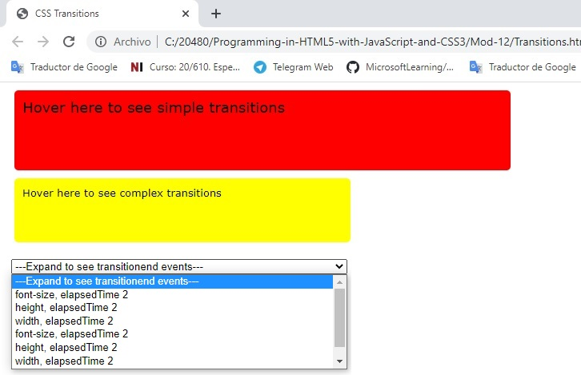
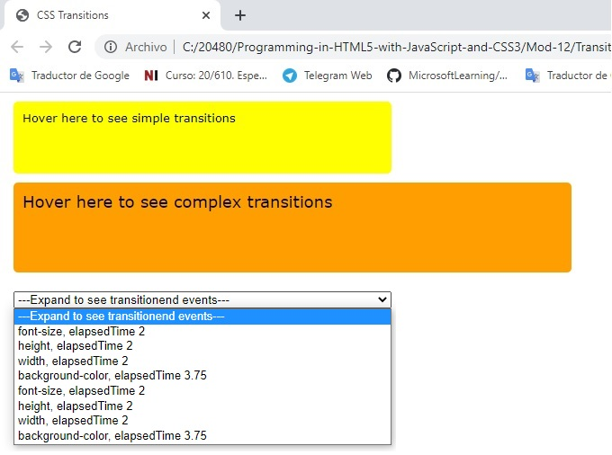
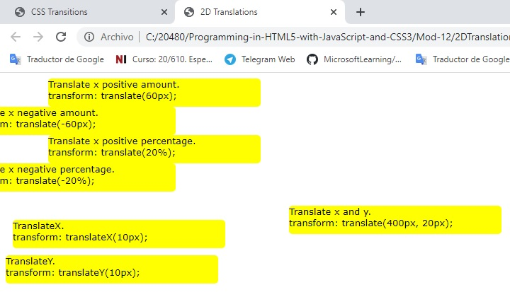
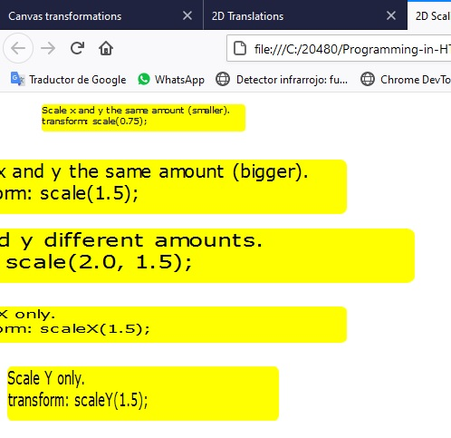
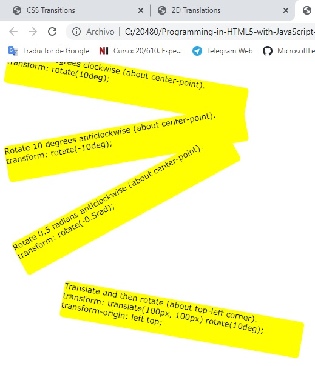
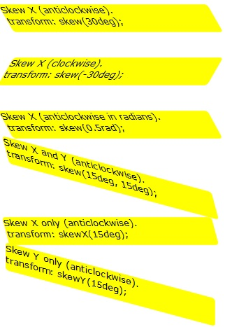
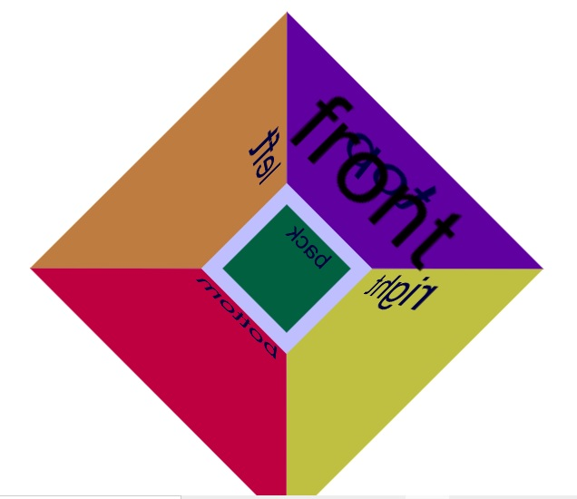
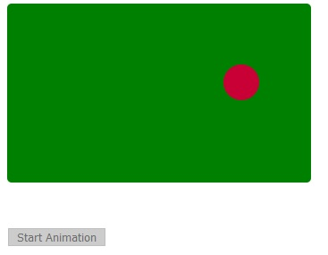

## Modulo 12: Animando la interfase de usuario

1. **Nombres y apellidos:** José René Fuentes
2. **Fecha:** Jueves 1 de octubre de 2020.
3. **Resumen del Ejercicio:**
    * En este laboratorio haremos tres lecciones que nos ayudan a entender como podemos transformar, rotar, trasladar, modificar y animar objetos en páginas web html.

    
4. **Dificultad o problemas presentados y como se resolvieron:** Ninguna presentada.

Fecha de entrega: Jueves 1 de octubre de 2020.

>**Objetivos**: 
* En este laboratorio tenemos como objetivo usar técnicas y herramientas que nos ayuden a rotar, transformar, trasladar, animar, escalar y más gráficos creado por nosotros en una aplicación web.

# Lección 1: Aplicación de las transiciones del CSS

## Demonstration: Uso de las transiciones del CSS

### Pasos de preparación 

Asegúrate de que has clonado el directorio 20480C de GitHub (**https://github.com/MicrosoftLearning/20480-Programming-in-HTML5-with-JavaScript-and-CSS3/tree/master/Allfiles**). Contiene los segmentos de código para los laboratorios y demostraciones de este curso.

### Pasos de la demostración

### Aplicar las transiciones CSS a los elementos HTML

1.	En la pantalla de inicio, haga clic en el mosaico **Escritorio**.
2.	En la barra de tareas de Windows, haga clic en **Borde de Microsoft**.
3.	En Microsoft Edge, abre el archivo **[Repository Root]\Allfiles\Mod12\Democode\Transitions.html**. 
4.	Si aparece un cuadro de mensaje preguntando si quieres permitir el contenido bloqueado, haz clic en **Permitir contenido bloqueado**.
5.	Coloca el puntero del ratón sobre el rectángulo superior de la página web. Verifique que las siguientes transiciones se aplican simultáneamente al rectángulo:
- El ancho, el alto y el tamaño de la fuente aumentan en un período de dos segundos.
- El color de fondo pasa al rojo en un período de 3,75 segundos.

6.	Aleje el puntero del ratón del rectángulo superior. Verifique que el rectángulo vuelva a su apariencia original, en el mismo período de tiempo.
7.	Repita los dos pasos anteriores para el segundo rectángulo. 8. Verifica que se aplican las mismas animaciones.

- Haga clic con el botón derecho del ratón en la página de Microsoft Edge y luego haga clic en **Ver fuente**. Ten en cuenta que:
- La primera regla **div** define las propiedades CSS por defecto para todos los elementos **&lt;div&gt;**.
- La regla **div.simple** define una propiedad **transición** que se aplica a las transiciones en las propiedades CSS **ancho**, **altura**, **tamaño de fuente** y **color de fondo**.
- La regla **div.complex** define transiciones similares, pero utiliza propiedades **transición-propiedad**, **transición-duración**, **función de temporización de la transición** y **retraso de la transición** separadas.
- La regla **div:hover** define los valores finales de las propiedades CSS **ancho**, **altura**, **tamaño de fuente** y **color de fondo** cuando el usuario coloca el puntero del ratón sobre un **&lt;div&gt;**


#### Manejar el evento de transición

1.	En Microsoft Edge, amplíe el cuadro de lista desplegable. Compruebe que muestra mensajes para todas las transiciones que han finalizado. La lista incluye eventos para las transiciones originales cuando se coloca el puntero del mouse sobre un rectángulo, así como eventos para las transiciones inversas cuando se aleja el puntero del mouse de un rectángulo.
2.	Cambiar a la ventana de origen.
3.	En el código de JavaScript, note que:
- La función **onLoad()** configura los manejadores de eventos que llaman a la función **onTransitionend()** cuando el evento **transitionend** se eleva en todos los elementos **&lt;div&gt;**.
- La función **onTransitionend()** muestra información sobre el evento **transitionend**, utilizando las propiedades **propertyName** y **elapsedTime** del argumento del evento.
4.	Cierre la ventana de origen.
5.	Cierre Microsoft Edge.

# Lección 2: Elementos de transformación

## Demonstration: Realizando transformaciones 2D

### Pasos de preparación 

Asegúrate de que has clonado el directorio 20480C de GitHub (**https://github.com/MicrosoftLearning/20480-Programming-in-HTML5-with-JavaScript-and-CSS3/tree/master/Allfiles**). Contiene los segmentos de código para los laboratorios y demostraciones de este curso. 

## Pasos de demostración

## Realiza traducciones en 2D

1.	En la pantalla de inicio, haga clic en el mosaico **Escritorio**.
2.	En la barra de tareas de Windows, haga clic en **Borde de Microsoft**.
3.	En Microsoft Edge, abre el archivo **[Repository Root]\Allfiles\Mod12\Democode\2DTranslations.html**. 
4.	Si aparece un mensaje preguntando si quieres permitir el contenido bloqueado, haz clic en **Permitir contenido bloqueado**.
5.	Verifica que el navegador muestra una serie de rectángulos. Cada rectángulo demuestra cómo realizar una traducción 2D utilizando las funciones **translate()**, **translateX()**, o **translateY()**. El mensaje de texto dentro de cada rectángulo describe la transformación para ese rectángulo.
6.	Haga clic con el botón derecho del ratón en la ventana del navegador, y luego seleccione **Ver fuente**. 
7.	7En la ventana de la fuente, desplácese hacia abajo hasta la parte inferior del documento. Observe que el cuerpo del documento tiene una serie de elementos **&lt;div...** y cada elemento tiene una clase CSS distinta.
8.	Desplácese hacia arriba hasta la parte superior del código, y luego localice el elemento **&lt;style&gt;**. Las reglas de CSS implementan traducciones para todos los elementos **&lt;div&gt;**. Las reglas de CSS establecen la propiedad estándar **transformar** así como las siguientes propiedades específicas del vendedor:
- **-ms-transform**: Realiza una transformación en Microsoft Edge 9.
- **-webkit-transform**: Realiza una transformación en navegadores basados en Webkit como Chrome y Safari.
- **-moz-transform**: Realiza una transformación en los navegadores de Mozilla.
- **-o-transformar**: Realiza una transformación en los navegadores Opera.
9.	Cierre la ventana de la fuente.
    - El resultado gráfico se muestra a continuación:



### Realizar transformaciones de escala 2D

1.	En Microsoft Edge, abre el archivo **[Repository Root]\Allfiles\Mod12\Democode\2DScaling.html**. 
2.	Verifica que el navegador muestra una serie de rectángulos. Cada rectángulo demuestra cómo realizar una transformación de escala 2D usando las funciones **scale()**, **scaleX()**, o **scaleY()**. El mensaje de texto dentro de cada rectángulo describe la transformación para ese rectángulo. 
3.	Haga clic con el botón derecho del ratón en la ventana del navegador, y luego seleccione **Ver fuente**. 
4.	En la ventana de la fuente, desplácese hacia abajo hasta la parte inferior del documento. Tenga en cuenta que el cuerpo del documento tiene una serie de elementos **&lt;div...** y cada elemento tiene una clase CSS distinta.
5.	Desplácese hacia arriba hasta la parte superior del código y localice el elemento **&lt;style&gt;**. Las reglas de CSS implementan transformaciones de escalado para todos los elementos **&lt;div&gt;**. Las reglas de CSS establecen la propiedad estándar **transformación** así como las propiedades específicas del vendedor.
6.	Cierre la ventana de la fuente.

    - El resultado gráfico se muestra a continuación:


### Realizar rotaciones 2D

1.	En Microsoft Edge, abre el archivo **[Repository Root]\Allfiles\Mod12\Democode\2DRotations.html**. 
2.	Verifica que el navegador muestra una serie de rectángulos. Cada rectángulo demuestra cómo realizar una rotación 2D utilizando la función **rotate()**. El cuarto rectángulo también muestra cómo realizar múltiples transformaciones, y cómo cambiar el origen de la transformación a la parte superior izquierda del elemento objetivo.
3.	Haga clic con el botón derecho del ratón en la ventana del navegador y seleccione **Ver origen**. 
4.	En la ventana de la fuente, desplácese hacia abajo hasta la parte inferior del documento. Tenga en cuenta que el cuerpo del documento tiene una serie de elementos **&lt;div
5.	Desplácese hacia arriba hasta la parte superior del código, y luego localice el elemento **&lt;style&gt;**. Las reglas de CSS implementan rotaciones para todos los elementos **&lt;div&gt;**. Las reglas de CSS establecen la propiedad estándar **transformar** así como propiedades específicas de cada vendedor. La regla final de CSS muestra cómo aplicar múltiples transformaciones, específicamente una traslación seguida de una rotación. La regla final de CSS también muestra cómo establecer el cambio de origen de la transformación estableciendo la propiedad **transformación-origen** y sus propiedades equivalentes específicas del vendedor.
6.	Cierre la ventana de origen.

    - El resultado gráfico se muestra a continuación:


## Realizar transformaciones de sesgo en 2D

1.	En Microsoft Edge, abre el archivo **[Repository Root]\Allfiles\Mod12\Democode\2DSkewing.html**. 
2.	Verifica que el navegador muestra una serie de rectángulos. Cada rectángulo demuestra cómo realizar una operación de inclinación 2D usando las funciones **skew()**, **skewX()**, o **skewY()**. 
3.	Haga clic con el botón derecho del ratón en la ventana del navegador, y luego seleccione **Ver fuente**. 
4.	En la ventana de la fuente, desplácese hacia abajo hasta la parte inferior del documento. Tenga en cuenta que el cuerpo del documento tiene una serie de elementos **&lt;div
5.	Desplácese hacia arriba hasta la parte superior del código, y luego localice el elemento **&lt;style&gt;**. Las reglas de CSS implementan transformaciones sesgadas para todos los elementos **&lt;div&gt;**. 
6.	Cierre la ventana de la fuente.
7.	Cierre Microsoft Edge.

    - El resultado gráfico se muestra a continuación:



>**Nota**: Algunas de las transformaciones en esta demostración hacen que los elementos de destino aparezcan parcialmente fuera de la pantalla.

## Demostración: Realizando transformaciones 3D


### Pasos de preparación 

Asegúrate de que has clonado el directorio 20480C de GitHub (**https://github.com/MicrosoftLearning/20480-Programming-in-HTML5-with-JavaScript-and-CSS3/tree/master/Allfiles**). Contiene los segmentos de código para los laboratorios y demostraciones de este curso.

### Pasos de la demostración

### Realizar transformaciones 3D que incluyan transiciones

1.	En la pantalla de inicio, haga clic en el mosaico **Escritorio**.
2.	En la barra de tareas de Windows, haga clic en **Borde de Microsoft**.
3.	En Microsoft Edge, abre el archivo **[Repository Root]\Allfiles\Mod12\Democode\3DTransformations.html**. 
4.	Si aparece un cuadro de mensaje preguntando si quieres permitir el contenido bloqueado, haz clic en **Permitir contenido bloqueado**.
5.	Verifica que el navegador muestra un cubo. El cubo tiene seis caras, cada una de las cuales muestra texto y tiene un color de fondo diferente. La cara frontal es parcialmente transparente para que no oscurezca completamente las otras caras.
6.	Coloca el puntero del ratón sobre el cubo. Verifica que gira 90 grados en un período de cinco segundos. Luego, mueve el puntero del ratón fuera del cubo y verifica que el cubo gira suavemente para volver a su posición original.
7.	Haz clic con el botón derecho del ratón en la ventana del navegador, y luego selecciona **Ver fuente**. 
8.	En la ventana de la fuente, desplácese hacia abajo hasta la parte inferior del documento. Observe que el cuerpo del documento tiene seis elementos **&lt;div...** que representan las seis caras del cubo. Estos elementos **&lt;div&gt;** están contenidos en un elemento padre **&lt;div&gt;** llamado **contenedor**.
9.	Desplácese hacia arriba hasta la parte superior del código, y luego localice el elemento **&lt;style**. Tenga en cuenta las siguientes reglas de CSS:
- **#contenedor**: Especifica una perspectiva para todos los elementos hijos del elemento **contenedor**, y una transición de cinco segundos para las transformaciones.
- **#container:hover**: Especifica una rotación de 90 grados cuando el usuario coloca el puntero del ratón sobre el elemento **contenedor**.
- **#rightFace**: Transforma el elemento **rightFace** en el espacio 3D, de modo que aparezca en el lado derecho del cubo.
- **#leftFace**: Transforma el elemento **caraIzquierda** en el espacio tridimensional, para que aparezca en el lado izquierdo del cubo.
- **#topFace**: Transforma el elemento **topFace** en el espacio 3D, de modo que aparezca en la parte superior del cubo.
- **#bottomFace**: Transforma el elemento **bottomFace** en el espacio 3D, de modo que aparezca en la parte inferior del cubo.
- **#backFace**: Transforma el elemento **bottomFace** en el espacio 3D, de modo que aparezca en la parte posterior del cubo.
- **#frontFace**: Transforma el elemento **FrenteCara** en el espacio 3D, para que aparezca en la parte delantera del cubo. El color de fondo es parcialmente transparente.
10. Cierra la ventana de la fuente.
11. Cierra Microsoft Edge.

    - El resultado gráfico se muestra a continuación:



# Lección 3: Aplicación de animaciones de fotogramas clave CSS

## Demonstration: Implementación de animaciones de fotogramas clave

### Pasos de preparación 

Asegúrate de que has clonado el directorio 20480C de GitHub (**https://github.com/MicrosoftLearning/20480-Programming-in-HTML5-with-JavaScript-and-CSS3/tree/master/Allfiles**). Contiene los segmentos de código para los laboratorios y demostraciones de este curso. 

### Pasos de la demostración

### Definir y ejecutar una animación de fotogramas clave

1.	En la pantalla de inicio, haga clic en el mosaico **Escritorio**.
2.	En la barra de tareas de Windows, haga clic en **Borde de Microsoft**.
3.	En Microsoft Edge, abre el archivo **[Repository Root]\Allfiles\Mod12\Democode\KeyframeAnimations.html**. 
4.	Si aparece un cuadro de mensaje preguntando si quieres permitir el contenido bloqueado, haz clic en **Permitir contenido bloqueado**.
5.	Verifica que aparece un rectángulo verde en la página, con un pequeño círculo blanco en la esquina superior izquierda. El rectángulo verde representa una mesa de billar y el círculo blanco representa una pelota. También hay un botón que te permite iniciar la animación.
6.	Haz clic en **Iniciar animación**. 
- Después de tres segundos, la bola empieza a moverse en diagonal en la mesa de billar. El color de la mesa de billar también cambia a azul y aparece un mensaje en la parte inferior de la página para indicar la hora de inicio de la animación.
- A medida que avanza la animación, la bola parece rebotar en los lados de la mesa de billar y el color de la bola varía de blanco a amarillo, luego a naranja, luego a rojo y finalmente a púrpura.
- Cuando la bola llega a la esquina inferior derecha de la mesa de billar, aparece un mensaje para indicar que la primera iteración de la animación se ha completado. Comienza la siguiente iteración de la animación; esta iteración reproduce la animación en sentido inverso, de modo que la bola termina en su posición original con su color original. 
- Al final de la animación, la mesa de billar vuelve a ser verde y aparecen mensajes en la parte inferior de la página para indicar el tiempo transcurrido de la animación.
7.	Haga clic con el botón derecho del ratón en la ventana del navegador, y luego seleccione **Ver fuente**. 
8.	En la ventana de la fuente, desplácese hacia abajo hasta la parte inferior del documento. Observe que el cuerpo del documento tiene un elemento **&lt;div&gt;** denominado **mesa de billar** que representa la mesa de billar y una anidada **&lt;div&gt;** denominada **bola** que representa la bola en la mesa de billar. También hay un elemento **&lt;botón** para iniciar la animación, y un **&lt;div...** llamado **etiqueta de mensajes** donde se muestran los mensajes.
9.	Desplácese hacia arriba hasta la parte superior del archivo, y luego localice el elemento **&lt;style&gt;**. Tenga en cuenta las siguientes reglas de CSS:
- **#pooltable**: Especifica la apariencia inicial de la mesa de billar.
- **#pooltable.animate**: Especifica un color diferente para la mesa de billar durante una animación. Hay un código JavaScript en otra parte del documento que añade programáticamente la clase **animar** al elemento **pooltable** cuando una animación empieza a hacer que la mesa de billar se ponga azul durante una animación.
- **#ball**: Especifica la apariencia inicial de la bola.
- **@-ms-keyframes movimiento de la bola**: Define una animación de fotogramas clave llamada **movimiento de la bola**. El primer conjunto de reglas especifica el color original y la ubicación de la pelota. Cada conjunto de reglas subsiguiente simula la bola golpeando uno de los lados de la mesa de billar y hace que la bola cambie de color durante cada parte de su recorrido. El último conjunto de reglas especifica el color y la ubicación final de la bola.
- **#ball.animate**: Aplica la animación del fotograma clave **movimiento de la bola** a una bola cuando la bola tiene la clase **animada**. Hay código JavaScript en otra parte del documento que añade programáticamente la clase **animada** al elemento **bola** cuando el usuario hace clic en el botón **Iniciar animación** para activar la animación.
10. Localizar el elemento **&lt;script Fíjate en eso:
- La función **init()**, invocada tan pronto como la página se haya cargado, establece funciones de manejo de eventos para los eventos **MSAnimationStart**, **MSAnimationIteration**, y **MSAnimationEnd** en el elemento **ball**: 
- La función de manejo de eventos **MSAnimationStart** es llamada cuando una animación comienza en el elemento **bola**. La función añade la clase **animada** a la mesa de billar para que la mesa de billar se vuelva azul. La función también muestra un mensaje para indicar el momento en que se inició la animación.
- La función de manejo de eventos **MSAnimationIteration** se llama cuando cada iteración de la animación se ha completado. La función muestra un mensaje para indicar el tiempo transcurrido de la animación.
- La función de manejo de eventos **MSAnimationEnd** se llama cuando una animación termina en el elemento **bola**. La función habilita el botón, elimina la clase **animada** de la bola y de la mesa de billar, y luego muestra un mensaje para indicar el tiempo transcurrido de la animación.
- La función **startAnimation()** se invoca cuando el usuario hace clic en el botón **Iniciar animación**. La función deshabilita el botón y añade la clase **animación** a la bola para disparar la animación. La animación comienza tres segundos después, debido al retraso de la animación **-ms: 3s;**

    - El resultado gráfico se muestra a continuación:


## Demonstration: Animación de la interfaz de usuario

### Pasos de preparación 

1. Asegúrate de que has clonado el directorio 20480C de GitHub (**https://github.com/MicrosoftLearning/20480-Programming-in-HTML5-with-JavaScript-and-CSS3/tree/master/Allfiles**). Contiene los segmentos de código para los laboratorios y demostraciones de este curso. 

### Pasos de la demostración

1.	Lea el escenario del laboratorio a los estudiantes y señale que deben leer cada escenario antes de intentar el laboratorio para un módulo.
2.	Señale a los estudiantes que el escenario de cada ejercicio contiene una descripción de lo que lograrán en el ejercicio y que también es una lectura esencial.
3.	Inicie Microsoft Visual Studio, y desde la carpeta **[Repository Root]\Allfiles\Mod12\Labfiles\Solution\Ejercicio 2**, abra la solución **ContosoConf.sln**.

>**Nota**: Si aparece el cuadro de diálogo **Aviso de seguridad para ContosoConf** claro **Pregúntame por cada proyecto de esta solución** y luego haz clic en **OK**.

4.	En el menú **Debug**, haga clic en **Iniciar sin depuración**.

>**Nota**: Si aparece el mensaje **Configuración de la Intranet desactivada por defecto**, haga clic en **No mostrar este mensaje de nuevo**.

5.	En Microsoft Edge, en la página **Casa**, mueve el puntero del ratón sobre el enlace **Registro gratuito**, y luego señala cómo se expande y gira el enlace a medida que el puntero del ratón lo atraviesa.
6.	En la barra de navegación, haz clic en **Feedback**.
7.	En la página de **Feedback**, coloca el puntero del ratón sobre las estrellas, y luego señala cómo se animan.
8.	Haga clic en **Enviar comentarios**, y luego señale cómo se anima el formulario de comentarios; cambia el tamaño y luego sale volando de la parte superior de la pantalla
9.	Cerrar Microsoft Edge.
10. En **Solution Explorer**, expande el proyecto **ContosoConf**, expande la carpeta **styles**, y luego haz doble clic en **header.css**.
11. En la ventana **Editorial de Códigos**, encuentre la regla **header.page-header .register:hover**, y luego llame la atención de los estudiantes a las propiedades **transformación** y **transición** de esta regla. Estas propiedades rotan y escalan el enlace **Registro Libre** durante un período de un segundo.
12. En **Solution Explorer**, en la carpeta **styles**, expandir la carpeta **pages**, y luego hacer doble clic en **feedback.css**. 
13. En la ventana **Editorial de códigos**, señale las propiedades de transición y transformación en las reglas **.star, .star:hover** y **.star:selected**. Estas son las transformaciones y transiciones que ocurren cuando el usuario coloca el puntero del ratón sobre las estrellas en la página **Feedback**.
14. Señala las reglas de **@frames** enviados y las reglas de **.sending**. Estas son las reglas CSS que animan el formulario de retroalimentación, haciendo que salga volando de la página cuando el usuario hace clic en **Enviar Retroalimentación**.
15. En el **Explorador de Soluciones**, expande la carpeta **scripts**, expande la carpeta **pages**, y luego haz doble clic en **feedback.js**. 
16. En la ventana **Editorial de códigos**, encuentra la siguiente línea de código:

    ```javascript
        form.classList.add("sending");
    ```
	
17. Explica que esta declaración añade la c0lase **sending** al formulario de retroalimentación, lo que dispara la animación definida por la regla **.sending** en la hoja de estilos **feedback.css**.
18. Cierra todas las ventanas abiertas.


