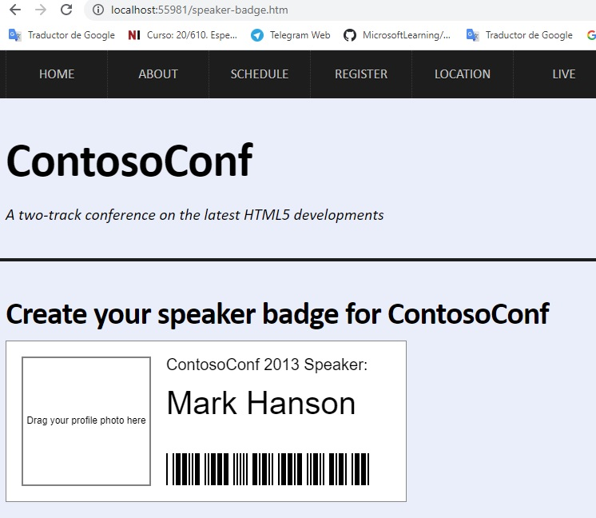
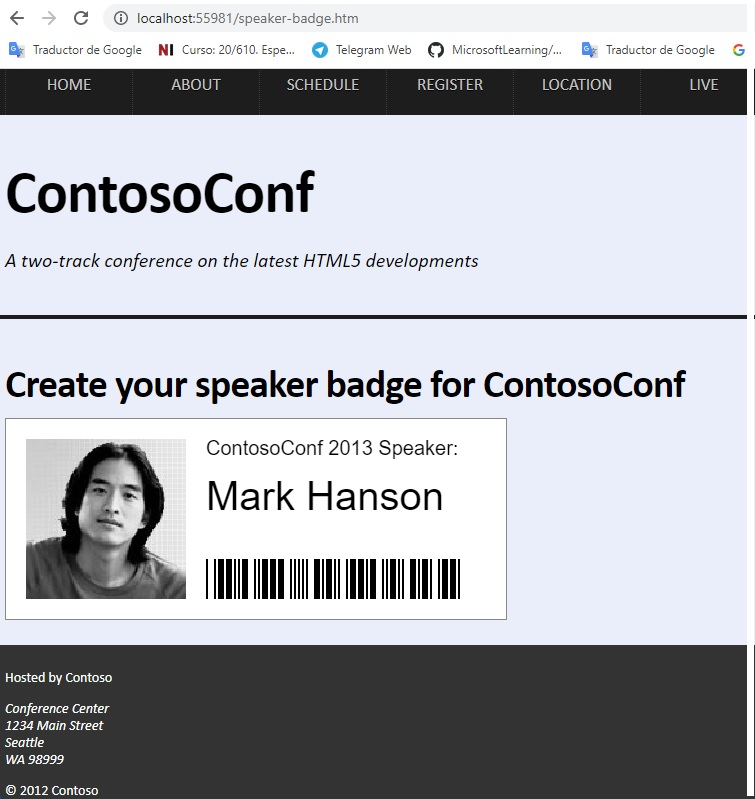
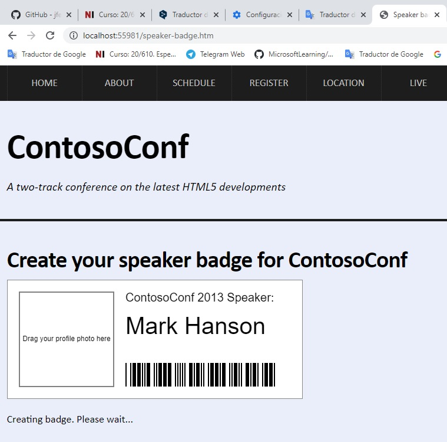
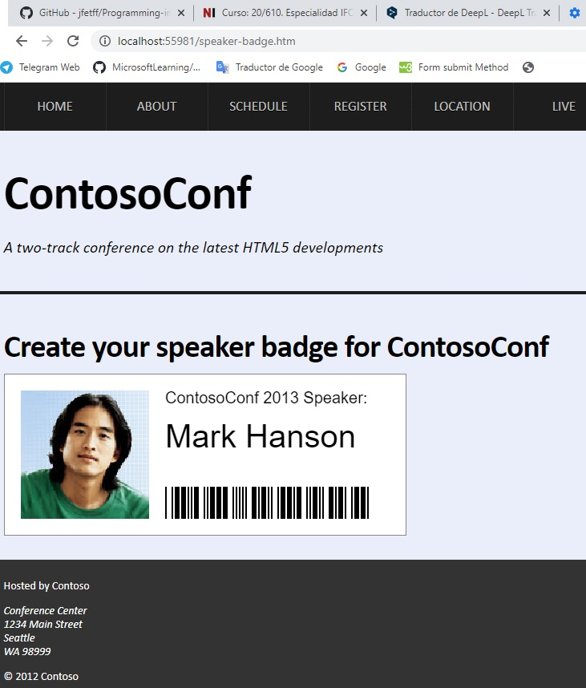

## Módulo 14: Realizar el procesamiento detrás el escenario mediante el uso de web Worker

1. **Nombres y apellidos:** José René Fuentes
2. **Fecha:** Lunes 5 de octubre de 2020.
3. **Resumen del Ejercicio:**
    * En este laboratorio haremos tres ejericios;
        * En el primero añadimos un código JavaScript a la página web **Live** para recibir preguntas de un web socket y para mostrarlas..
        * En el segundo ejercicio se modifica la página **Live**, para permitir a los usuarios hacer preguntas enviando mensajes al servidor mediante el socket web.
        * En el último ejercicio, agregamos una función a la página **Live** que permite a los usuarios informar preguntas inapropiadas y hace que la aplicación las elimine..

    
4. **Dificultad o problemas presentados y como se resolvieron:** Ninguna presentada.

**Fecha de entrega:** Lunes 5 de octubre de 2020

>**Objetivos**: 
*   En este laboratorio haremos tres ejericios;
        * Usar código JavaScript a la página web **Live** para recibir preguntas de un web socket y para mostrarlas.
        * En el segundo ejercicio se prentened modificar la página **Live**, para comprender como podemos que los usuarios puedan hacer preguntas enviando mensajes al servidor mediante el socket web.
        * En el último ejercicio, aprendemos como agregar una función a la página **Live** que permite a los usuarios informar preguntas inapropiadas y hace que la aplicación las elimine.

# Laboratorio: Crear un proceso de Web Worker

## Configuración del Lab 

## Pasos de Preparación

Asegúrate de que has clonado el directorio 20480C de GitHub (**https://github.com/MicrosoftLearning/20480-Programming-in-HTML5-with-JavaScript-and-CSS3/tree/master/Allfiles**). Contiene los segmentos de código para los laboratorios y demostraciones de este curso.


## Ejercicio 1: Mejorar la capacidad de respuesta usando un web worker

### Tarea 1: Revisar la página de la insignia de orador

1.	Abrir **Microsoft Visual Studio 2019**.
2.	En Microsoft Visual Studio, en el menú **Archivo**, apunta a **Abrir**, y luego haz clic en **Proyecto/Solución**.
3.	En el cuadro de diálogo **Abrir Proyecto**, apunta a **[Repository Root]\Allfiles\Mod14\Labfiles\Starter\Exercise 1**, haz clic en **ContosoConf.sln**, y luego en **Abrir**.
>**Nota**: Si aparece el cuadro de diálogo **Aviso de seguridad para ContosoConf**, desactive la casilla **Aviso para cada proyecto de esta solución** y luego haga clic en **OK**.

4.	En **Solution Explorer**, amplíe el proyecto **ContosoConf**, y luego haga doble clic en **speaker-badge.htm**.
5.	Verifique que la página contiene el siguiente marcado HTML:
    ```javascript
        <script src="/scripts/grayscale.js" type="module"></script>
    ```
6.	En **Solution Explorer**, expande la carpeta **scripts**, y luego haz doble clic en **grayscale.js**.
7.	Verifica que el archivo contiene la siguiente función de JavaScript:
    ```javascript
        export function grayscaleImage(image) {
			// Converts a colour image into gray scale.

			// Return a new promise.
			return new Promise(function (resolve, reject) {
				
				const canvas = createCanvas(image);
				const context = canvas.getContext("2d");
				const imageData = getImageData(context, image);

				// TODO: Create a Worker that runs /scripts/grayscale-worker.js

				const pixels = imageData.data;
				// 4 array items per pixel => Red, Green, Blue, Alpha
				for (const i = 0; i < pixels.length; i += 4) {
					grayscalePixel(pixels, i);
				}

				// Update the canvas with the gray scaled image data.
				context.clearRect(0, 0, canvas.width, canvas.height);
				context.putImageData(imageData, 0, 0);

				// Returning a Promise makes this function easy to chain together with other deferred operations.
				// The canvas object is returned as this can be used as an image.
				resolve(canvas);
			});
		};
    ```

### Tarea 2: Convertir la imagen de la insignia de honor a escala de grises

1.	En **Solution Explorer**, en la carpeta **scripts**, haga doble clic en **speakerBadgePage.js**.
2.	En **speakerBadgePage.js**, encuentra el siguiente comentario:
    ```javascript
        // TODO: Add grayscaleImage into the processing pipeline.
    ```
3.	Modifique el código después de este comentario, como se muestra a continuación:
    ```javascript
		this.readFile(file)
			.then((file) => this.loadImage(file))
			.then((file) => grayscaleImage(file))
			.then((file) => this.drawBadge(file))
			.then((file) => this.notBusy(file));
    ```
4.	En **Solution Explorer**, haga doble clic en **speaker-badge.htm**.
5.	En el menú **Debug**, haga clic en **Iniciar sin depuración**.
6.	En el navegador, si aparece el mensaje **Configuración de la Intranet desactivada por defecto**, haga clic en **No mostrar este mensaje de nuevo**.
7.	En la barra de tareas de Windows, haga clic en **Explorador de archivos**.
8.	Navega a la carpeta **[Repository Root]\Allfiles\Mod14\Labfiles\Resources**.
9.	Arrastra **mark-hanson-large.jpg** desde el Explorador de Windows al borde de Microsoft y suéltalo en el lienzo con la etiqueta **Arrastra tu foto de perfil aquí**.
10.	Verifique que no puede desplazarse por la página o moverse a otra página hasta que la imagen haya sido mostrada. Esto puede tardar varios segundos.
11.	Si el navegador muestra el mensaje **localhost no está respondiendo debido a un guión de larga duración**, espera a que el mensaje desaparezca.
12.	Cierre el navegador.

    - Representación gráfica del ejercicio anterior. Visualización de la página **speaker-badge.htm** antes de arrastrar la imagen:

    

    - Representación gráfica del ejercicio anterior. Visualización de la página **speaker-badge.htm** después de arrastrar la imagen:

    


### Tarea 3: Crear un web worker para realizar el procesamiento de imágenes

1.	En ContosoConf - Microsoft Visual Studio, en **Solution Explorer**, en la carpeta **scripts**, haga doble clic en **grayscale.js**
2.	Encuentra el siguiente comentario:
    ```javascript
        // TODO: Create a Worker that runs /scripts/grayscale-worker.js
    ```
3.	Después de este comentario, añade el siguiente código "JavaScript":
    ```javascript
        const worker = new Worker("/scripts/grayscale-worker.js");
        worker.postMessage(imageData);
    ```
4.	En **Solution Explorer**, en la carpeta **scripts**, haga doble clic en **grayscale-worker.js**.
5.	Añade el siguiente código JavaScript a este archivo, después del comentario de arriba:
    ```javascript
        addEventListener("message", function (event) {
        
        });
    ```
6.	En **Solution Explorer**, haga doble clic en **grayscale.js**. 
7.	Busca las siguientes declaraciones de JavaScript:
    ```javascript
        const worker = new Worker("/scripts/grayscale-worker.js");
        worker.postMessage(imageData);
    ```
8.	Inserte el siguiente código entre estas dos declaraciones:
    ```javascript
        const handleMessage = function (event) {
        };
        worker.addEventListener("message", handleMessage.bind(this));
    ```

### Tarea 4: Mover el código de procesamiento de imágenes al trabajador de la web

1.	En **grayscale.js**, corta el siguiente código que define la función **grayscalePixel** al portapapeles:
    ```javascript
		function grayscalePixel(pixels, index) {
			/// <summary>Updates the pixel, starting at the given index, to be gray scale.</summary>

			const brightness = 0.34 * pixels[index] + 0.5 * pixels[index + 1] + 0.16 * pixels[index + 2];

			pixels[index] = brightness; // red
			pixels[index + 1] = brightness; // green
			pixels[index + 2] = brightness; // blue
		};
    ```
2.	En **grayscale-worker.js**, debajo del código existente, pegar el código JavaScript para la función **grayscalePixel** del portapapeles.
3.	En **grayscale.js**, en la función **grayscaleImage()**, borra el siguiente código:
    ```javascript
        const pixels = imageData.data;
        // 4 array items per pixel => Red, Green, Blue, Alpha
        for (let i = 0; i < pixels.length; i += 4) {
            grayscalePixel(pixels, i);
        }
    ```
4.	En **grayscale-worker.js**, añade el siguiente código al mentod **addEventListner**:
    ```javascript
        const imageData = event.data;
        const pixels = imageData.data;
        for (let i = 0; i < pixels.length; i += 4) {
            grayscalePixel(pixels, i);
        }
    ```

### Tarea 5: Devolver los datos de la imagen del trabajador de la web

1.	En **grayscale-worker.js**, después del bucle **for** en la declaración **addEventListener**, añade el siguiente código:
    ```javascript
        for (let i = 0; i < pixels.length; i += 4) {
            grayscalePixel(pixels, i);
        }
        postMessage({ done: imageData });
    ```
2.	En **grayscale.js**, en la función **grayscaleImage()**, borre el siguiente código: 
    ```javascript
        // Update the canvas with the gray scaled image data.
        context.clearRect(0, 0, canvas.width, canvas.height);
        context.putImageData(imageData, 0, 0);

        // Returning a Promise makes this function easy to chain together with other deferred operations.
        // The canvas object is returned as this can be used like an image.
        resolve(canvas);
    ```
3.	Encuentra la siguiente declaración en JavaScript:
    ```javascript
          const handleMessage = function (event) { };
    ```
4.	Añade el siguiente código JavaScript a esta declaración:
    ```javascript
        // Update the canvas with the gray scaled image data.
        context.clearRect(0, 0, canvas.width, canvas.height);
        context.putImageData(imageData, 0, 0);

        // Returning a Promise makes this function easy to chain together with other deferred operations.
        // The canvas object is returned as this can be used like an image.
        resolve(canvas);
    ```

#### Tarea 6: Probar la aplicación

1.	En la Barra de Tareas de Windows, haga clic en **Microsoft Edge**.
2.	En el navegador, presione F12.
3.	Haz clic en la pestaña **Red** y luego en **Borrar caché**.
4.	Presiona F12, y luego cierra el navegador.
5.	En ContosoConf - Microsoft Visual Studio, en **Solution Explorer**, haz doble clic en **speaker-badge.htm**.
6.	En el menú **Debug**, haga clic en **Start Without Debugging**.
7.	En la barra de tareas de Windows, haga clic en **File Explorer**.
8.	Navega a la carpeta **[Repository Root]\Allfiles\Mod14\Labfiles\Resources**.
9.	Arrastra **mark-hanson-large.jpg** desde el Explorador de Archivos a el navegador y suéltalo en el lienzo con la etiqueta **Arrastra tu foto de perfil aquí**.
10.	Verifique que puede desplazar la página hacia arriba y hacia abajo mientras se procesa la imagen.
11.	Cierre el navegador.
12. Cierre todas las ventanas abiertas.

    - Representación gráfica del ejercicio anterior. Visualización de la página **speaker-badge.htm** utlizando web worker antes de arrastrar la imagen:

    

    - Representación gráfica del ejercicio anterior. Visualización de la página **speaker-badge.htm** utlizando web worker  después de arrastrar la imagen:

    


>**Resultados**: Después de completar este ejercicio, habrás creado una página web que sigue respondiendo mientras el código de procesamiento de imágenes lento se ejecuta en el trabajador de la web.


