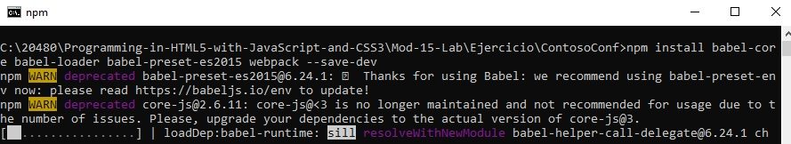

# Modulo 15: JavaScript Empaquetado para el despliegue de la producción

1. **Nombres y apellidos:** José René Fuentes
2. **Fecha:** Lunes 5 de octubre de 2020.
3. **Resumen del Ejercicio:**
    * En este laboratorio haremos uso de diferentes librerias para construir o empaquetar un proyecto ya creado con javascript. Entre las librerías que usamos están; babel, webpack, su dependencian y otras. Al final tendremos un archivo **bundle.js** que es compatible con ECMAScript 5 para navegadores más antiguos.

    
4. **Dificultad o problemas presentados y como se resolvieron:** Al subir al github los archivo uno de los archivos creado por el bundle en el último ejercicio no se puede subir ya que el nombre creado por el cache es muy largo. A continuación se muestra el problema presentado:


Lo que he hecho es cambiar el nombre a "sha-512" aunque por ser cache creo que no tiene mucho problema a ejecutar la aplicación.

**Fecha de entrega:** Lunes 5 de octubre de 2020

>**Objetivos**: 
* En este laboratorio tenemos como objetivo usar librerías como; babel, webpack, su dependencian y otras para poder empaquetar un proyecto de javascript. Aprender a crear un archivo bundle.js que contiene todas lo necesario de la aplicación.

# Laboratorio: Preparando el paquete Webpack para la producción

## Configuración del Lab

## Pasos de preparación
 
Asegúrate de que has clonado el directorio 20480C de GitHub (**https://github.com/MicrosoftLearning/20480-Programming-in-HTML5-with-JavaScript-and-CSS3/tree/master/Allfiles**). Contiene los segmentos de código para los laboratorios y demostraciones de este curso.

## Ejercicio 1: Crear un paquete de despliegue usando el webpack

### Tarea 1: Instalar y configurar Babel y webpack

1.	Abrir Microsoft Visual Studio 2019.
2.	En Microsoft Visual Studio, en el menú **Archivo**, apunta a **Abrir**, y luego haz clic en **Proyecto/Solución**.
3.	En el cuadro de diálogo **Abrir Proyecto**, hacer clic en **[Repository Root]\Allfiles\Mod15\Labfiles\Starter**, haz clic en **ContosoConf.sln**, y luego en **Abrir**.

>**Nota**: Si aparece el cuadro de diálogo **Aviso de seguridad para ContosoConf** claro **Pregúntame por cada proyecto de esta solución** y luego haz clic en **OK**.

4.	En ContosoConf - Microsoft Visual Studio, en el menú **Proyecto**, haga clic con el botón derecho **Agregar nuevo elemento**.
5.	En el cuadro de diálogo **Agregar nuevo elemento - ContosoConf**, haga clic en **Archivo de configuración npm**.
6.	En el cuadro **Nombre**, escriba **paquete.json**.
7.	Haga clic en **Add**.
8.  Abra el símbolo del sistema y navegue hasta la carpeta del proyecto.
9.  Para instalar **babel-core**, **babel-loader**, **babel-preset-es2015**, y **webpack**, ejecute el siguiente comando en la línea de comandos:
   ```bash
        npm install babel-core babel-loader babel-preset-es2015 webpack --save-dev
   ```
    - Representación gráfica del ejercicio anterior. Instalación del **babel-preset** antes de ejecutar la el **npm run build**:




10. En ContosoConf - Microsoft Visual Studio, en el menú **Proyecto**, haga clic con el botón derecho **Agregar nuevo elemento**.
11. En el cuadro de diálogo **Agregar nuevo elemento - Elementos de la solución**, haga clic en **Archivo JavaScript**.
12. En el cuadro **Nombre**, escriba **webpack.config.js**.
13. Haga clic en **Agregar**.
14. En el archivo **webpack.config.js**, para almacenar los paquetes **page** y **webpack** en variables, use **require**.
   ```javascript
        var path = require('path');
        var webpack = require('webpack');
   ```
15. Para configurar el objeto **module.exports** con el objeto **entry** que incluye una entrada para cada archivo JavaScript que fue importado en el archivo html, use el siguiente código:
   ```javascript

        module.exports = {
            entry: {
                video: './scripts/pages/video.js',
                feedback: './scripts/pages/feedback.js',
                live: './scripts/pages/live.js',
                location: './scripts/pages/location.js',
                locationVenue: './scripts/pages/location-venue.js',
                register: './scripts/pages/register.js',
                schedule: './scripts/pages/schedule.js',
                speakerBadge: './scripts/pages/speaker-badge.js',
                offline: './scripts/offline.js'
            },
        }
   ```
16. Añade el objeto **salida** a **module.exports**, configura la propiedad **path** para indicar dónde guardar los archivos **bundle**, la propiedad **filename** con el marcador de posición **name**, y **publicPath** con el valor **dist**.
   ```javascript
   
        output: {
            path: path.resolve(__dirname,'dist'),
            filename: '[name].bundle.js',
            publicPath: '/dist/'
        },
   ```
17. Añade el objeto **módulo** a **módulo.exportaciones**. 18. Dentro del objeto, agregue la matriz **rules** con el objeto de configuración **babel-loader**.
   ```javascript

        module: {
            rules: [
                {
                    test: /\.js$/,
                    loader: 'babel-loader',
                    query: {
                        presets: ['es2015']
                    }
                }
            ]
        },
   ```
18. A **module.exports**, añade los **stats**, **devtool**, y **mode** objetos.
   ```javascript

        stats: {
            colors: true
        },
        devtool: 'source-map',
        mode: 'production'
   ```


## Tarea 2: Crear archivos de paquete y reemplazar el JavaScript

1.  En la ventana de comandos, ejecute el siguiente comando.
   ```bash
        npm run webpack
   ```
2.  Para cada archivo html, reemplace todos los **script src** para cargar los nuevos archivos de la carpeta **dist**. Por ejemplo:
   ```html
        <script src="/dist/video.bundle.js" type="module"></script>
   ```
3.  Ejecute la aplicación. La aplicación debería funcionar como antes y ser compatible con versiones anteriores de Internet Explorer.

>**Resultados**: Después de completar este ejercicio, tendrá un nuevo archivo **bundle.js** que es compatible con ECMAScript 5 para navegadores más antiguos.


