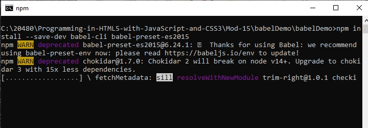
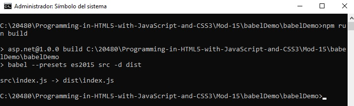
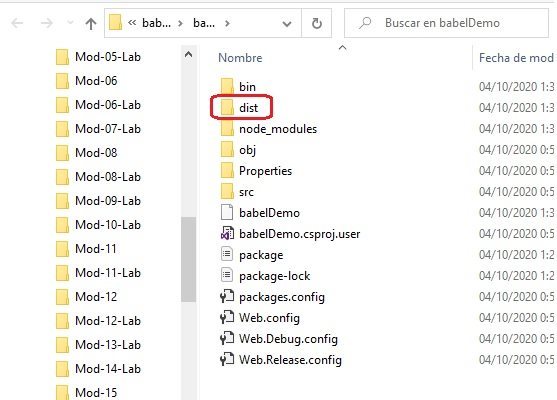

# Modulo 15: JavaScript de empaquetado para el despliegue de la producción

1. **Nombres y apellidos:** José René Fuentes
2. **Fecha:** Jueves 1 de octubre de 2020.
3. **Resumen del Ejercicio:**
    * En este laboratorio haremos tres lecciones que nos ayudan a entender como podemos transformar, rotar, trasladar, modificar y animar objetos en páginas web html.

    
4. **Dificultad o problemas presentados y como se resolvieron:** Ninguna presentada.

Fecha de entrega: Jueves 1 de octubre de 2020.

>**Objetivos**: 
* En este laboratorio tenemos como objetivo usar técnicas y herramientas que nos ayuden a rotar, transformar, trasladar, animar, escalar y más gráficos creado por nosotros en una aplicación web.

# Lección 2: Creación de paquetes separados para el soporte de los navegadores cruzados

### Demonstration: Usando Babel CLI para compilar código JavaScript

#### Pasos de preparación
 

Asegúrate de que has clonado el directorio 20480C de GitHub (**https://github.com/MicrosoftLearning/20480-Programming-in-HTML5-with-JavaScript-and-CSS3/tree/master/Allfiles**). Contiene los segmentos de código para los laboratorios y demostraciones de este curso.

## Pasos de la demostración

### Crear un nuevo proyecto

1.	Abrir Microsoft Visual Studio 2019.
2.	En Microsoft Visual Studio, en el menú **Archivo**, apunta a **Nuevo**, y luego haz clic en **Proyecto**.
3.	En el panel izquierdo del cuadro de diálogo **Nuevo proyecto**, en **Instalado**, amplíe el nodo **Visual C#** y, a continuación, haga clic en el nodo **Web**.
4.	Haga clic en **Aplicación Web ASP.NET (.NET Framework)**.
5.	En la casilla **Nombre**, escriba **babelDemo**.
6.	En la casilla **Localización**, escribe **[Repository Root]\Allfiles\Mod15\DemoCode**, y luego haz clic en **OK**.
7.	En la nueva página de la Aplicación Web ASP.NET - babelDemo seleccione **Vacío** y luego haga clic en **OK**.
8.	En babelDemo - Microsoft visual Studio, en el menú **Proyecto**, haga clic en **Nueva Carpeta**.
9.	Nómbrela **src**.
10.	En babelDemo - Microsoft Visual Studio, haz clic con el botón derecho del ratón en la carpeta **src** y apunta a **Agregar** y luego haz clic en **NuevoItem**.
11.	En el cuadro de diálogo **Agregar nuevo elemento - babelDemo**, haz clic en **Archivo JavaScript**.
12.	En el cuadro **Nombre**, escriba **index.js**.
13.	Haga clic en **Agregar**.
14.	Añade el siguiente código:
```javascript
    let customer = { name: "Joann Chambers" };
    let message = `Hello ${customer.name}`;
    let message = `Hola ${nombre.del.cliente}`;
```

### Configurar Babel en un nuevo proyecto

1.	En babelDemo - Microsoft Visual Studio, en el menú **Proyecto** haga clic en **Agregar nuevo elemento**.
2.	En el cuadro de diálogo **Agregar nuevo elemento - babelDemo**, haga clic en **archivo de configuración npm**.
3.	En el cuadro **Nombre**, escriba **paquete.json**.
4.	Haga clic en **Agregar**.
5.  En el símbolo del sistema, navegue hasta la carpeta de proyectos.
6.  Para instalar **babel-cli** y **babel-preset**, ejecute el siguiente comando en la línea de comandos:
   ```bash
        npm install --save-dev babel-cli babel-preset-es2015
   ```
    - Representación gráfica del ejercicio anterior. Instalación del **babel-preset** antes de ejecutar la el **npm run build**:




7.  Inserte el siguiente código en **package.json**:
   ```json
        "scripts": {
            "build": "babel --presets es2015 src -d dist"
        },
  ```


>**Nota**: Este código te permite ejecutar **npm ejecutar build** sin referencia a **node_modules babel**. 

8.  En la línea de comandos, ejecute el comando:
```bash
        npm run build
```
    - Representación gráfica del ejercicio anterior. Ejecución del comando **npm run build** para la creación del **dist build**:




    - Representación gráfica de la carpeta **dist build** creada:



>**Nota**: La aplicación crea la carpeta **dist** y el archivo **new index** de acuerdo con las normas de ECMAScript 2015.

## Demostración: Usando Webpack y Babel para construir una aplicación JavaScript

### Pasos de preparación 

Asegúrate de que has clonado el directorio 20480C de GitHub. Contiene los segmentos de código para los laboratorios y demostraciones de este curso. (**https://github.com/MicrosoftLearning/20480-Programming-in-HTML5-with-JavaScript-and-CSS3/tree/master/Allfiles**)

## Pasos de demostración

### Configuración de Npm

1.	Abra el Microsoft Visual Studio.
2.	En Microsoft Visual Studio, en el menú **Archivo**, apunta a **Abrir**, y luego haz clic en **Archivo**.
3.	En el cuadro de diálogo **Abrir archivo**, apunta a la carpeta **[Repository Root]\Allfiles\Mod15\DemoCode\build-tutorial**, haz clic en **build-tutorial.sln**, y luego en **Abrir**.
4.	En build-tutorial - Microsoft Visual Studio, en el menú **Proyecto**, haz clic en **Agregar nuevo elemento**.
5.	En el cuadro de diálogo **Add New Item - build-tutorial**, haga clic en **npm Configuration File**.
6.	En el cuadro **Name**, escriba **package.json**.
7.	Haga clic en **Add**.

### Configurar Babel y Webpack

1.  Abra el símbolo del sistema y navegue hasta la carpeta de proyectos.
2.  Para instalar **@babel/core**, **babel-loader**, **@babel/preset-env**, **webpack** y **webpack-cli**, ejecute el siguiente comando en el símbolo del sistema:
   ```bash
        npm install @babel/core babel-loader @babel/preset-env webpack webpack-cli --save-dev
   ```
Fig-4-BabelWebPack

Fig-5-BabelPollyFill

3.  Para instalar **babel-polyfill**, **babel-plugin-transform-async-functions**, **isomorphic-fetch**, ejecute el siguiente comando en la línea de comandos:
   ```bash
        npm install babel-polyfill babel-plugin-transform-async-functions isomorphic-fetch --save
   ```
4.  En el tutorial de construcción - Microsoft Visual Studio, en el menú **Proyecto**, haga clic en **Agregar nuevo elemento**.
5.  En el cuadro de diálogo **Add New Item - build-tutorial**, haz clic en **JavaScript File**.
6.  En el cuadro **Nombre**, escriba **webpack.config.js**.
7.  Haga clic en **Agregar**.
8.  En el archivo **webpack.config.js**, configure **webpack** de la siguiente manera:
   ```javascript
    var path = require('path');
    var webpack = require('webpack');

    module.exports = {
        entry: ['babel-polyfill', './scripts/app.js'],
        output: {
            path: path.resolve(__dirname, 'build'),
            filename: 'app.bundle.js'
        },
        module: {
            rules: [
                {
                    test: /\.js$/,
                    loader: 'babel-loader',
                    options: {
                        presets: ["@babel/preset-env"],
                        plugins: ["transform-async-functions"]
                    }
                }
            ]
        },
        stats: {
            colors: true
        },
        devtool: 'source-map'
    };
   ```
   
9.  En el Explorador de soluciones, expanda la carpeta de scripts y luego haga doble clic en app.js al inicio, agregue el siguiente código:
   ```javascript
    require('babel-polyfill');
    require('isomorphic-fetch');
   ```
10.  Abre el archivo **package.json** y añade un nombre de script nombrado **webpack** que construya tu aplicación usando **webpack** y **Babel**.
   ```json
        "scripts": {
            "webpack": "webpack"
        },
   ```
11.  En el Explorador de soluciones, haga clic con el botón derecho del ratón en **construir -tutorial** y apunte a **Agregar** y luego haga clic en **Nueva carpeta**.
12.  En la casilla **Nombre**, escriba **construir**.
13.  Haga clic en **Agregar**.

#### Construir y ejecutar la aplicación

1.  En la línea de comandos, ejecute el siguiente comando:
   ```bash
        npm run webpack
   ```
2.  Abrir **index.html** y reemplazar el valor del script **src** del archivo bundle.
   ```html
        <script src="build/app.bundle.js"></script>
   ```
3.  Ejecute la aplicación.
4.  Abra el Microsoft Internet Explorer 11 y vaya a **http://localhost:51341/index.html**.
5.  Compruebe si la página web funciona en Internet Explorer 11 como lo hace en Microsoft Edge.
6.  En el menú de depuración, haz clic en **Detener depuración**.
7.  Cierra todas las ventanas abiertas.


