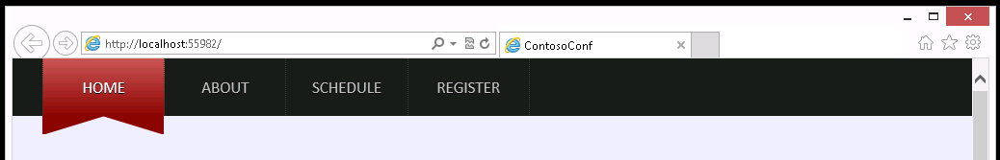
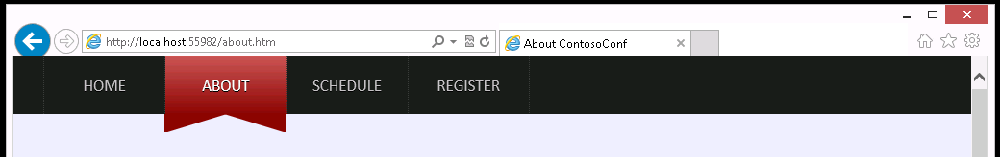
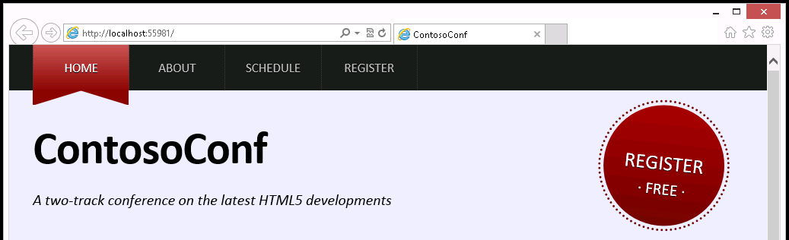

# Módulo 6: Estilo HTML5 usando CSS3

Fichero de Instrucciones: Instructions\20480C_MOD06_LAK.md

Entregar el url de GitHub con la solución y un readme con las siguiente información:

1. **Nombres y apellidos:** José René Fuentes Cortez
2. **Fecha:** 29 de Septiembre 2020
3. **Resumen del Ejercicio:** (Respondiendo a la siguiente pregunta: ¿Cuál es el objetivo del ejercicio? y los pasos realizados para su cumplimiento.
4. **Dificultad o problemas presentados y como se resolvieron:** Errores en la consola del programa, la página web no realizaba los cambios solicitados, etc.

**NOTA**: Si no hay descripcion de problemas o dificultades, y al yo descargar el código para realizar la comprobacion y el código no funcionar, el resultado de la califaciación del laboratorio será afectado.

Fecha de entrega: Viernes 25 de septiembre de 2020

# Laboratorio: Estilo de texto y elementos de bloque mediante CSS3

## Ejercicio 1: Estilo de la barra de navegación

### Tarea 1: Revisar la estructura HTML

1. Abra Microsoft Visual Studio 2019.
2. En Microsoft Visual Studio, en el menú **Archivo**, seleccione **Abrir** y luego seleccione **Proyecto/Solución**.
3. En el cuadro de diálogo **Abrir proyecto**, vaya a **[Repository Root]\Allfiles\Mod06\Labfiles\Starter\Exercise 1**, haga clic en **ContosoConf.sln** y luego haga clic en **Abrir**.
> ** Nota **: Si aparece el cuadro de diálogo ** Advertencia de seguridad para ContosoConf**, desactive la casilla de verificación **Preguntarme por todos los proyectos de esta solución** y luego haga clic en **Aceptar**.
4. En **Explorador de soluciones**, expanda el proyecto **ContosoConf** y luego doble clic en **index.htm**.

5. Verifique que el elemento **&lt;hea &gt;** contenga el siguiente marcado HTML:
   ```html
        <link href = "/styles/nav.css" rel = "stylesheet" type = "text/css" />
   ```
6. Busque las líneas que contienen el siguiente marcado HTML:
   ```html
        <nav class = "page-nav">
          <div class = "container">
            <a href="/index.htm" class="active">Home</a>
   ```
7. En el menú **Depurar**, haga clic en **Iniciar sin depurar**.
8. En el navegador, si aparece el mensaje **La configuración de la intranet está desactivada de forma predeterminada**, haga clic en **No volver a mostrar este mensaje**.
9. Verifique que la barra de navegación en la parte superior de la página contenga una fila de enlaces sin estilo.
10. Cierre el navegador.

### Tarea 2: Estilo de la barra de navegación y los enlaces

1. En ContosoConf - Microsoft Visual Studio, en **Explorador de soluciones**, expanda la carpeta **estilos** y luego haga doble clic en **nav.css**.
2. Busque el siguiente comentario:
   ``` css
        /* TODO: nav.page-nav */
   ```
3. Después de este comentario, inserte las siguientes hojas de estilo en cascada (CSS):
   ``` css
        nav.page-nav {
            background-color: #1d1d1d;
            line-height: 6rem;
            font-size: 1.7rem;
        }
   ```
4. Busque el siguiente comentario CSS:
   ``` css
        /* TODO: nav.page-nav .container */
   ```
5. Después de este comentario, inserte el siguiente CSS:
   ``` css
        nav.page-nav .container {
            display: -ms-flexbox;
            display: flex;
        }
   ```
6. Busque el siguiente comentario:
   ``` css
        /* TODO: nav.page-nav a */
   ```
7. Después del comentario, inserte el siguiente CSS:
   ``` css
        nav.page-nav a {
            display: block;
            min-width: 9rem;
            padding: 0 1.8rem;
            border-right: 1px dotted #3d3d3d;
            text-decoration: none;
            text-transform: uppercase;
            text-align: center;
            color: #c3c3c3;
            text-shadow: 0 1px 0 #000;
        }
   ```
8. Busque el siguiente comentario:
   ``` css
         /* TODO: nav.page-nav a: primer hijo */
   ```
9. Después del comentario, inserte el siguiente CSS:
   ``` css
        nav.page-nav a: primer hijo {
            border-left: 1px dotted #3d3d3d;
        }
   ```
10. Busque el siguiente comentario:
   ``` css
        /* TODO: nav.page-nav a: hover */
   ```
11. Después del comentario, inserte el siguiente CSS:
   ``` css
        nav.page-nav a: hover {
            color: #e4e4e4;
            background-color: black;
        }
   ```
12. Busque el siguiente comentario:
   ``` css
        /* TODO: nav.page-nav .active */
   ```
13. Después del comentario, inserte el siguiente CSS:
   ``` css
        nav.page-nav .active {
            color: #fff;
            background: -ms-linear-gradient(#c95656, #8d0606);
            background: linear-gradient(#c95656, #8d0606);
        }
   ```
14. Busque el siguiente comentario:
   ``` css
        /* TODO: nav.page-nav .active: hover */
   ```
15. Después del comentario, inserte el siguiente CSS:
   ``` css
        nav.page-nav .active: hover {
            /* Anular el efecto de desplazamiento para el enlace de la página activa */
            color: #fff;
        }
   ```

### Tarea 3: Crear gráficos utilizando seudo elementos

1.	Encuentra el siguiente comentario:
   ``` css
        /* TODO: nav.page-nav .activo:antes */
   ```
2.	Después del comentario, inserte el siguiente CSS:
   ``` css
        nav.page-nav .active:before {
            position: absolute;
            top: 6rem;
            display: block;
            height: 0;
            width: 0;
            margin-left: -1.9rem;
            border-top: 2rem solid #8d0606;
            border-right: 6.5rem solid transparent;
            content: "";
        }
   ```
3.	Encuentra el siguiente comentario:
   ``` css
        /* TODO: nav.page-nav .activo:después */
   ```
4.	Después del comentario, inserte el siguiente CSS:
   ``` css
        nav.page-nav .active:after {
            position: absolute;
            display: block;
            height: 0;
            width: 0;
            margin-left: 4.3rem;
            border-top: 2rem solid #8d0606;
            border-left: 6.5rem solid transparent;
            content: "";
        }
   ```

### Tarea 4: Probar la barra de navegación

1.	En **Solution Explorer**, haga doble clic en **index.htm**.
2.	En el menú **Debug**, haga clic en **Iniciar sin depuración**.
3.	Verifique que la barra de navegación se vea similar a la siguiente imagen:



4.	En la barra de navegación, haga clic en **Acerca de**.
5.	Verifica que el elemento **Acerca de** esté estilizado correctamente.



6.	Cerrar el navegador.


>**Resultados**: Después de completar este ejercicio, habrás estilizado la barra de navegación para que coincida con la maqueta de diseño.

## Ejercicio 2: Estilizar el enlace del registro

### Tarea 1: Revisar el HTML y el CSS

1.	En ContosoConf - Microsoft Visual Studio, en el menú **Archivo**, apunte a **Abrir**, y luego haga clic en **Proyecto/Solución**.
2.  En el cuadro de diálogo **Abrir Proyecto**, apunta a la carpeta **[RepositoryRoot]\Allfiles\Mod06\Labfiles\Starter\Exercise 2**, apunta a **ContosoConf.sln**, y luego haz clic en **Abrir**.

>**Nota**: Si aparece el cuadro de diálogo **Advertencia de seguridad para ContosoConf**, desactive la casilla **Ask me for each project in this solution** y luego haga clic en **OK**.

3.	En **Solution Explorer**, expanda el proyecto **ContsoConf**, y luego haga doble clic en **index.htm**.
4.	Verifique que el elemento **&lt;head
   ```html
        <link href="/styles/header.css" rel="stylesheet" type="text/css" />
   ```
5.	Verifique que el elemento **&lt;header
   ```html
        <header class="page-header">
            <div class="container">
                <h1>ContosoConf</h1>
                <p class="tag-line">A two-track conference on the latest HTML5      developments</p>

                <a class="register" href="/register.htm">
                    Register<br />
                    <span class="free">&#183; Free &#183;</span>                
                </a>
            </div>
        </header>
   ```
6.	En el menú **Debug**, haga clic en **Iniciar sin depuración**.
7.	En el navegador, verifique que el enlace **Registro** en el encabezado de la página aparece como un enlace ordinario y no tiene estilo.
8.	Cierre el navegador.


### Tarea 2: Colocar el enlace del Registro y fijar el estilo del texto

1.	En **Solution Explorer**, expande la carpeta **styles**, y luego haz doble clic en **header.css**.
2.	Encuentra el siguiente comentario:
    ``` css
        /* TODO: header.page-header .register */
    ```
3.	Modifica la regla CSS siguiendo este comentario, y añade las propiedades CSS que se muestran a continuación:
   ```css
        header.page-header .register {
            display: block;
            position: absolute;
            top: 2rem;
            right: 3.5rem;
            width: 16rem;
            height: 10rem;
            padding-top: 6rem;
        }
   ```
4.	Añade las siguientes propiedades CSS a la regla **header.page-header .register** CSS: 
   ```css
        header.page-header .register {
            display: block;
            position: absolute;
            top: 2rem;
            right: 3.5rem;
            width: 16rem;
            height: 10rem;
            padding-top: 6rem;
            font-size: 2.7rem;
            text-align: center;
            text-decoration: none;
            text-transform: uppercase;
            text-shadow: 0 1px 0 #000;
            color: #fff;
        }
   ```

#### Tarea 3: Estilizar el fondo del enlace del Registro, la forma y las propiedades de rotación

1.	Añade las siguientes propiedades CSS a la regla **header.page-header .register** CSS:
   ```css
        header.page-header .register {
            display: block;
            position: absolute;
            top: 2rem;
            right: 3.5rem;
            width: 16rem;
            height: 10rem;
            padding-top: 6rem;
            font-size: 2.7rem;
            text-align: center;
            text-decoration: none;
            text-transform: uppercase;
            text-shadow: 0 1px 0 #000;
            color: #fff;
            background: -ms-linear-gradient(#a80000, #740404);
            background: linear-gradient(#a80000, #740404);
            -ms-border-radius: 100%;
            border-radius: 100%;
            -ms-transform: rotate(6deg);
            transform: rotate(6deg);
        }
   ```
2.	Encuentra la siguiente regla CSS:
   ``` css
        header.page-header .register:hover {
        
        }
   ```
3.	Añade las siguientes propiedades CSS a esta regla:
   ``` css
        header.page-header .register:hover {
            background: -ms-linear-gradient(#bc0101, #8c0909);
            background: linear-gradient(#bc0101, #8c0909);
        }
   ```
4.	Encuentra la siguiente regla CSS: 
   ``` css
        header.page-header .register:before {
        
        }
   ```
5.	Añade las siguientes propiedades CSS a esta regla: 
   ``` css
        header.page-header .register:before {
            display: block;
            position: absolute;
            top: -.7rem;
            right: -.7rem;
            height: 16.8rem;
            width: 16.8rem;
            content: "";
            border: 3px dotted #740404;
            -ms-border-radius: 100%;
            border-radius: 100%;
        }
   ```

#### Tarea 4: Probar el enlace del Registro

1.	En **Solution Explorer**, haga doble clic en **index.htm**.
2.	En el menú **Debug**, haga clic en **Iniciar sin depuración**.
3.	En el navegador, verifique que el enlace **Registrar** en el encabezado de la página se vea como la siguiente imagen:



4.	Mueva el puntero del ratón sobre el enlace **Registro**, y luego verifique que cambia de color.
5.	Cerrar el navegador.

>**Resultados**: Después de completar este ejercicio, habrás puesto estilo al enlace **Registrarse** en el encabezado de la página **Casa**.


## Ejercicio 3: Esilizar la página About

### Tarea 1: Revisar el HTML y el CSS

1.	En ContosoConf - Microsoft Visual Studio, en el menú **Archivo**, apunte a **Abrir**, y luego haga clic en **Proyecto/Solución**.
2.	En el cuadro de diálogo **Abrir Proyecto**, apunta a la carpeta **[RepositoryRoot]\Allfiles\Mod06\Labfiles\Starter\Exercise 3**, apunta a **ContosoConf.sln**, y luego haz clic en **Abrir**.

>**Nota**: Si aparece el cuadro de diálogo **Advertencia de seguridad para ContosoConf**, desactive la casilla **Ask me for each project in this solution** y luego haga clic en **OK**.

3. En **Solution Explorer**, expanda el proyecto **ContsoConf**, y luego haga doble clic en **about.htm**.
4.	Verifique que el elemento **&lt;head** contiene el siguiente marcado HTML:
   ```html
        <link href="/styles/pages/about.css" rel="stylesheet" type="text/css" />
   ```
5.	Verifique que el elemento **&lt;body&gt;** contiene el siguiente markup html:
   ```html
        <section class="page-section about">
            <article class="container">
                ...
            </article>
        </section>
   ```

#### Tarea 2: Definir las columnas de texto

1.	En **Solution Explorer**, expande la carpeta **styles**, expande la carpeta **pages**, y luego haz doble clic en **about.css**.
2.	En **about.css**, encuentra el siguiente comentario de CSS:
   ```css
        /* TODO: .acerca de > artículo > sección */
   ```
3.	Después de este comentario, añade el siguiente CSS:
   ```css
        .about > article > section {
            column-count: 3;
            column-gap: 5rem;
            text-align: justify;
        }
   ```

### Tarea 3: Añadir un tapón al principio del texto

1.	Encuentra el siguiente comentario:
   ```css
        /* TODO: Añadir estilo de tapa de caída */
   ```
2.	Después de este comentario, añade el siguiente CSS:
   ``` css
        .about p:first-child:first-letter {
            font-size: 300%;
            float: left;
            margin: 0 0.5rem 0 0;
            line-height: .8;
            color: #aaa;
        }
   ```

#### Tarea 4: Párrafos sangrientos

1.	Encuentra el siguiente comentario:
   ```css
        /* TODO: Párrafos sangrientos */
   ```
2.	Después de este comentario, añade el siguiente CSS:
   ```css
        .about p {
            text-indent: 3rem;
        }

        .about p:first-child {
            /* Prevents text indenting after drop cap */
            text-indent: 0;
            margin-top: 0;
        }
   ```

#### Tarea 5: Estilizar la cita del bloque

1.	Encuentra el siguiente comentario:
   ```css
        /* TODO: Cita Bloqueada */
   ```
2.	Después del comentario, añade el siguiente CSS:
   ```css
        .about blockquote {
            font-size: 1.2em;
            padding: 0 0 0 6rem;
            margin: 0;
            font-style: italic;
            position: relative;
        }
        
        .about blockquote:before {
            content: '\201C';
            position: absolute;
            font-size: 10rem;
            font-family: serif;
            left: 0;
            top: -1rem;
            line-height: 1;
        }
   ```
### Tarea 6: Prueba la página Acerca de

1. En **Explorador de soluciones**, haga doble clic en **about.htm**.
2. En el menú **Depurar**, haga clic en **Iniciar sin depurar**.
3. En el navegador, verifique que la página sea similar a la siguiente imagen:

! [texto alternativo] (./Images/20480B_6_About-Final.png "La página Acerca de")

4. Cierre el navegador.
5. Cierre todas las ventanas abiertas.

> **Resultado**: después de completar este ejercicio, habrá aplicado estilo al texto en la página **Acerca de**.