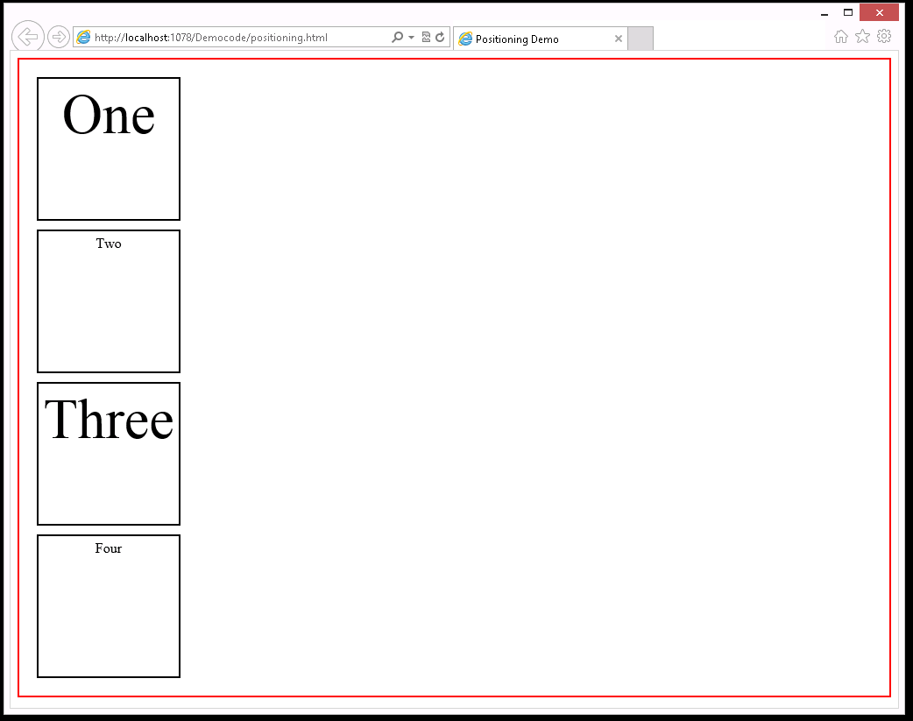

# Módulo 6: Estilizar HTML5 usando CSS3

1. **Nombres y apellidos:** José René Fuentes
2. **Fecha:** 24 de Septiembre 2020.
3. **Resumen del Ejercicio:**
    * Ver la relación con la ventana del explorador variando sus elementos usando estilos o diferente atributos. Manejamos el navegador para que la ventana sea lo suficientemente pequeña como para requerir el desplazamiento y vea los elementos o que la misma permanezca fija para ver si los elementos usnado atributos y estilos sus elementos se desplazan (no se desplaza a la vista).
    
4. **Dificultad o problemas presentados y como se resolvieron:** Al no tener algún resultado de como es el comportamiento de los elementos no podríamos poner esfuerzos en ajustar o buscar posibles errores en la aplicación de estilos y/o atributos.

Fecha de entrega: Jueves 24 de septiembre de 2020

>**Objetivos**: 
* Ver la relación con la ventana del explorador variando sus elementos usando estilos o diferente atributos. Manejamos el navegador para que la ventana sea lo suficientemente pequeña como para requerir el desplazamiento y vea los elementos o que la misma permanezca fija para ver si los elementos usnado atributos y estilos sus elementos se desplazan (no se desplaza a la vista).

Dondequiera que la ruta de un archivo comience con *[Raíz del repositorio]*, reemplácela con la ruta absoluta de la carpeta en la que reside el repositorio 20480. Por ejemplo, si clonaste o extrajiste el repositorio 20480 a to **C:\Users\John Doe\Downloads\20480**, cambiar la ruta de: **[Repository Root]\AllFiles\20480C\Mod01** a **C:\Users\John Doe\Downloads\20480\AllFiles\20480C\Mod01**.


# Lección 2: Elementos de bloque de estilo

### Demonstration: Cambiar entre los modelos de diseño de las hojas de estilo en cascada (CSS)


#### Pasos de la demostración

#### Cambiar entre los modos de diseño de una página web

1.	Abrir Microsoft Visual Studio 2017.
2.	En Microsoft Visual Studio, en el menú **Archivo**, apunta a **Abrir**, y luego haz clic en **Archivo**.
3.	En el cuadro de diálogo **Abrir archivo**, ve a la carpeta **[Raíz del repositorio]\Allfiles\Mod06\Democode**, apunta a **posicionamiento.html**, y luego haz clic en **Abrir**.
4.	Revisa el código con los estudiantes. Este archivo contiene un **artículo** HTML con cuatro elementos **div**. El archivo también contiene estilos para los elementos **article** y **div**.

   ```html
        <!DOCTYPE html>
        <html xmlns="http://www.w3.org/1999/xhtml">
        <header>
          <title>Posicionamiento Demo</title>
          <style type="text/css">
            cuerpo {
              texto-alineado: centro;
            }

            artículo {
              acolchado: 10px;
              borde: 2px rojo sólido;
            }

            div {
              margen: 10px;
              acolchado: 5px;
              borde: 2px negro sólido;
              ancho: 150px;
              altura: 150px;
            }

            div:nth-child(impar) {
              Tamaño de letra: 4rem;
            }
          </estilo>
        </cabeza>
        <cuerpo>
          <artículo>
            <div id="one">One</div>
            <div id="dos">Dos</div>
            <div id="tres">Tres</div>
            <div id="four">Cuatro</div>
          </artículo>
        </cuerpo>
        </html>
   ```
5.	En el menú **Archivo**, haga clic en **Ver en el navegador (Microsoft Edge)**.

6.	En Microsoft Edge, si aparece el mensaje **Configuración de la Intranet desactivada por defecto**, haga clic en **No mostrar este mensaje de nuevo**.
7.	Observe los cuatro elementos **div** dispuestos uno debajo del otro, en orden, dentro del elemento **artículo**. Para resaltar sus límites, el elemento **artículo** tiene un borde rojo. Este es el modo de **distribución de bloques**.



8.	Presiona F12.
9. En el panel de herramientas para desarrolladores de F12, haz clic en la opción **Dock Bottom** en la esquina superior derecha, para que puedas ver las ventanas de Microsoft Edge y Developer al mismo tiempo.
10.	Para mostrar la versión completamente expandida de las reglas de diseño aplicadas al contenido HTML, haga clic en la pestaña **Elementos**.
11. En la pestaña Elementos expandir **body** y expandir **article**.
12.	Haga clic con el botón derecho del ratón en la entrada **div** y luego seleccione **Agregar atributo**.
13.	Escriba **style=display: inline** para cada entrada **div**, y luego presione INTRO.

14.	En Microsoft Edge, note que los cuatro elementos **div** están ahora alineados lado a lado por la línea base de texto con las propiedades de altura y anchura ignoradas. Este es el modo de **inline layout**.


15.	Redimensiona la ventana del navegador para hacerla más estrecha, de modo que puedas ver cómo la aplicación envuelve los bloques en la siguiente línea en el modo **diseño en línea**.
16.	En la ventana de F12 Herramientas de desarrollo, en la pestaña **CSS**, haga clic en la regla **display: inline**, cámbiela por **display:inline-block**, y luego presione INTRO.
17.	Note que el diseño es el mismo pero las propiedades **altura** y **ancho** se conservan ahora. Este es el modo **inline-block**. 

>**Nota**: Si es necesario, haga la ventana del navegador más ancha para que los bloques **Uno** y **Tres** estén en la misma línea.


18.	En Microsoft Edge, cambia el tamaño de la ventana del navegador para que puedas ver cómo la aplicación envuelve los bloques en la siguiente línea en el modo **diseño en línea**.
19.	En la ventana de F12 Developer Tools, en la pestaña **CSS**, haga clic en la regla **display: inline-block**. Cambie esta regla a **display:-ms-flexbox**, y luego presione INTRO.
20.	Para ver el nuevo diseño, cambie a Microsoft Edge. La aplicación muestra los elementos **div** en una columna vertical.
21.	En la ventana de Herramientas de desarrollo de F12, en la pestaña **CSS**, haga clic en la regla **display: -ms-flexbox**, cámbiela a **display:table-cell**, y luego presione INTRO.
22.	Para ver el nuevo diseño, cambie a Microsoft Edge. La aplicación muestra los elementos **div** en una tabla horizontal.

#### Cambiar entre los modos de posicionamiento en una página web

1.	En la ventana de herramientas de desarrollo de F12, en la pestaña **CSS**, desactive las tres casillas de verificación junto a los atributos de visualización de **cuerpo**, **artículo** y **div**.
2.	Haga clic con el botón derecho del ratón en la entrada **div**, y luego seleccione **Agregar regla**.
3.	Escriba **#tres**, y luego presione **Tab**.

>**Nota**: Esta acción crea una nueva regla para el elemento **&lt;div...** con la propiedad **id** establecida en **tres**. Este es el **&lt;div&gt;** que contiene el texto **Three**.

4.	Escriba **posición: relativa**, y luego pulse ENTER.
	Haga clic con el botón derecho del ratón en la entrada **#tres**, y luego seleccione **Agregar propiedad**.
6.	Escriba **superior: 2em**, y luego pulse ENTER.
7.	Haga clic con el botón derecho del ratón en la entrada **#tres**, y luego seleccione **Agregar propiedad**.
8.	Escriba **izquierda: 2em**, y luego presione ENTER.
9.	En Microsoft Edge, observe cómo la aplicación posiciona la casilla **tres** en relación a su posición normal.
10.	En la ventana de F12 Developer Tools, en la pestaña **CSS**, haga clic en la regla **position:relative** para el selector **#three**, cámbiela a **position:absolute**, y luego presione ENTER.
11.	En Microsoft Edge, observe cómo la aplicación posiciona la casilla **three** en relación con su bloque de **artículo**.
12.	En la ventana de F12 Developer Tools, en la pestaña **CSS**, haga clic en la regla **position:absolute** del selector **#three**, cámbiela a **position:fixed**, y luego presione ENTER.
13.	En Microsoft Edge, observe cómo la aplicación posiciona el cuadro **tres** en relación con la ventana del explorador. Haga que la ventana sea lo suficientemente pequeña como para requerir el desplazamiento y vea cómo la casilla **tres** permanece fija cuando se desplaza (no se desplaza a la vista).
14.	Cierre Microsoft Edge.
15. Cerrar **positioning.html - Microsoft Visual Studio**. 