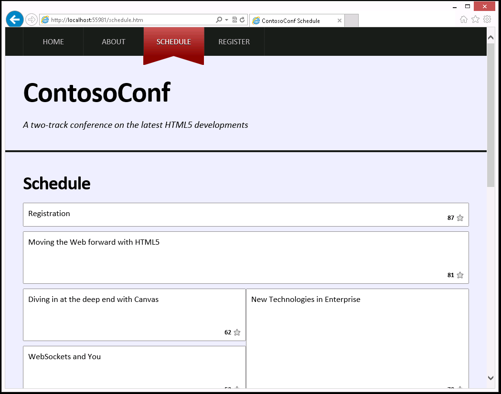

# Módulo 7: Crear objetos y métodos usando JavaScript

1. **Nombres y apellidos:** José René Fuentes
2. **Fecha:** 29 de Septiembre 2020.
3. **Resumen del Ejercicio:**
    * En este laboratorio hace uso de objetos para refactorizar el código JavaScript para que la página **schedule** sea más mantenible. La idea es aprender a refactorizar el código JavaScript y presentar las diferentes sessiones y aulas de las conferencias dando a los conferencistas la oportunidad de poder inscribirte de manera automática.
    
4. **Dificultad o problemas presentados y como se resolvieron:** Si que las hay al ejecutar el código final y llamar la función startDownload() el navegador da un error que no la reconoce como función. El problema es porque los métodos de la nueva clase ScheduleList quedan fuera de la clase y debieran estar dentro de la clase. En las instrucciones no está muy bien explicado esto y parece que al seguir las instrucciones del LAK uno tiende a poner los métodos de la clase afuera de la misma. 

Fecha de entrega: Martes 29 de septiembre de 2020

>**Objetivos**: 
* En este laboratorio hace uso de objetos para refactorizar el código JavaScript para que la página **schedule** sea más mantenible. La idea es aprender a refactorizar el código JavaScript y presentar las diferentes sessiones y aulas de las conferencias dando a los conferencistas la oportunidad de poder inscribirte de manera automática.

Dondequiera que la ruta de un archivo comience con *[Raíz del repositorio]*, reemplácela con la ruta absoluta de la carpeta en la que reside el repositorio 20480. Por ejemplo, si clonaste o extrajiste el repositorio 20480 a to **C:\Users\John Doe\Downloads\20480**, cambiar la ruta de: **[Repository Root]\AllFiles\20480C\Mod01** a **C:\Users\John Doe\Downloads\20480\AllFiles\20480C\Mod01**.

# Laboratorio: Refinando el código de mantenimiento y extensibilidad.

### Pasos de Preparación

Asegúrate de que has clonado el directorio 20480C de GitHub (**https://github.com/MicrosoftLearning/20480-Programming-in-HTML5-with-JavaScript-and-CSS3/tree/master/Allfiles**). Contiene los segmentos de código para los laboratorios y demostraciones de este curso.


## Ejercicio 1: Refactorización del código JavaScript para usar clases y objetos

#### Tarea 1: Crear la clase ScheduleList

1.	En Microsoft Visual Studio, en el menú **Archivo**, apunta a **Abrir**, y luego haz clic en **Proyecto/Solución**.
2.	En el cuadro de diálogo **Abrir Proyecto**, apunta a **[Raíz del Repositorio]\AllFiles\Mod07\Labfiles\Ejercicio 1**, apunta a **ContosoConf.sln**, y luego haz clic en **Abrir**.
>**Nota**: Si aparece el cuadro de diálogo **Aviso de seguridad para ContosoConf**, desactive la casilla **Aviso para cada proyecto de esta solución** y luego haga clic en **OK**.
3.	Expandir el proyecto **ContosoConf**, expandir la carpeta **scripts** y luego expandir la carpeta **pages**.
4.	Haga doble clic en **schedule.js**.
5.	Encuentra el siguiente comentario:

    ```Javascript
        // TODO: Crear una clase de ScheduleList.
    ```
6. Haga clic con el botón derecho del ratón en la carpeta **scripts**, apunte a **Add**, y luego seleccione **JavaScript File**.
7. Para el nombre del elemento, agregue **ScheduleList.js**, y luego haga clic en **Ok**.
8. Añada el siguiente código JavaScript:
	```javascript
		import { ScheduleItem } from "./ScheduleItem.js";

		export class ScheduleList {
			//TODO: Add Constructor
		}
		
		//TODO: Add methods
	```
9.	En **schedule.js**, encuentre y elimine el siguiente comentario:
	```javascript
        // TODO: Crear una clase de ScheduleList.
    ```

#### Tarea 2: Convertir las variables en propiedades de la clase ScheduleList

1.	En **schedule.js**, encuentra el siguiente comentario:
    ```javascript
        // TODO: Refactor these variables into properties of the ScheduleList class.
		// Assign them in the "initialize" method from arguments
    ```
2.	Borre la siguiente línea de código JavaScript después de este comentario:
    ```javascript
        const element, localStarStorage;
    ```

3.	En **ScheduleList.js**, encuentra el siguiente código JavaScript:
    ```javascript
        //TODO: Añadir Constructor
    ```
4.	Reemplaza el código por la siguiente línea de código JavaScript:
    ``` Javascript
        constructor(element, localStarStorage) {
			this.element = element;
			this.localStarStorage = localStarStorage;
		}
    ```
	
### Tarea 3: Convertir las funciones en métodos de la clase ScheduleList

1.	En **schedule.js**, encuentra el siguiente código JavaScript:
    ```javascript
    // TODO: Refactor these functions into methods of the ScheduleList class.
    ```
2.	Borre las funciones **startDownload**, **downloadDone**, **downloadFailed**, **addAll**, y añadir las funciones **add** que continuan al comentario.
3.  En **ScheduleList.js**, encuentra el siguiente comentario:
    ```javascript
        //TODO: Añadir métodos
    ```
4.	Reemplaza el código por el siguiente código JavaScript:
    ``` Javascript
		async startDownload() {
			// await response of fetch call
			let response = await fetch("/schedule/list");
			// transform body to json
			let data = await response.json();
	
			// checking response is ok
			if (response.ok) {
				this.downloadDone(data);
			} else {
				this.downloadFailed();
			}
		}

		downloadDone(responseData) {
			this.addAll(responseData.schedule);
		}

		downloadFailed() {
			alert("Could not retrieve schedule data at this time. Please try again later.");
		}

		addAll(itemsArray) {
			itemsArray.forEach(this.add, this);
		}

		add(itemData) {
			const item = new ScheduleItem(itemData, this.localStarStorage);
			this.element.appendChild(item.element);
		}
    ```

#### Tarea 4: Crear y utilizar un objeto ScheduleList

1.	En **schedule.js**, encuentra el siguiente código JavaScript:
    ```javascript
        // TODO: Replace the following code by creating a ScheduleList object 
        //       and calling the startDownload method.
        element = document.getElementById("schedule");
        localStarStorage = LocalStarStorage.create(localStorage);
        startDownload();
    ```
2.	Borre este bloque de código JavaScript y reemplácelo por el siguiente código:
    ``` Javascript
		const scheduleList = new ScheduleList(
			document.getElementById("schedule"),
			new LocalStarStorage(localStorage)
		);
		scheduleList.startDownload();
    ```
3.	Encuentra el siguiente código JavaScript:
    ```javascript
		//TODO: Import objects/functions from the modules/classes.
		import { LocalStarStorage } from "../LocalStarStorage.js";
		import { ScheduleItem } from "../ScheduleItem.js";
    ```
4.	Borre este bloque de código JavaScript y reemplácelo por el siguiente código:
    ``` javascript
		import { LocalStarStorage } from "../LocalStarStorage.js";
		import { ScheduleList } from "../ScheduleList.js";
    ```


#### Tarea 5: Probar la aplicación

1.	En **Solution Explorer**, haga doble clic en **schedule.htm**.
2.	En el menú **Debug**, haga clic en **Start Without Debugging**.
3.	En el navegador, si la **Configuración de la Intranet está desactivada por defecto** del objeto **ScheduleList** aparece, haga clic en **No mostrar este mensaje de nuevo**.
4.	Verifica que la página se vea similar a la imagen de abajo:



5.	Cerrar el navegador.
6.  Cierre todas las ventanas abiertas.

>**Resultados**: Al completar este ejercicio, has usado objetos para refactorizar el código JavaScript para que la página **Calendario** sea más mantenible.
Después de completar este ejercicio, habrá refactorizado el código JavaScript para que la página **Calendario** sea más mantenible usando objetos.
