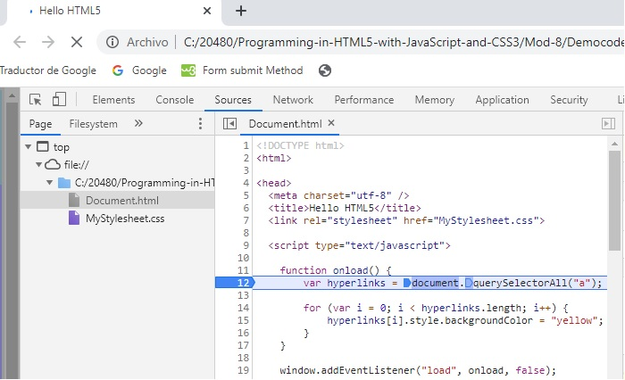
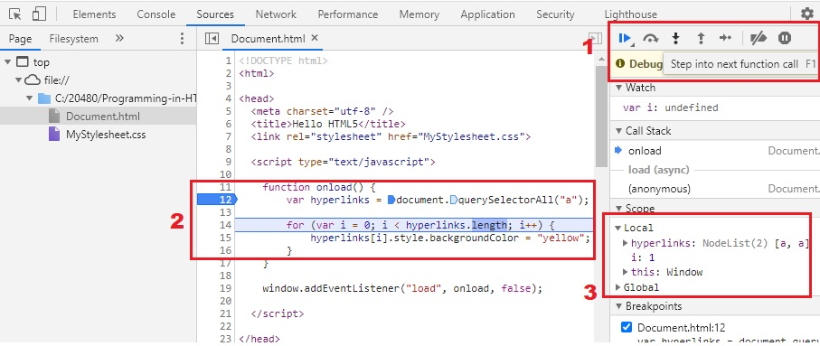
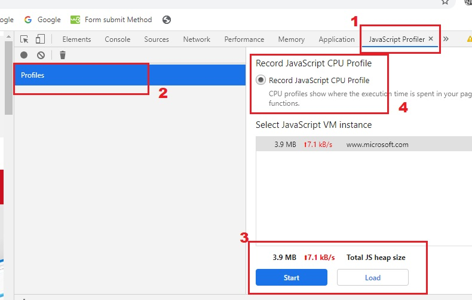
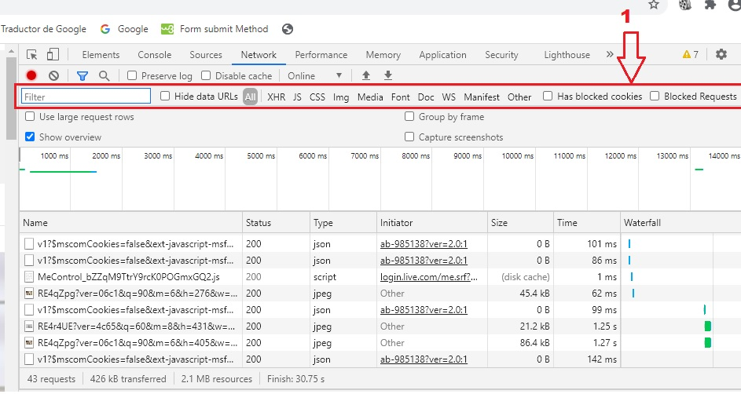
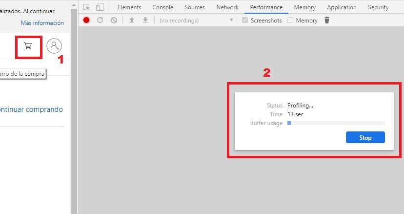

## Modulo 8 - Creando página interactivas usando APIs de HTML5

1. **Nombres y apellidos:** José René Fuentes
2. **Fecha:** 30 de Septiembre 2020.
3. **Resumen del Ejercicio:**
    * En este laboratorio hace uso Chrome DevTools que son un conjunto de herramientas de creación web y depuración integrado en Google Chrome. Usamos DevTools para iterar y depurar tu sitio, y para crear un perfil de él. 
    Algunos de los paneles que contiene son:
    * Device Mode - para desarrollar experiencias web con una completa capacidad de respuestas y que prioricen los dispositivos móviles. Emula sensores: ubicación geográfica y acelerómetro.
    * Elements - el panel de Elements se usa para iterar la distribución y el diseño de tu sitio mediante la libre manipulación de DOM y CSS. Además; Inspecciona y modifica ligeramente tus páginas, Edita estilos y Edita el DOM.
    * Console - para registrar información de diagnóstico durante el desarrollo o úsalo como un shell para interactuar con el código JavaScript en la página. Entro lo cual; Interactúa desde la línea de comandos.
    * Sources - Panel Sources Depura tu código JavaScript con puntos de interrupción en el panel Sources o conecta los archivos locales mediante espacios de trabajo para usar el editor en tiempo real de DevTools. Además; Depura con puntos de interrupción, Depura código ofuscado, Configura la persistencia con los espacios de trabajo de DevTools.
    * Network - el panel Network para obtener información sobre recursos solicitados y descargados, y optimizar el rendimiento de carga de tu página. Como por ejemplo; Conceptos básicos del panel Network, Comprensión de Resource Timing, Limitación de la red.
    * Timeline - el panel Timeline para mejorar el rendimiento del tiempo de ejecución de la página mediante la grabación y la exploración de los diferentes eventos que ocurren durante el ciclo de vida de un sitio. Además nos ayuda con; Cómo ver el rendimiento, Analizar el rendimiento del tiempo de ejecución,
    Diagnosticar diseños sincrónicos forzados.
    * Profiles - el panel Profiles si necesitas más información que la que proporciona el panel Timeline; por ejemplo, para rastrear pérdidas de memoria, también así se usa como; Generador de perfiles de CPU en JavaScript, Generador de perfiles de montón.
    * Application - el panel Resources para inspeccionar todos los recursos que se cargan; entre otros, bases de datos IndexedDB o Web SQL, almacenamiento local y de sesión, cookies, caché de la app, imágenes, fuentes y hojas de estilos, además de Administrar datos.
    
4. **Dificultad o problemas presentados y como se resolvieron:** La experiencia nueva de usar F12 es la única dificultad. Hay caracteristicas que no son las mismas en diferentes navegadores. En mi caso yo uso Chrome por eso enfoco el desarrollo de este laboratorio a Chrome. 

Fecha de entrega: Martes 29 de septiembre de 2020

>**Objetivos**: 
* En este laboratorio hace uso de Chrome DevTools que son un conjunto de herramientas de creación web y depuración integrado en Google Chrome. Usamos DevTools para iterar y depurar tu sitio, y para crear un perfil de él. En el resumen del ejercicio indicamos los diferentes paneles con los cuales nos vamos a familirizar en este laboratorio.

Dondequiera que la ruta de un archivo comience con *[Raíz del repositorio]*, reemplácela con la ruta absoluta de la carpeta en la que reside el repositorio 20480. Por ejemplo, si clonaste o extrajiste el repositorio 20480 a to**C:\Users\John Doe\Downloads\20480**, cambiar la ruta de:**[Repository Root]\AllFiles\20480C\Mod01** a**C:\Users\John Doe\Downloads\20480\AllFiles\20480C\Mod01**.


# Lección 4: Depuración y creación de perfiles de una aplicación web

## Demostración: Uso de las herramientas de desarrollo F12 para depurar código JavaScript

### Pasos de preparación

#### Establecer un punto de interrupción en el código JavaScript

1. En la pantalla de Inicio, haga clic en el mosaico**Escritorio**.
2. En la barra de tareas de Windows, haga clic en**el navegador**.
3. En el navegador, busque el archivo **[Repository Root]\Allfiles\Mod08\Democode\Document.html**.
4. Si aparece el mensaje **el navegador restringió esta página web para que no ejecute scripts o controles ActiveX**, haga clic en **Permitir contenido bloqueado**.
5. Para mostrar la ventana **Herramientas para desarrolladores**, presione F12.
6. Si la ventana **F12 Developer Tools**aparece como un panel en el navegador, en el panel **F12 Developer Tools**, haga clic en **Desanclar**.

> **Nota:**Esta acción hace que la ventana **F12 Developer Tools**aparezca como una ventana independiente.

7. En la ventana **F12 Developer Tools**, haga clic en **Script**.
8. Para crear un punto de interrupción en la primera declaración dentro de la función **onload ()**, haga clic en el margen junto a la línea 12.

    * En Chrome no existe "Start Debug", así que usamos la tecla F5 para comenzar la depuración. 
    * Respuesta al paso anterior - Primer break point:



#### Pasar por el código JavaScript y examinar las variables

1.	En la barra de herramientas de **F12 Developer Tools**, haga clic en **Start debugging**. 
2.	En la ventana **F12 Herramientas de desarrollo**, verifique que el depurador detenga la ejecución en el punto de interrupción. 
3.	En el panel derecho, haga clic en la pestaña **Locales**.
4.	En la barra de herramientas **F12 Developer Tools**, haga clic en el botón **Step over** varias veces para recorrer el código. En la pestaña **Locales**, verifica que el valor de la variable **i** cambia a medida que avanza la ejecución.

    * En la siguiente imagen podemos ver como en los pasos:
        1. Se muestra la tecla para el "Step Over" en Chrome.
        2. Como hemos avanzado hasta el bucle for y los valores de la variable "i" han cambiado hasta 1.
        3. Como en el "Scope" local observamos los valores de la variable en cuestion "i". 
    * Respuesta gráfica a lo expuesto anteriormente - Step Over:



5.	Cierra la ventana de **F12 Developer Tools**.
6.	Cierre el navegador.

### Demostración: Uso de las herramientas de desarrollo F12 para crear un perfil de una aplicación web

#### Pasos de preparación 

Asegúrate de que has clonado el directorio 20480C de GitHub (**https://github.com/MicrosoftLearning/20480-Programming-in-HTML5-with-JavaScript-and-CSS3/tree/master/Allfiles**). Contiene los segmentos de código para los laboratorios y demostraciones de este curso.

#### Pasos de la demostración

#### Examinar el tráfico de la red para una aplicación web

1.	En la pantalla de inicio, haga clic en el mosaico **Escritorio**.
2.	En la barra de tareas de Windows, haga clic en **Borde de Microsoft**.
3.	En el navegador, navegar a la página web **http://www.microsoft.com/**.
4.	Para mostrar la ventana **F12 Developer Tools**, presione F12.
5.	En la ventana **F12 Herramientas para desarrolladores**, pulse **Red**.
6.	En la barra de herramientas **F12 Herramientas para desarrolladores**, haga clic en **Iniciar sesión de perfiles**.

    * En la siguiente imagen podemos ver como en los pasos entre ellos; podemos hacer uso para rastrear pérdidas de memoria, generar perfiles de CPU en JavaScript y también generar de perfiles de montón:
        1. El panel de perfiles se encuentra en la barra de herramientas en Chrome.
        2. Creación de perfiles uno o varios.
        3. Crear la captura de un CPU basado en un perfil javaScript
        4. Botón de comienzo de la captura de la memoria..

    * Respuesta gráfica a lo expuesto anteriormente - Perfiles:




7.	Haga clic en la primera línea de la captura de la red.
8.	En el lado derecho, haga clic en cada una de las siguientes pestañas y muestre los datos que contienen:
- **Request headers**
- **Request body**
- **Response headers**
- **Response body**
- **Cookies**
- **Initiator**
- **Timings**

    * En la siguiente imagen podemos ver que en Chrome las últimas carácteristicas del panel network esta distribuido en una barra. Las opciones descritas anteriormente se muestran en esa barra:
        1. El panel de network y en su barra de herramientas en los request antes mencionados.
        2. El filtro nos ayuda a poder restringir la búsqueda o la opción que uno quiere.

    * Respuesta gráfica a lo expuesto anteriormente - Network:




9.	En la barra de herramientas **F12 Developer Tools**, haga clic en **Stop Profiling Session**.

#### Capturar datos de perfil para una aplicación web

1.	En la ventana **F12 Herramientas de desarrollo**, haga clic en **Rendimiento**.
2.	En la barra de herramientas de **F12 Herramientas para desarrolladores**, haga clic en **Iniciar sesión de perfilado**.
3.	En el navegador, haz clic en el icono **Cart** de la barra de navegación.
4.	Vuelve a la ventana de **F12 Herramientas para desarrolladores**.
5.	En la barra de herramientas de **F12 Herramientas para desarrolladores**, haz clic en **Detener sesión de perfilado**.

    * En la siguiente imagen podemos ver que en Chrome que para capturar un perfil pero con la caracteristica de tener en cuenta el rendimiento o **Performance** se hace en el propio panel de performance. Las opciones descritas anteriormente se muestran en las figuras siguiente:
        1. El panel de performance podemos arrancar un perfil y de esa manera arrancar la captura del rendimiento.
            * Respuesta gráfica a lo expuesto anteriormente - Timeline y orden de aparición del evento agregado:


        2. El filtro nos ayuda a poder restringir la búsqueda o la opción que uno quiere.
        3. El **Timeline** como tal en Chrome se muestra en en cuerpo del panel. La respuesta de las peticiones del request y el orden de aparición que es lo que se pide en este ejercicio se muestra en abajo del cuerpo del panel tal y como aparece en la siguiente imagen.
    * Respuesta gráfica a lo expuesto anteriormente - Timeline y orden de aparición del evento agregado:


6.	En la barra de herramientas de **F12 Developer Tools**, en la lista de **Performance**, haga clic en **Timeline**.
7.	En la **Timeline**, puedes ver el orden y la hora en que se agrega el evento.
8.	Haga clic en **JavaScript call stacks**.
9.	En el **JavaScript call stacks**, puedes ver el árbol de métodos que se añaden.
10.	Cierra la ventana **F12 Developer Tools**.
11.	Cierra el navegador.

---

# Mod-8 Lab Ejercicio 3

## Demostración: Creación de páginas interactivas con APIs HTML5

### Pasos de preparación 

Asegúrate de que has clonado el directorio 20480C de GitHub (**https://github.com/MicrosoftLearning/20480-Prgramming-in-HTML5-with-JavaScript-and-CSS3/tree/master/Allfiles**). Contiene los segmentos de código para los laboratorios y demostraciones de este curso. 

#### Pasos de la demostración

1.	Lea el escenario del laboratorio a los estudiantes y señale que deben leer cada escenario antes de intentar el laboratorio para un módulo.
2.	Señale a los estudiantes que el escenario de cada ejercicio contiene una descripción de lo que lograrán en el ejercicio, y que también es una lectura esencial.
3.	Iniciar Microsoft Visual Studio, y luego desde la carpeta **[Repository Root]\Allfiles\Mod08\Labfiles\Solution\Exercise 3**, abrir la solución **ContosoConf.sln**.
>**Nota**: Si aparece el cuadro de diálogo **Advertencia de seguridad para ContosoConf**, desmarca la casilla **Ask me for each project in this solution** y luego haz clic en **OK**.
4.	En **Solution Explorer**, expanda el proyecto **ContosoConf**, y luego haga doble clic en **speaker-badge.htm**.
5.	En la ventana **Editorial de código**, desplácese a través del código y encuentre el siguiente elemento **&lt;sección
    ```html
        <section class="page-section badge">
            <div class="container">
                <h1>Create your speaker badge for ContosoConf</h1>
                <p>Drag and drop your profile picture here...</p>
                
            </div>
        </section>
    ```
6.	Explique que los alumnos añadirán una función de arrastrar y soltar en el elemento **&lt;img...** de esta sección para que el usuario pueda arrastrar un archivo de imagen y soltarlo en la página web, donde aparecerá en este elemento.
7.	En **Solution Explorer**, expanda la carpeta **scripts**, expanda la carpeta **pages**, y luego haga doble clic en **speaker-badge.js**. Los estudiantes completarán el código del objeto **SpeakerBadgePage** en este guión para manejar los eventos **dragover** y **dragdrop**. Cuando el evento **dragdrop** ocurra, el manejador de eventos leerá el archivo soltado en el elemento de la imagen y mostrará el contenido en la página web.
8.	Mostrar el archivo **speaker-badge.htm** en la ventana **Editorial de código**, y luego en el menú **Debug**, hacer clic en **Iniciar sin depuración**.

>**Nota**: Es necesario mostrar este archivo en la ventana **Editorial de códigos** para que Visual Studio navegue directamente a esta página cuando inicie la aplicación; la página Speaker Badge no aparece en la barra de navegación.

>**Nota**: Si aparece el mensaje **Configuración de la intranet desactivada de forma predeterminada**, haz clic en **No volver a mostrar este mensaje**.

9.	En la barra de tareas de Windows, haz clic en **Explorador de Archivos**, y luego navega a **[Raíz del Repositorio]\Ntodos los archivos\NMod08\N-Labfiles\Nrecursos**.
10.  Arrastra y suelta **mark-hanson.jpg** desde el Explorador de Archivos, en el rectángulo vacío de el navegador, y verifica que la imagen aparezca en la página.
11.	Cierre el navegador.
12.	En **Solution Explorer**, haga doble clic en **index.htm**.
13.	Encuentra la siguiente sección cerca de la parte inferior del archivo. Esta sección contiene el marcado HTML para los controles de video que descargan y reproducen una presentación de video de una sesión de una conferencia anterior:

    ```html
        <section class="video">
            <h2>Video from last year</h2>
            <video src="http://ak.channel9.msdn.com/ch9/265b/9a76fccd-941e-4285-ad00-9ea200aa265b/MIX09KEY01_high_ch9.mp4"></video>
            <div class="video-controls" style="display: none">
                <button class="video-play">Play</button>
                <button class="video-pause">Pause</button>
                <span class="video-time"></span>
            </div>
        </section>
    ```
14.	En **Solution Explorer**, en la carpeta **scripts\pages**, haga doble clic en **video.js**. Explique que este archivo contiene el código que los estudiantes escribirán para reproducir y pausar el vídeo y mostrar el tiempo transcurrido mientras el vídeo se ejecuta.
15.	En el menú **Debug**, haga clic en **Iniciar sin depuración**.
16.	Desplácese hasta la parte inferior de la página de **Home**, y luego haga clic en **Play**. 17. Observe que el video comienza a ejecutarse, aparece un botón de **Pausa**, y también se muestra el tiempo transcurrido.
17.	Para suspender el vídeo, haz clic en **Pausa**.
18.	Cierra el navegador.
19.	En **Solution Explorer**, haz doble clic en **location.htm**.
20.	Encuentra la siguiente sección cerca de la parte inferior del archivo. Este elemento **&lt;h2;** con el **id** de distancia se usará para mostrar la distancia del usuario del lugar de la conferencia:

    ```html
        <section class="travel">
            <h1>Travelling to ContosoConf</h1>
            <h2 id="distance"></h2>
            <h2>Address</h2>
            <address>
                ...
            </address>
            <h2>Hotels</h2>
            <p>...</p>
        </section>
    ```
21.	En **Solution Explorer**, en la carpeta **scripts\pages**, haga doble clic en **location.js**. Explique que este archivo contiene el código que los estudiantes escribirán para encontrar y mostrar la distancia del usuario del lugar de la conferencia utilizando el API de Geolocalización.
22.	En el menú **Debug**, haga clic en **Iniciar sin depuración**.
23.	En la barra de navegación, haga clic en **Localización**.
24.	Si el **localhost quiere rastrear su ubicación física** aparece el cuadro de mensaje, haga clic en **Permitir una vez**.
25.	Si aparece el cuadro de diálogo **Habilitar servicios de localización**, haz clic en **Sí**.
26.	Señale que la distancia a la sede de la conferencia aparece encima de la dirección en la página **Localización**.
27.	Cierre el navegador.
28. Cierre todas las ventanas abiertas.


