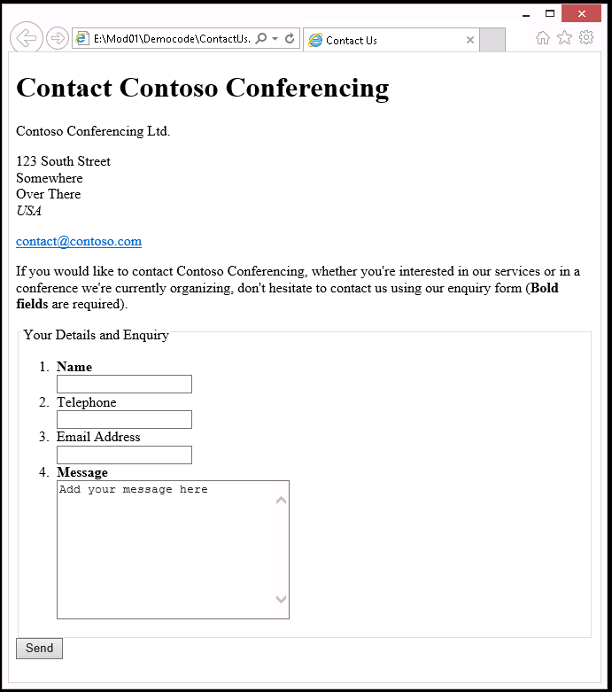
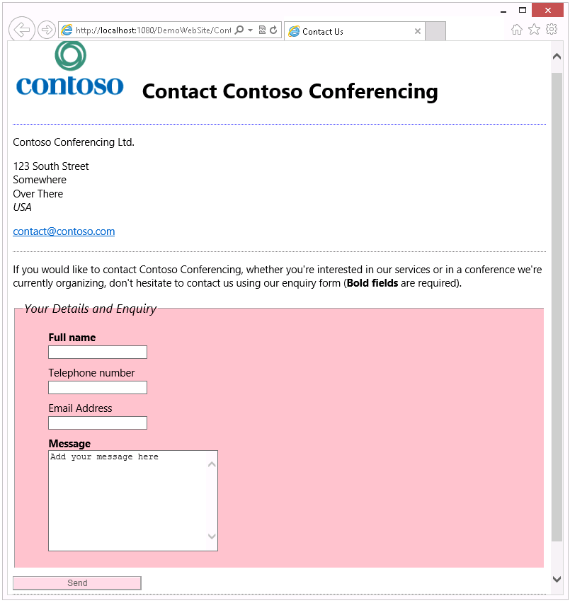

# Programming-in-HTML5-with-JavaScript-y-CSS3

### MODULO 1 

### Lección 1 Introducción HTML

#### Demonstración: Creating a Simple Contact Form 

##### Pasos de preparación

1. Clonar todos los archivos desde el repo de git para tenerlos disponibles:
 **(https://github.com/MicrosoftLearning/20480-Programming-in-HTML5-with-JavaScript-y-CSS3/tree/master/AllFiles)**. 
2. Navegar y abrir la solución **DemoWebSite - Complete.sln**.
3. Ejecutar la aplicación **DemoWebSite - Complete.sln**.
4. Verificar en la barra del Navegador, que en mi caso es Google Chrome el puerto donde se ejecuta la aplicación. **http://localhost:56423**.
5. Cerrar el navegador - Google Chrome.

### Lección 3 Crear una Aplicación Web usando Visual Studio 2019

#### Demonstración: Crear una Aplicación Web usando Visual Studio 2019

1. Crear un archivo HTML con la siguiente estructura:
   ```html
       <!DOCTYPE HTML>
        <html lang="en">
            <head>
              <meta charset="UTF-8" />
              <title>Contact Us</title>
            </head>
            <body>

            </body>
        </html>
   ```
2. Salvarlo como **ContactUs.html**


#### Agregar el contenido a la página

1.	Agregar un heading 1:
   ```html
    <h1>Contact Contoso Conferencing</h1>
   ```
2.  Agregar parragrafos con line break:
    ```html
    <p>Contoso Conferencing Ltd.</p>
    <p>
        123 South Street<br />
        Somewhere<br />
        Over There<br />
        <em>USA</em>
    </p>
    ```
3.	Agregar el nombre, email, dirección de la compañia. Usar **mailto** para el email.
   ```html
    <p>
        <a href="mailto:contact@contoso.com">
        contact@contoso.com</a>
    </p>
   ```
4.	Invitar otros usuarios:
   ```html
    <p>
        If you would like to contact Contoso Conferencing, whether you're interested in our services or in a conference we're currently organizing, don't hesitate to contact us by usando our enquiry form. (<strong>Bold fields</strong> are required.)
    </p>
   ```
5.	Salvar el archivo.

#### Agregar controles de entrada
1.	Agregar un formulario con elementoo **form**:
   ```html
    <form method="Post" action="support.aspx">
    </form>
   ```
2. Agregar un elemento **fieldset** y un elementoo botón **submit**:
   ```html
    <fieldset>
        <legend>
            Your Details y Enquiry
        </legend>
    </fieldset>
    <input type="submit" value="Send" />
   ```
3.	Agregar un elemento **&lt;/legend&gt;**, agregar una lista no ordeneda con; nombre de usuario, telefono, email y un mensaje:
   ```html
    <ol>
        <li>
          <label>
            <strong>name</strong><br />
            <input type="texto" 
                   name="Username" />
          </label>
        </li>
        <li>
          <label>
            Telephone<br />
            <input type="texto" 
                   name="Phone" />
          </label>
        </li>
        <li>
          <label>
            Email dirección<br />
            <input type="texto" 
                   name="Email" />
          </label>
        </li>
        <li>
          <label>
            <strong>Message</strong><br />
            <textoarea name="Message" 
              cols="30" rows="10">Agregar your message here
            </textoarea>
          </label>
        </li>
    </ol>
   ```

4.	Salvar el archivo.

### Ver la página

1.	Abrir el explorador de archivos.
2.	Navegar hasta el proyecto **..\Mod01\DemoCode**.
3.	Hacer doble Clic en **ContactUs.html**.



### Lesson 3: Crear un Aplicación Web Usando Visual Studio 2019

### Demonstración: Crear un Website Usando Visual Studio 2019

#### Preparación 

1. Clonar los archivos necesarios desde GitHub **(https://github.com/MicrosoftLearning/20480-Programming-in-HTML5-with-JavaScript-y-CSS3/tree/master/AllFiles)**. 


#### Crear un proyecto website

1.	Abrir Microsoft Visual Studio 2019.
2.	En el Microsoft Visual Studio, en el menu **archivo** >> **New** >> **Proyecto**.
3.	En **New Proyecto** >> **Web** >> **ASP.NET Web Application(.NET Framework)**.

>**Note**: NO importa a esta etapa usar **Visual Basic** o **Visual C#**.
4. En **name** >> **DemoWebSite**.
5.	De la lista despegable >> **Mod01\DemoCode\DemoWebSite** >>  **OK**.
6. En **New ASP.NET Web Application-DemoWebSite** >> **Empty** >> **OK**.

### Agregar y editar archivos en el proyecto

1.	En **DemoWebSite - Microsoft Visual Studio** >> **Solution Explorer**.
2.	En el explorador de Solución Explorer, clic derecho **DemoWebSite** >> **Agregar** >> **Existing Item**.
3.	En **Agregar Existing Item - DemoWebSite** >> **\Mod01\DemoCode** >> **ContactUs.html** >> **Agregar**.
4.	En el explorado de Solución, clic derecho **ContactUs.html**, y entonces clic **Set As Start página**.
5.	En el explorado de Solución,  clic derecho en **DemoWebSite** Proyecto, apuntar a **Agregar**, clic **New Folder**, y entonces nombrelo **Estilos**.
6.	clic derecho en **Estilos** >> **Agregar** >> **New Item**.
7.	En **Agregar New Item - DemoWebSite** >> **Style Sheet**. En **name** >> **ContactUsEstilos.css** >> **Agregar**.

>**Note**: Se puede usar **Agregar New Item - DemoWebSite** para crear nuevos archivos de JavaScript y HTML para el proyecto.

8.	En **ContactUsEstilos.css** escribir el estilo:
   ```css
        body {
            font-family: 'Times New Roman';
            color: blue;
        }
   ```
9.	En el explorado de Solución, doble-clic **ContactUs.html**.
10. En la etiqueta **&lt;head&gt;**:
   ```html
        <head>
            <meta charset="UTF-8" />
            <title>Contact Us</title>
            <link href="Estilos/ContactUsEstilos.css" rel="Estilosheet" type="texto/css" />
        </head>
   ```


11. En el menu **archivo** >> **Salvar Todo**.


---

## MOD 2 

### Lección 1 Creando una página HTML5 

#### Demonstración: usando HTML5 Features in a Simple Contact Form



#### Preparación  

Asegurese que que ha clonado el directorio de GitHub (**https://github.com/MicrosoftLearning/20480-Programming-in-HTML5-with-JavaScript-y-CSS3/tree/master/AllFiles**).

#### Demonstración

#### Divida el contenido de la página en un Article con Sections

1.	Abrir Microsoft Visual Studio 2019.
2.	En el Visual Studio, en el menu **archivo** >> **Abrir** >> **Proyecto/Solution**.
3.	En el **Abrir Proyecto** caja de dialogo, browse a la **[Repository Root]\AllFiles\Mod02\DemoCode\Starter** folder, clic **DemoWebSite.sln**, y entonces clic **Abrir**.
4.	En el explorador de soluciones, expy **DemoWebSite** Proyecto, y entonces doble-clic **ContactUs.html**.
5.	En el archivo **ContactUs.html**, encierre los contenidos de los **&lt;body&gt;** elementos en un **&lt;article&gt;** elemento como se muestra En el siguiente ejemplo de código:
    ```html
        <!DOCTYPE HTML>
        <html lang="en">  
          ...
          </head>
          <body>
            <article>
            ...
            </article>
          </body>
        </html>

    ```
6.	Con el **&lt;article&gt;** elemento, encierre los primeros tres **&lt;p&gt;** elementos conteniendo el nombre de la compañia, dirección, y email de contacto en el **&lt;section&gt;** elemento, como se muestra en el siguiente ejemplo de código:
    ```html
        ...
        <h1>Contact Contoso Conferencing</h1>
          <section>
            <p>Contoso Conferencing Ltd.</p>
            <p>123 South Street<br />
            Somewhere<br />
            Over There<br />
            <em>USA</em></p>
            <p>
              <a href="mailto:contact@contoso.com">contact@contoso.com</a>
            </p>
          </section>
        <p>
        If you would like to contact Contoso Conferencing ...
        </p>
        ...
    ```
7.	Envuelva el formulario HTML y el **&lt;p&gt;** elemento immediatamente sobre el segundo **&lt;section&gt;** elemento, como se muestra en el siguiente ejemplo de código:
    ```html
        ...
        <section>
          <p>
          If you would like to contact Contoso Conferencing ...
          </p>
          <form method="POST" action="support.aspx">
            ...
          </form>
        </section>
        ...
    ```
8.	En el menu **archivo** >> **Salvar Todo**.

#### Agregar un Header y un Footer a la página

1.	Encierre el **&lt;h1&gt;** elemento cerca del  archivo **ContactUs.html** en un **&lt;header&gt;** elemento, como se muestra en el siguiente ejemplo de código:
    ```html
        ...
        <article>
          <header>
            <h1>Contact Contoso Conferencing</h1>
          </header>
          ...
        </article>
        ...
    ```
2.	Agregar el siguiente **&lt;img&gt;** elemento a el **&lt;header&gt;** elemento, el cual está encima del **&lt;h1&gt;** elemento.
    ```html
        <header>
          
          <h1>Contact Contoso Conferencing</h1>
        </header>
    ```
3.	Agregar el siguiente HTML markup immediatamente después de la etiqueta **&lt;/article&gt;** cerca del final del documento tal que el código se muestre como:
    ```html
        ...
        </article>
        <footer>
          <p>
            <small>
              Last updated 
              <time datetime="2012-08">
                August 2012
              </time>
            </small>
          </p>
        </footer>
      </body>
    </html>
    ```
4.	En el menu **archivo**, clic **Salvar Todo**.

#### Ver la estructura de la página usando las herramientas del desarrollador F12

1.	En el menu **Debug**, clic **Start Without Debugging**.
2.	En Google Chrome, si aparece el mensaje **Intranet settings are turned off by default**, clic **Don’t show this message again**.
3.	presione F12.
4.	En la ventana **F12**, clic en **HTML**.
5.	Expanda el **&lt;html&gt;** elemento.
6.	Expanda el **&lt;body&gt;** elemento.
7.	Expanda el **&lt;article&gt;** elemento, y entonces verifique que containe un **&lt;header&gt;** elemento y dos **&lt;section&gt;** elementos.
8.	Expanda el **&lt;header&gt;** elemento.
9.	Ver el **&lt;h1&gt;** elemento.
10. En el ventana **F12**, clic en cada elemento y verifique que Google Chrome envuelve cada elemento cuando selecciona.


#### Hacer un cambio a la página usando the F12 - Herramientas del desarrollador

1.	En el **&lt;h1&gt;** elemento, clic **Contact Contoso Conferencing**.
2.	Cambie este texto a **We'd love to hear de you…**, y entonces presione digite.
3.	verifique que Google Chrome muestra el texto modificado.
4.	Para cerrar the **F12** ventana, presione F12.
5.	Cierre Google Chrome, y entonces cierre Visual Studio.

# Lesson 2: Haciendo estilos en una página HTML5 

### Demonstración: Agregar estilos CSS a una página HTML

#### Preparación 

Asegurese que que ha clonado el 20480C directorio de GitHub (**https://github.com/MicrosoftLearning/20480-Programming-in-HTML5-with-JavaScript-y-CSS3/tree/master/AllFiles**). 

#### Demonstración

#### Crear Nuevos Estilos usando Visual Studio

1.	Abrir Visual Studio.
2.	En el Visual Studio, en el **archivo** menu, **Abrir**, y entonces clic **Proyecto/Solution**.
3.	En la **Abrir Proyecto** caja de dialogo, >> **Mod02\DemoCode\Starter** >> **DemoWebSite.sln** >> **Abrir**.

>**Nota**: Si aparece la caja de dialogo **Inconsistent Line Endings**, limpiar el checkbox **Always show this dialog** y entonces clic **Yes**.

4.	En el explorador de soluciones, expanda el **DemoWebSite** Proyecto y entonces expandir el folder **Estilos**.
5.	doble-clic **ContactUsEstilos.css**.
6.	Ver las reglas existentes de estilos para los elementos **body** y **h1**.
7.	Modificar la regla **body**, quitar la regla **color**, y cambiar la fuente usada en toda la página como se muestra en el siguiente ejemplo de código.
    ```css
        body {
          font-family: "Segoe UI", Helvetica, Arial, sans-serif;
        }
    ```
8.	Quitar la regla siguiente regla del hola de Estilos:
    ```css
        h1 {
          font-family: 'Copperplate Gothic';
          color: red;
        }
    ```
9.	Para hacer que el header aparezca seprado del resto de contenido, agregar la siguiente regla:
    ```css
        header {
          pAgregaring-bottom: 10px;
          border-bottom: 2px dotted blue;
          margin-bottom: 10px;
        }

        header h1 {
          margin-left: 20px;
          display: inline-block;
        }
    ```
10.	Agregar la siguiente regla vacía:
    ```css
        section {
        }
    ```
11.	verifique que la regla de la section ahora se ve como esto:
    ```css
        section {
          padding-bottom: 5px;
          border-bottom-style: dotted;
          border-bottom-width: 1px;
          border-bottom-color: grey;
        }
    ```
12.	Para agregar estilo al formulario y sus elementos, agregar el siguiente regla:
    ```css
        fieldset {
          background-color: pink;
          margin-bottom: 10px;
        }

        legend {
          font-size: 1.2em;
          font-style: italic;
        }

        fieldset li {
          list-style: none;
          margin-bottom: 10px;
        }

        input[type="submit"] {
          background-color: pink;
          opacity: 0.6;
          width: 200px;
        }
    ```
13.	En el menu **archivo**, clic **Salvar Todo**.

#### Use F12 - Herramientas del desarrollador para inspeccionar los estilos

1.	En el explorador de soluciones, doble-clic **ContactUs.html**.
2.	En el menu **Debug** >> **Start Without Debugging**.
3.	Verificar que los estilos se han aplicado.


5.	En Google Chrome, presione F12.
6.	En el **F12** ventana, seleccione el **DOM Explorer**, y entonces doble-clic en el **&lt;html&gt;** elemento.
7.	Clic en el **&lt;body&gt;** elemento.
8.	En el panel derecho, verifique que las siguientes reglas CSS aparecen:
    ```css
        font-family: "Segoe UI", Helvetica, Arial, sans-serif;
    ```
9.	En esta regla, seleccione el texto **"Segoe UI"**, cambielo a **"Times New Roman"**, y entonces presione enter.
10.	En Google Chrome, verifique que este cambio en el font se refleja sobre la página.
12.	En el panel izquierdo, expanda el **&lt;body&gt;** elemento, expanda el **&lt;article&gt;** elemento, y entonces clic al primer **&lt;section&gt;** elemento.
13.	En el panel derecho, verifique que el siguiente estilo se especifica para esta section:
    ```css
        inherited – body
          body
            font-family: "Times New Roman", Helvetica, Arial, sans-serif;
        section 
          padding-bottom: 5px;
          border-bottom-color: grey;
          border-bottom-width: 1px;
          border-bottom-style: dotted;
    ```
14.	Para cerrar la ventana **F12**, presione F12.
15.	Cierre Google Chrome, y entonces cierre Visual Studio.

### Demonstración: Crear y dar estilo a una página HTML5 

#### Preparación 

Asegurese que que ha clonado el directorio de GitHub (**https://github.com/MicrosoftLearning/20480-Programming-in-HTML5-with-JavaScript-y-CSS3/tree/master/AllFiles**). .


--- 

## MOD 3 

# Lesson 1: Introducción a JavaScript

### Demonstración: Crear un archivo simple de Javascript que defina variables, arreglos y funciones

#### Preparación  

Asegurese que ha clonado el directorio de GitHub (**https://github.com/MicrosoftLearning/20480-Programming-in-HTML5-with-JavaScript-y-CSS3/tree/master/AllFiles**). 

#### Demonstración

#### Crear un nuevo proyecto

1. Abrir Microsoft Visual Studio 2017.
2. En **Microsoft Visual Studio**, en el **archivo** menu, apuntar a **New**, y entonces clic **Project**.
3. En el **New Project** dialog box, en el panel izquierdo, bajo **Installed**, expy **Visual C#**, y entonces clic **Web**.
4. Clic **ASP.NET Empty Web Application(.NET Framework)**.
5. En el **name** box, digite **HtmlBasics**.
6.	En el **Location** box, digite **[Repository root]AllFiles\Mod03\Labarchivos\Starter\Exercise 1**, y entonces clic **OK**.
7. En caja de dialago **New ASP.NET Web Application- HtmlBasics**, seleccione **Empty** y entonces clic **OK**.

#### Agregar el index page

1.	In **HtmlBasics - Microsoft Visual Studio**, En el **Project** menu, clic **Agregar New Item**.
2.	En la caja de dialogo **Agregar New Item – HtmlBasics**, clic **HTML Page**.
3.	En la caja **name**, digite **index.html**.
4.	Clic **Agregar**.
5. Abrir el archivo **index.html**.
6. En el archivo **index.html** , agregar el siguiente texto:
   ```html
        <!DOCTYPE html>
        <html>
        <head>
            <meta charset="utf-8" />
            <title>HTML Basic</title>
        </head>
        <body>

        </body>
        </html>
   ```

#### Agregar un archivo JavaScript

1.  Clic-derecho **HtmlBasics**, apuntar a **Agregar** y entonces seleccione **New folder**. Tipo **Scripts**.
2.  Clic-derecho en **Scripts** folder, seleccione **Agregar**, y entonces clic **New Item**.
3.  En la caja de dialog **Agregar New Item – HtmlBasics**, clic **JavaScript archivo**.
4.  En la caja **name**, digite **indexScript.js**.
5.  Clic **Agregar**.
6.  Abrir el archivo **indexScript.js**.
7.  Crear una función **Init**, digite el siguiente código: 
   ```javascript
        function init() {
        }
   ```
8.  Define un arreglo de personas con las propiedades **name**, **Age**, y **Email**, digite el siguiente código:
   ```javascript

        const personsLst = [
        {
            name: 'Adam adam',
            age: 22,
            email: 'adam@example.com'
        },
        {
            name: 'eve perkins',
            age: 18,
            email: 'eve@example.com'
        },
        {
            name: 'melvin wood',
            age: 20,
            email: 'melvin@example.com'
        },
        {
            name: 'signe lorenzo',
            age: 19,
            email: 'signe@example.com'
        },
        {
            name: 'william rasmussen',
            age: 25,
            email: 'william@example.com'
        }]
   ```
9.  Defina una propiedad **age**, digite el siguiente código:
    ```javascript
        const age = 20;
    ```
10. Crear a función que reciba el arreglo de las personas y la propiedad **age**, y entonces regrese un nuevo array con todas las personas que tengan edad definada, digite el siguiente código:
   ```javascript
        function getPersonsAboveAge(array, age) {
            const personAboveAge = [];

            for (let person of array) {
            
                if (person.age >= age) {
                    personAboveAge.push(person);
                }
            }
            regrese personAboveAge;
        }
   ```
11. Crear una función que reciba an array y imprimelo a la console by usando a **for** loop, digite el siguiente código:
   ```javascript
        function printArray(array) {
            for (let i = 0; i < array.length; i++) {
                console.log(`${array[i].name} (${array[i].age}) ${array[i].email}`);
            }
        }
   ```

12. Call the **printArray** function de the **init** function with the complete array, digite el siguiente código:
   ```javascript
        printArray(personsLst);
   ```
13. Call **getPersonsAboveAge** with el arreglo y the **age** property that we defined earlier, y entonces save the regrese value in a **const** property, digite el siguiente código:
   ```javascript
        const personAboveAge = getPersonsAboveAge(personsLst, age);
   ```
14. Call the **printArray** function again but now with el arreglo of people above the defined age, digite el siguiente código:
   ```javascript
        printArray(personAboveAge);
   ```
15. En el **index.html** page, a la **&lt;Head&gt;** element, Agregar el siguiente script tag:
   ```html
        <script src="/Scripts/indexScript.js"></script>
   ```

#### Run the web application

1.	En el explorador de soluciones, double-Clic **Properties**.
2.	En el panel izquierdo, clic **web**.
3.	seleccione **specific page**, clic **...**, y entonces seleccione **Index.html** y clic **OK**. 
4.	Clic **IIS Express (Google Chrome)**.
5.	Para ver la consola, en Google Chrome, presione F12.
6.	Verifique que el arreglo imprime a la console.
7.	Cierre Google Chrome, y entonces regrese a Visual Studio.

### Demonstración: Manipular el DOM con Javascript

#### Preparación 

Asegurese que ha clonado el directorio de GitHub (**https://github.com/MicrosoftLearning/20480-Programming-in-HTML5-with-JavaScript-y-CSS3/tree/master/AllFiles**). 

#### Demonstración 

#### Crear un nuevo proyecto

1. Abrir **Microsoft Visual Studio**.
2. En **Microsoft Visual Studio**, en el menu **archivo**, apuntar a **New**, y entonces clic **Project**.
3. En el **New Project** dialog box, en el panel izquierdo, bajo **Installed**, escoja el nodo **Visual C#**, y entonces clic the **Web** node.
4. Clic **ASP.NET Web Application(.NET Framework)**.
5. En la caja **name**, digite **HtmlDOMSample**.
6.	En la caja **Location**, digite **[Repository root]AllFiles\Mod03\Labarchivos\Starter\Exercise 2**, y entonces clic **OK**.
7. En la caja de dialogo **New ASP.NET Web Application- HtmlDOMSample**, seleccione **MVC** y entonces clic **OK**.

#### Agregar el index page

1.	En **HtmlDOMSample - Microsoft Visual Studio**, en el menu **Project**, clic **Agregar New Item**.
2.	En la caja de dialogo **Agregar New Item – HtmlDOMSample**, clic **HTML Page**.
3.	En la caja **name**, digite **index.html**.
4.	Clic **Agregar**.
5. Abrir el archivo **index.html**.
6. En el archivo, agregar el siguiente código:
   ```html
        <!DOCTYPE html>
        <html>
        <head>
            <meta charset="utf-8" />
            <meta name="Verport" content="width=device-width, initial-scale=1.0">
            <title>HTML Basic</title>
            <link href="/Content/Site.css" rel="Estilosheet" type="text/css" />
            <link href="/Content/bootstrap.min.css" rel="Estilosheet" type="text/css" />
            <script src="/Scripts/modernizr-2.6.2.js"></script>
        </head>
        <body>
            <div class="navbar navbar-inverse navbar-fixed-top">
                <div class="container">
                    <div class="navbar-header">
                        <button type="button" class="navbar-toggle" data-toggle="collapse" data-target=".navbar-collapse">
                            <span class="icon-bar"></span>
                            <span class="icon-bar"></span>
                            <span class="icon-bar"></span>
                        </button>

                    </div>
                    <div class="navbar-collapse collapse">
                        <ul class="nav navbar-nav"></ul>
                    </div>
                </div>
            </div>

            <div class="container body-content">
                <form>
                    <fieldset>
                        <legend>
                            digite your details
                        </legend>
                        <ol>
                            <li>
                                <label>
                                    <strong>Full name</strong>
                                    <br />
                                    <input type="text" name="Username" />
                                </label>
                            </li>
                            <li>
                                <label>
                                    Telephone number
                                    <br />
                                    <input type="text" name="Phone" />
                                </label>
                            </li>
                            <li>
                                <label>
                                    Email dirección
                                    <br />
                                    <input type="text" name="Email" />
                                </label>
                            </li>
                            <li>
                                <label>
                                    My hobbies
                                </label>
                                <div id="hobbiesList">
                                    <input type="text" name="hobby" class="hobbiesInput" />
                                    <button type="button" id="newHobbyBtn">Agregar hobby</button>
                                </div>
                            </li>
                        </ol>
                    </fieldset>
                    <input type="submit" value="Check my details" />
                </form>
            </div>
        </body>
        </html>
   ```
#### Agregar the JavaScript archivo

1. Clic-derecho en el folder **Scripts**, seleccione **Agregar**, y entonces clic **New Item**.
2. En la caja de dialogo **Agregar New Item – HtmlDOMSample**, clic **JavaScript archivo**.
3. En la caja **name**, digite **indexScript.js**.
4.	Clic **Agregar**.
5. Abrir el archivo **indexScript.js**.
6. Para crear una función **CrearNode** que reciba el nombre del elemento html y regrese un elemento html, digite el siguiente código:
   ```javascript
        function CrearNode(element) {
            regrese documento.CrearElement(element);
        }
   ```
7. Crear una función **append** que reciba el pariente y elementos hijos y agregue el hijo al padre, digite el siguiente código:
   ```javascript
        function append(parent, el) {
            regrese parent.appendChild(el);
        }
   ```
8. Crear una función **AgregarHobbies** agregando el siguiente código:
```javascript
        function AgregarHobbies () { }
   ```
9. Para obtener todos los inputs con la clase **hobbiesInput** class en la variable *const*, digite el siguiente código:
    ```javascript
        const inputList = documento.queryseleccioneorAll('.hobbiesInput');
    ```
10. Para verificar que **inputList** contiene menos de cinco elementos, agregar nuevos inputs con el node **CrearNode** y la función **append**, y si **inputList** contiene más de cinco elementos, quitar el event listener, y entonces digite el siguiente código:
    ```javascript
        if (inputList.length < 5) {
        
            const hobbiesList = documento.getElementById('hobbiesList');        
            const newLineElement = CrearNode('br'),
            inputElement = CrearNode('input');
        
            inputElement.setAttribute("class", "hobbiesInput");
        
            append(hobbiesList, newLineElement);
            append(hobbiesList, inputElement);
        }
        else {
            documento.getElementById('newHobbyBtn').quitarEventListener('Clic', AgregarHobbies);
        }
    ```
11. En la página JavaScript, agregar un event listener en **DOMContentLoaded**, digite el siguiente código:
    ```javascript
        documento.AgregarEventListener('DOMContentLoaded', function (event) {
            
        });
    ```
12. Para obtener un botón **newHobbyBtn** con **getElementById**, agregar un event listener en el button, y adjuntar una función **AgregarHobbies**, digite el siguiente código:
    ```javascript
        documento.getElementById('newHobbyBtn').AgregarEventListener('Clic', AgregarHobbies);
    ```
13. En las **index.html**, al **&lt;Head&gt;** elemento, agregar el siguiente script tag:
    ```html
        <script src="/Scripts/indexScript.js"></script>
    ```

#### Ejecute la aplicación web

1.	En el explorador de soluciones, double-Clic **Properties**.
2.	En el panel izquierdo, clic **web**.
3.	seleccione **Specific Page**, clic **...**, y entonces seleccione **Index.html** y clic **OK**. 
4.	Clic **IIS Expresione (Google Chrome)**.
5.	En la ventana **HTML Basic**, en la caja de input abajo de la etiqueta label **My hobbies**, escriba un hobby y entonces clic en el botón **Agregar hobby**. Repita este paso 5 veces.
6.	Verifique que no puede agregar más de 5 hobbies.
7. En **HtmlDOMSample - Microsoft Visual Studio**, en el menu **Debug**, clic **Stop Debugging**.
8.	Cierre todas las ventas abiertas.
